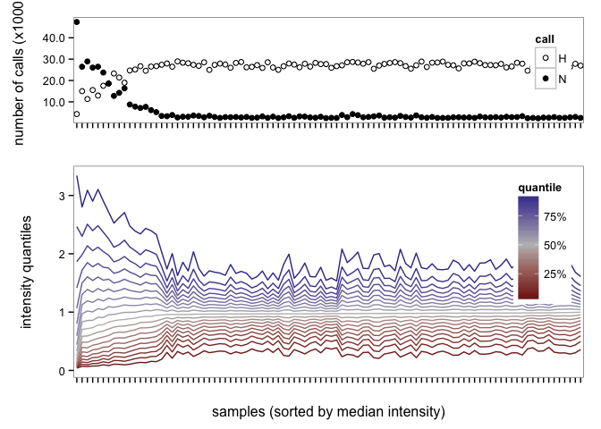
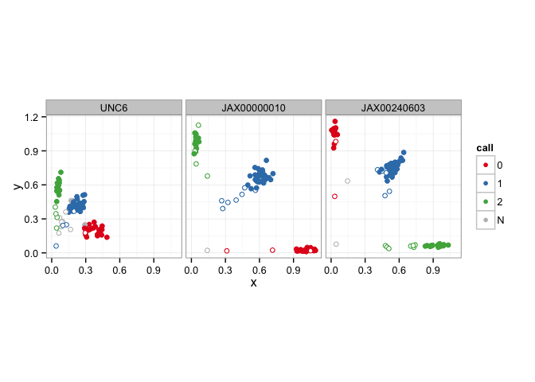

<!-- README.md is generated from README.Rmd. Please edit that file -->


argyle
======

An `R` package for import, QC and (some) analysis of genotyping and hybridization-intensity data from Illumina Infinium arrays.

Dependencies
------------

Effort has been made to keep to a minimum the number of package dependencies, subject to the constraint that I don't want to re-implement from scratch what others have done better.

-   `data.table`: really fast and efficient handling of big (multi-GB scale) table-style data with low overhead
-   `preprocessCore` (Biodoncuctor): robust quantile normalization routine written in `C`
-   `plyr`: generalizations of base-`R`'s `apply()` family
-   `reshape2`: easy "flattening" of matrices to dataframes
-   `digest`: for computing MD5 checksums to check data integrity

The following are required for some functions but one could get by without them:

-   `ggplot2` (and friends): required for the plotting functions
-   `corpcor`: required for "fast"-mode PCA

Installation
------------

Installation of the package directly from Github requires `devtools`.

``` {.r}
library(devtools)

## allow R to look for pacakges in both CRAN and Bioconductor
setRepositories(1:2)

## install from Github source
install_github("andrewparkermorgan/argyle")
```

Performance
-----------

For a realistic test of `argyle`'s performance, I use an Illumina BeadStudio dataset from the MegaMUGA array for mouse, containing 77808 markers x 96 samples (available from [do.jax.org](http://churchill.jax.org/research/cc/do_data/megamuga/raw/MegaMUGA_22Oct2012/)). The relevant files, compressed with ZIP, have total size 149 MB.

Testing on my Mac Pro desktop (OS X 10.6.8.10K549, 2x2.26 GHz quad-core Xeon, 24 GB DDR3 RAM) under `R` 3.1.3:

    #> Loading argyle
    #> Loading required package: data.table
    #> Loading required package: digest
    #> Loading required package: preprocessCore
    #> Loading required package: reshape2
    #> Loading required package: plyr

``` {.r}
system.time( geno <- read.beadstudio("", snps, "./data/MM_sample") )
#> Reading sample manifest from < ./data/MM_sample/Sample_Map.zip > ...
#> Reading genotypes and intensities from < ./data/MM_sample/FinalReport.zip > ...
#> 
Read 0.0% of 7469568 rows
Read 12.3% of 7469568 rows
Read 24.6% of 7469568 rows
Read 36.9% of 7469568 rows
Read 49.3% of 7469568 rows
Read 61.4% of 7469568 rows
Read 73.8% of 7469568 rows
Read 86.1% of 7469568 rows
Read 98.1% of 7469568 rows
Read 7469568 rows and 11 (of 11) columns from 0.478 GB file in 00:00:12
#> Constructing genotype matrix...
#> Constructing intensity matrices...
#>   77725 sites x 96 samples
#> Done.
#>    user  system elapsed 
#>  35.287   5.096  43.403

summary(geno)
#> --- geno ---
#> A genotypes object with 77725 sites x 96 samples
#> Intensity data: yes (raw) 
#> Sample metadata: no
#> Filters set: 0 sites / 0 samples 
#> File source: /Users/apm/Dropbox/pmdvlab/argyle/data/MM_sample (on 2015-05-13 17:25:12 )
#> Checksum: 5dec3557df628860ca53c7192faa838f

print(object.size(geno), units = "Mb")
#> 202.1 Mb

sessionInfo()
#> R version 3.1.3 (2015-03-09)
#> Platform: x86_64-apple-darwin10.8.0 (64-bit)
#> Running under: OS X 10.6.8 (Snow Leopard)
#> 
#> locale:
#> [1] en_US.UTF-8/en_US.UTF-8/en_US.UTF-8/C/en_US.UTF-8/en_US.UTF-8
#> 
#> attached base packages:
#> [1] stats     graphics  grDevices utils     datasets  methods   base     
#> 
#> other attached packages:
#> [1] argyle_0.1            plyr_1.8.1            reshape2_1.4.1       
#> [4] preprocessCore_1.28.0 digest_0.6.8          data.table_1.9.4     
#> [7] devtools_1.7.0       
#> 
#> loaded via a namespace (and not attached):
#>  [1] chron_2.3-45    evaluate_0.5.5  formatR_1.0     htmltools_0.2.6
#>  [5] knitr_1.9       Rcpp_0.11.5     rmarkdown_0.5.1 roxygen2_4.1.1 
#>  [9] stringr_0.6.2   tools_3.1.3     yaml_2.1.13
```

The final object is 202.1 Mb, and is completely "self-contained" in that sample and marker metadata are stored alongside the genotypes and hybridization intensities. It is worth noting that if the input files were decompressed they would occupy about 500 MB on disk.

Usage
-----

``` {.r}
## overview of object's contents
summary(geno)
#> --- geno ---
#> A genotypes object with 77725 sites x 96 samples
#> Intensity data: yes (raw) 
#> Sample metadata: no
#> Filters set: 0 sites / 0 samples 
#> File source: /Users/apm/Dropbox/pmdvlab/argyle/data/MM_sample (on 2015-05-13 17:25:12 )
#> Checksum: 5dec3557df628860ca53c7192faa838f

## see marker map and sample metadata
head( markers(geno) )
#>              chr      marker     cM     pos A1 A2
#> UNC6        chr1        UNC6 1.4995 3000355  T  C
#> JAX00000010 chr1 JAX00000010 1.5620 3125499  A  G
#> JAX00240603 chr1 JAX00240603 1.6075 3242877  C  T
#> JAX00240610 chr1 JAX00240610 1.6111 3256689  C  T
#> JAX00240613 chr1 JAX00240613 1.6260 3313481  T  C
#> JAX00240636 chr1 JAX00240636 1.6433 3379644  C  A
head( samples(geno) )
#>                   fid        iid mom dad sex pheno
#> 1-670268     1-670268   1-670268   0   0   0    -9
#> 11-670268   11-670268  11-670268   0   0   0    -9
#> 111-670268 111-670268 111-670268   0   0   0    -9
#> 112-670268 112-670268 112-670268   0   0   0    -9
#> 113-670268 113-670268 113-670268   0   0   0    -9
#> 114-670268 114-670268 114-670268   0   0   0    -9

## subset operations: equivalent pairs
x <- subset(geno, chr == "chrM")
x <- geno[ markers(geno)$chr == "chrM", ]
print(x)
#>             1-670268 11-670268 111-670268 112-670268 113-670268 114-670268
#> Mit002      "G"      "G"       "T"        "T"        "G"        "G"       
#> Mit001      "G"      "G"       "A"        "A"        "G"        "G"       
#> Mit003      "A"      "A"       "A"        "A"        "A"        "A"       
#> Mit004      "C"      "C"       "C"        "C"        "C"        "C"       
#> Mit005      "C"      "C"       "C"        "C"        "C"        "C"       
#> repMit005   "C"      "C"       "C"        "C"        "C"        "C"       
#> Mit006      "T"      "T"       "T"        "T"        "T"        "T"       
#> Mit007      "C"      "C"       "C"        "C"        "C"        "C"       
#> Mit008      "A"      "A"       "A"        "A"        "A"        "A"       
#> Mit027      "G"      "G"       "A"        "A"        "G"        "G"       
#> Mit009      "C"      "C"       "C"        "C"        "C"        "C"       
#> Mit010      "A"      "A"       "A"        "A"        "A"        "A"       
#> Mit011      "G"      "A"       "A"        "A"        "G"        "G"       
#> JAX00725096 "C"      "C"       "T"        "T"        "C"        "C"       
#> Mit012      "N"      "N"       "N"        "N"        "N"        "N"       
#> JAX00725100 "C"      "C"       "T"        "T"        "C"        "C"       
#> Mit028      "C"      "C"       "T"        "T"        "C"        "C"       
#> JAX00725105 "A"      "A"       "A"        "A"        "A"        "A"       
#> Mit029      "C"      "C"       "T"        "T"        "C"        "C"       
#> Mit013      "C"      "A"       "C"        "C"        "C"        "C"       
#> Mit014C     "C"      "A"       "C"        "C"        "C"        "C"       
#> Mit014G     "A"      "N"       "A"        "A"        "A"        "A"       
#> Mit016      "C"      "C"       "C"        "C"        "T"        "C"       
#> Mit023      "T"      "T"       "T"        "T"        "T"        "T"       
#> Mit024      "T"      "T"       "T"        "T"        "T"        "T"       
#> Mit025      "T"      "T"       "T"        "T"        "T"        "T"       
#> Mit026      "N"      "T"       "T"        "T"        "N"        "N"       
#> Mit017      "G"      "A"       "A"        "A"        "G"        "G"       
#> Mit018      "G"      "A"       "A"        "A"        "G"        "G"       
#> Mit019      "G"      "A"       "G"        "G"        "G"        "G"       
#> Mit020      "T"      "H"       "T"        "T"        "T"        "T"       
#> Mit031      "T"      "H"       "T"        "T"        "T"        "T"       
#> Mit021      "T"      "C"       "N"        "N"        "T"        "T"       
#> Mit022      "G"      "A"       "A"        "A"        "A"        "A"       
#> Mit0040     "T"      "T"       "T"        "T"        "T"        "T"       
#> Mit0041     "C"      "C"       "C"        "C"        "C"        "C"       
#> Mit0042     "T"      "T"       "A"        "A"        "T"        "T"       
#> Mit0043     "C"      "C"       "N"        "N"        "C"        "C"       
#> Mit0044     "C"      "C"       "C"        "C"        "C"        "C"       
#> Mit0045     "H"      "H"       "T"        "T"        "H"        "H"       
#> Mit0046     "A"      "A"       "A"        "A"        "A"        "A"       
#> Mit0047     "T"      "T"       "T"        "T"        "T"        "T"       
#> Mit0048     "C"      "C"       "C"        "C"        "C"        "C"       
#> Mit0049     "T"      "T"       "T"        "T"        "T"        "T"       
#> Mit0050     "G"      "A"       "G"        "G"        "G"        "G"       
#> Mit0051     "T"      "T"       "C"        "C"        "T"        "T"       
#>             12-670268 127-670268 128-670268 133-670268 134-670268
#> Mit002      "G"       "G"        "T"        "T"        "T"       
#> Mit001      "G"       "G"        "A"        "A"        "A"       
#> Mit003      "A"       "A"        "C"        "C"        "C"       
#> Mit004      "C"       "C"        "T"        "T"        "T"       
#> Mit005      "C"       "C"        "C"        "C"        "C"       
#> repMit005   "C"       "C"        "C"        "C"        "C"       
#> Mit006      "T"       "T"        "T"        "C"        "C"       
#> Mit007      "C"       "C"        "T"        "C"        "C"       
#> Mit008      "A"       "A"        "A"        "A"        "A"       
#> Mit027      "G"       "G"        "A"        "G"        "G"       
#> Mit009      "C"       "C"        "T"        "C"        "C"       
#> Mit010      "A"       "A"        "G"        "G"        "G"       
#> Mit011      "G"       "G"        "A"        "A"        "A"       
#> JAX00725096 "C"       "C"        "T"        "C"        "C"       
#> Mit012      "N"       "N"        "N"        "N"        "N"       
#> JAX00725100 "C"       "C"        "T"        "T"        "T"       
#> Mit028      "C"       "C"        "C"        "C"        "C"       
#> JAX00725105 "A"       "A"        "G"        "G"        "G"       
#> Mit029      "C"       "C"        "C"        "T"        "N"       
#> Mit013      "C"       "C"        "A"        "N"        "N"       
#> Mit014C     "C"       "C"        "C"        "C"        "C"       
#> Mit014G     "A"       "A"        "A"        "A"        "A"       
#> Mit016      "C"       "C"        "T"        "C"        "C"       
#> Mit023      "T"       "T"        "T"        "T"        "T"       
#> Mit024      "T"       "T"        "T"        "T"        "T"       
#> Mit025      "T"       "T"        "T"        "T"        "T"       
#> Mit026      "N"       "N"        "N"        "N"        "N"       
#> Mit017      "G"       "G"        "N"        "A"        "N"       
#> Mit018      "G"       "G"        "N"        "A"        "A"       
#> Mit019      "G"       "G"        "G"        "G"        "N"       
#> Mit020      "T"       "T"        "T"        "T"        "T"       
#> Mit031      "T"       "T"        "T"        "T"        "T"       
#> Mit021      "T"       "T"        "N"        "C"        "C"       
#> Mit022      "G"       "A"        "A"        "N"        "G"       
#> Mit0040     "T"       "T"        "T"        "T"        "T"       
#> Mit0041     "C"       "C"        "T"        "T"        "T"       
#> Mit0042     "T"       "T"        "A"        "A"        "A"       
#> Mit0043     "C"       "C"        "N"        "N"        "N"       
#> Mit0044     "C"       "C"        "C"        "C"        "N"       
#> Mit0045     "H"       "H"        "T"        "T"        "T"       
#> Mit0046     "A"       "A"        "A"        "A"        "A"       
#> Mit0047     "T"       "T"        "T"        "T"        "T"       
#> Mit0048     "C"       "C"        "C"        "C"        "C"       
#> Mit0049     "T"       "T"        "T"        "T"        "T"       
#> Mit0050     "G"       "G"        "G"        "G"        "G"       
#> Mit0051     "T"       "T"        "C"        "C"        "C"       
#>             139-670268 140-670268 15-670268 16-670268 161-670268
#> Mit002      "G"        "T"        "G"       "T"       "G"       
#> Mit001      "G"        "A"        "G"       "A"       "G"       
#> Mit003      "A"        "C"        "A"       "A"       "A"       
#> Mit004      "C"        "T"        "C"       "C"       "C"       
#> Mit005      "C"        "C"        "C"       "C"       "C"       
#> repMit005   "C"        "C"        "C"       "C"       "C"       
#> Mit006      "T"        "C"        "T"       "T"       "T"       
#> Mit007      "C"        "C"        "C"       "C"       "C"       
#> Mit008      "A"        "A"        "A"       "A"       "A"       
#> Mit027      "G"        "G"        "G"       "A"       "G"       
#> Mit009      "C"        "C"        "C"       "C"       "C"       
#> Mit010      "A"        "G"        "A"       "A"       "A"       
#> Mit011      "G"        "A"        "G"       "A"       "G"       
#> JAX00725096 "C"        "C"        "C"       "T"       "C"       
#> Mit012      "N"        "N"        "N"       "N"       "N"       
#> JAX00725100 "C"        "T"        "C"       "T"       "C"       
#> Mit028      "C"        "C"        "C"       "T"       "C"       
#> JAX00725105 "A"        "G"        "A"       "A"       "A"       
#> Mit029      "C"        "T"        "C"       "T"       "C"       
#> Mit013      "C"        "N"        "C"       "C"       "C"       
#> Mit014C     "C"        "C"        "C"       "C"       "C"       
#> Mit014G     "A"        "A"        "A"       "A"       "A"       
#> Mit016      "C"        "C"        "C"       "C"       "T"       
#> Mit023      "T"        "T"        "T"       "T"       "T"       
#> Mit024      "T"        "T"        "T"       "T"       "T"       
#> Mit025      "T"        "T"        "T"       "T"       "N"       
#> Mit026      "N"        "N"        "N"       "T"       "N"       
#> Mit017      "G"        "A"        "G"       "A"       "G"       
#> Mit018      "G"        "A"        "G"       "A"       "G"       
#> Mit019      "G"        "G"        "G"       "G"       "G"       
#> Mit020      "T"        "T"        "T"       "T"       "T"       
#> Mit031      "T"        "T"        "T"       "T"       "T"       
#> Mit021      "T"        "C"        "T"       "N"       "T"       
#> Mit022      "G"        "N"        "A"       "A"       "A"       
#> Mit0040     "T"        "T"        "T"       "T"       "T"       
#> Mit0041     "C"        "T"        "C"       "C"       "C"       
#> Mit0042     "T"        "A"        "T"       "A"       "T"       
#> Mit0043     "C"        "N"        "C"       "N"       "C"       
#> Mit0044     "C"        "C"        "C"       "C"       "C"       
#> Mit0045     "H"        "N"        "H"       "T"       "H"       
#> Mit0046     "A"        "A"        "A"       "A"       "A"       
#> Mit0047     "T"        "T"        "T"       "T"       "T"       
#> Mit0048     "C"        "C"        "C"       "C"       "C"       
#> Mit0049     "T"        "T"        "T"       "T"       "T"       
#> Mit0050     "G"        "G"        "G"       "G"       "G"       
#> Mit0051     "T"        "C"        "T"       "C"       "T"       
#>             162-670268 165-670268 179-670268 181-670268 182-670268
#> Mit002      "T"        "T"        "G"        "T"        "T"       
#> Mit001      "A"        "A"        "G"        "A"        "A"       
#> Mit003      "C"        "C"        "A"        "A"        "C"       
#> Mit004      "T"        "T"        "C"        "C"        "T"       
#> Mit005      "C"        "C"        "C"        "C"        "C"       
#> repMit005   "C"        "C"        "C"        "C"        "C"       
#> Mit006      "C"        "C"        "T"        "T"        "T"       
#> Mit007      "C"        "C"        "C"        "C"        "T"       
#> Mit008      "A"        "A"        "A"        "A"        "A"       
#> Mit027      "G"        "G"        "G"        "A"        "A"       
#> Mit009      "C"        "C"        "C"        "C"        "T"       
#> Mit010      "G"        "G"        "A"        "A"        "G"       
#> Mit011      "A"        "A"        "G"        "A"        "A"       
#> JAX00725096 "C"        "C"        "C"        "T"        "T"       
#> Mit012      "N"        "N"        "N"        "N"        "N"       
#> JAX00725100 "T"        "T"        "C"        "T"        "T"       
#> Mit028      "C"        "C"        "C"        "T"        "C"       
#> JAX00725105 "G"        "G"        "A"        "A"        "G"       
#> Mit029      "N"        "T"        "C"        "T"        "C"       
#> Mit013      "N"        "N"        "C"        "C"        "A"       
#> Mit014C     "C"        "C"        "C"        "C"        "C"       
#> Mit014G     "A"        "A"        "A"        "A"        "A"       
#> Mit016      "C"        "C"        "C"        "C"        "T"       
#> Mit023      "T"        "T"        "T"        "T"        "T"       
#> Mit024      "T"        "T"        "T"        "T"        "T"       
#> Mit025      "T"        "T"        "T"        "T"        "T"       
#> Mit026      "N"        "N"        "N"        "N"        "N"       
#> Mit017      "A"        "A"        "G"        "A"        "N"       
#> Mit018      "A"        "A"        "G"        "A"        "N"       
#> Mit019      "G"        "G"        "G"        "G"        "G"       
#> Mit020      "T"        "T"        "T"        "T"        "T"       
#> Mit031      "T"        "T"        "T"        "T"        "T"       
#> Mit021      "C"        "C"        "T"        "N"        "N"       
#> Mit022      "N"        "N"        "A"        "A"        "A"       
#> Mit0040     "T"        "T"        "T"        "T"        "T"       
#> Mit0041     "T"        "T"        "C"        "C"        "T"       
#> Mit0042     "A"        "A"        "T"        "A"        "A"       
#> Mit0043     "N"        "N"        "C"        "N"        "N"       
#> Mit0044     "C"        "C"        "C"        "C"        "C"       
#> Mit0045     "N"        "T"        "H"        "T"        "T"       
#> Mit0046     "A"        "A"        "A"        "A"        "A"       
#> Mit0047     "T"        "T"        "T"        "T"        "T"       
#> Mit0048     "C"        "C"        "C"        "C"        "C"       
#> Mit0049     "T"        "T"        "T"        "T"        "T"       
#> Mit0050     "G"        "G"        "G"        "G"        "G"       
#> Mit0051     "C"        "C"        "T"        "C"        "C"       
#>             183-670268 184-670268 186-670268 187-670268 188-670268
#> Mit002      "G"        "G"        "G"        "G"        "T"       
#> Mit001      "G"        "G"        "G"        "G"        "A"       
#> Mit003      "A"        "A"        "A"        "A"        "C"       
#> Mit004      "C"        "C"        "C"        "C"        "T"       
#> Mit005      "C"        "C"        "C"        "C"        "C"       
#> repMit005   "C"        "C"        "C"        "C"        "C"       
#> Mit006      "T"        "T"        "T"        "T"        "C"       
#> Mit007      "C"        "C"        "C"        "C"        "C"       
#> Mit008      "A"        "A"        "A"        "A"        "A"       
#> Mit027      "G"        "G"        "G"        "G"        "G"       
#> Mit009      "C"        "C"        "C"        "C"        "C"       
#> Mit010      "A"        "A"        "A"        "A"        "G"       
#> Mit011      "G"        "A"        "A"        "G"        "A"       
#> JAX00725096 "C"        "C"        "C"        "C"        "C"       
#> Mit012      "N"        "N"        "N"        "N"        "N"       
#> JAX00725100 "C"        "C"        "C"        "C"        "T"       
#> Mit028      "C"        "C"        "C"        "C"        "C"       
#> JAX00725105 "A"        "A"        "A"        "A"        "G"       
#> Mit029      "C"        "C"        "C"        "C"        "T"       
#> Mit013      "C"        "A"        "A"        "C"        "N"       
#> Mit014C     "C"        "A"        "A"        "C"        "C"       
#> Mit014G     "A"        "H"        "H"        "A"        "A"       
#> Mit016      "C"        "C"        "C"        "C"        "C"       
#> Mit023      "T"        "T"        "T"        "T"        "T"       
#> Mit024      "T"        "T"        "T"        "T"        "T"       
#> Mit025      "T"        "T"        "T"        "T"        "N"       
#> Mit026      "N"        "T"        "T"        "N"        "N"       
#> Mit017      "G"        "A"        "A"        "G"        "A"       
#> Mit018      "G"        "A"        "A"        "G"        "A"       
#> Mit019      "G"        "A"        "A"        "G"        "G"       
#> Mit020      "T"        "H"        "H"        "T"        "T"       
#> Mit031      "T"        "H"        "H"        "T"        "T"       
#> Mit021      "T"        "C"        "C"        "T"        "C"       
#> Mit022      "G"        "A"        "A"        "A"        "N"       
#> Mit0040     "T"        "T"        "T"        "T"        "T"       
#> Mit0041     "C"        "C"        "C"        "C"        "T"       
#> Mit0042     "T"        "T"        "T"        "T"        "A"       
#> Mit0043     "C"        "C"        "C"        "C"        "N"       
#> Mit0044     "C"        "C"        "C"        "C"        "C"       
#> Mit0045     "H"        "H"        "H"        "H"        "T"       
#> Mit0046     "A"        "A"        "A"        "A"        "A"       
#> Mit0047     "T"        "T"        "T"        "T"        "T"       
#> Mit0048     "C"        "C"        "C"        "C"        "C"       
#> Mit0049     "T"        "T"        "T"        "T"        "T"       
#> Mit0050     "G"        "A"        "A"        "G"        "G"       
#> Mit0051     "T"        "T"        "T"        "T"        "C"       
#>             19-670268 195-670268 196-670268 2-670268 20-670268 204-670268
#> Mit002      "G"       "G"        "G"        "G"      "G"       "T"       
#> Mit001      "G"       "G"        "G"        "G"      "G"       "A"       
#> Mit003      "A"       "A"        "A"        "A"      "A"       "A"       
#> Mit004      "C"       "C"        "C"        "C"      "C"       "C"       
#> Mit005      "C"       "C"        "C"        "C"      "C"       "C"       
#> repMit005   "C"       "C"        "C"        "C"      "C"       "C"       
#> Mit006      "T"       "T"        "T"        "T"      "T"       "T"       
#> Mit007      "C"       "C"        "C"        "C"      "C"       "C"       
#> Mit008      "A"       "A"        "A"        "A"      "A"       "A"       
#> Mit027      "G"       "G"        "G"        "G"      "G"       "A"       
#> Mit009      "C"       "C"        "C"        "C"      "C"       "C"       
#> Mit010      "A"       "A"        "A"        "A"      "A"       "A"       
#> Mit011      "G"       "G"        "G"        "G"      "G"       "A"       
#> JAX00725096 "C"       "C"        "C"        "C"      "C"       "T"       
#> Mit012      "N"       "N"        "N"        "N"      "N"       "N"       
#> JAX00725100 "C"       "C"        "C"        "C"      "C"       "T"       
#> Mit028      "C"       "C"        "C"        "C"      "C"       "T"       
#> JAX00725105 "A"       "A"        "A"        "A"      "A"       "A"       
#> Mit029      "C"       "C"        "C"        "C"      "C"       "T"       
#> Mit013      "C"       "C"        "C"        "C"      "C"       "C"       
#> Mit014C     "C"       "C"        "C"        "C"      "C"       "C"       
#> Mit014G     "A"       "A"        "A"        "A"      "A"       "A"       
#> Mit016      "C"       "T"        "C"        "C"      "C"       "C"       
#> Mit023      "T"       "T"        "T"        "T"      "T"       "T"       
#> Mit024      "T"       "T"        "T"        "T"      "T"       "T"       
#> Mit025      "T"       "N"        "T"        "T"      "T"       "T"       
#> Mit026      "N"       "N"        "N"        "N"      "N"       "T"       
#> Mit017      "G"       "G"        "G"        "G"      "G"       "A"       
#> Mit018      "G"       "G"        "G"        "G"      "G"       "A"       
#> Mit019      "G"       "G"        "G"        "G"      "G"       "G"       
#> Mit020      "T"       "T"        "T"        "T"      "T"       "T"       
#> Mit031      "T"       "T"        "T"        "T"      "T"       "T"       
#> Mit021      "T"       "T"        "T"        "T"      "T"       "N"       
#> Mit022      "A"       "A"        "A"        "A"      "A"       "A"       
#> Mit0040     "T"       "T"        "T"        "T"      "T"       "T"       
#> Mit0041     "C"       "C"        "C"        "C"      "C"       "C"       
#> Mit0042     "T"       "T"        "T"        "T"      "T"       "A"       
#> Mit0043     "C"       "C"        "C"        "C"      "C"       "N"       
#> Mit0044     "C"       "C"        "C"        "C"      "C"       "C"       
#> Mit0045     "H"       "H"        "H"        "H"      "H"       "T"       
#> Mit0046     "A"       "A"        "A"        "A"      "A"       "A"       
#> Mit0047     "T"       "T"        "T"        "T"      "T"       "T"       
#> Mit0048     "C"       "C"        "C"        "C"      "C"       "C"       
#> Mit0049     "T"       "T"        "T"        "T"      "T"       "T"       
#> Mit0050     "G"       "G"        "G"        "G"      "G"       "G"       
#> Mit0051     "T"       "T"        "T"        "T"      "T"       "C"       
#>             205-670268 206-670268 207-670268 208-670268 210-670268
#> Mit002      "G"        "T"        "G"        "T"        "G"       
#> Mit001      "G"        "A"        "G"        "A"        "G"       
#> Mit003      "A"        "A"        "A"        "C"        "A"       
#> Mit004      "C"        "C"        "C"        "T"        "C"       
#> Mit005      "C"        "C"        "C"        "C"        "C"       
#> repMit005   "C"        "C"        "C"        "C"        "C"       
#> Mit006      "T"        "T"        "T"        "T"        "T"       
#> Mit007      "C"        "C"        "C"        "T"        "C"       
#> Mit008      "A"        "A"        "A"        "A"        "A"       
#> Mit027      "G"        "A"        "G"        "A"        "G"       
#> Mit009      "C"        "C"        "C"        "T"        "C"       
#> Mit010      "A"        "A"        "A"        "G"        "A"       
#> Mit011      "G"        "A"        "G"        "A"        "G"       
#> JAX00725096 "C"        "T"        "C"        "T"        "C"       
#> Mit012      "N"        "N"        "N"        "N"        "N"       
#> JAX00725100 "C"        "T"        "C"        "T"        "C"       
#> Mit028      "C"        "T"        "C"        "C"        "C"       
#> JAX00725105 "A"        "A"        "A"        "G"        "A"       
#> Mit029      "C"        "T"        "C"        "C"        "C"       
#> Mit013      "C"        "C"        "C"        "A"        "C"       
#> Mit014C     "C"        "C"        "C"        "C"        "C"       
#> Mit014G     "A"        "A"        "A"        "A"        "A"       
#> Mit016      "T"        "C"        "C"        "T"        "C"       
#> Mit023      "T"        "T"        "T"        "T"        "T"       
#> Mit024      "T"        "T"        "T"        "T"        "T"       
#> Mit025      "N"        "T"        "T"        "T"        "T"       
#> Mit026      "N"        "T"        "N"        "N"        "N"       
#> Mit017      "G"        "A"        "G"        "N"        "G"       
#> Mit018      "G"        "A"        "G"        "N"        "G"       
#> Mit019      "G"        "G"        "G"        "G"        "G"       
#> Mit020      "T"        "T"        "T"        "T"        "T"       
#> Mit031      "T"        "T"        "T"        "T"        "T"       
#> Mit021      "T"        "N"        "T"        "N"        "T"       
#> Mit022      "A"        "A"        "G"        "A"        "A"       
#> Mit0040     "T"        "T"        "T"        "T"        "T"       
#> Mit0041     "C"        "C"        "C"        "T"        "C"       
#> Mit0042     "T"        "A"        "T"        "A"        "T"       
#> Mit0043     "C"        "N"        "C"        "N"        "C"       
#> Mit0044     "C"        "C"        "C"        "C"        "C"       
#> Mit0045     "H"        "T"        "H"        "T"        "H"       
#> Mit0046     "A"        "A"        "A"        "A"        "A"       
#> Mit0047     "T"        "T"        "T"        "T"        "T"       
#> Mit0048     "C"        "C"        "C"        "C"        "C"       
#> Mit0049     "T"        "T"        "T"        "T"        "T"       
#> Mit0050     "G"        "G"        "G"        "G"        "G"       
#> Mit0051     "T"        "C"        "T"        "C"        "T"       
#>             211-670268 212-670268 213-670268 214-670268 215-670268
#> Mit002      "T"        "T"        "T"        "T"        "G"       
#> Mit001      "A"        "A"        "A"        "A"        "G"       
#> Mit003      "C"        "C"        "C"        "A"        "A"       
#> Mit004      "T"        "T"        "T"        "C"        "C"       
#> Mit005      "C"        "C"        "C"        "C"        "C"       
#> repMit005   "C"        "C"        "C"        "C"        "C"       
#> Mit006      "C"        "C"        "T"        "T"        "T"       
#> Mit007      "C"        "C"        "T"        "C"        "C"       
#> Mit008      "A"        "A"        "A"        "A"        "A"       
#> Mit027      "G"        "G"        "A"        "A"        "G"       
#> Mit009      "C"        "C"        "T"        "C"        "C"       
#> Mit010      "G"        "G"        "G"        "A"        "A"       
#> Mit011      "A"        "A"        "A"        "A"        "G"       
#> JAX00725096 "C"        "C"        "T"        "T"        "C"       
#> Mit012      "N"        "N"        "N"        "N"        "N"       
#> JAX00725100 "T"        "T"        "T"        "T"        "C"       
#> Mit028      "C"        "C"        "C"        "T"        "C"       
#> JAX00725105 "G"        "G"        "G"        "A"        "A"       
#> Mit029      "T"        "T"        "C"        "T"        "C"       
#> Mit013      "N"        "N"        "A"        "C"        "C"       
#> Mit014C     "C"        "C"        "C"        "C"        "C"       
#> Mit014G     "A"        "A"        "A"        "A"        "A"       
#> Mit016      "C"        "C"        "T"        "C"        "C"       
#> Mit023      "T"        "T"        "T"        "T"        "T"       
#> Mit024      "T"        "T"        "T"        "T"        "T"       
#> Mit025      "N"        "N"        "T"        "T"        "T"       
#> Mit026      "N"        "N"        "N"        "T"        "N"       
#> Mit017      "A"        "A"        "N"        "A"        "G"       
#> Mit018      "A"        "A"        "N"        "A"        "G"       
#> Mit019      "G"        "G"        "G"        "G"        "G"       
#> Mit020      "T"        "T"        "T"        "T"        "T"       
#> Mit031      "T"        "T"        "T"        "T"        "T"       
#> Mit021      "C"        "C"        "N"        "N"        "T"       
#> Mit022      "N"        "N"        "A"        "A"        "A"       
#> Mit0040     "T"        "T"        "T"        "T"        "T"       
#> Mit0041     "T"        "T"        "T"        "C"        "C"       
#> Mit0042     "A"        "A"        "A"        "A"        "T"       
#> Mit0043     "N"        "N"        "N"        "N"        "C"       
#> Mit0044     "C"        "C"        "C"        "C"        "C"       
#> Mit0045     "T"        "T"        "T"        "T"        "H"       
#> Mit0046     "A"        "A"        "A"        "A"        "A"       
#> Mit0047     "T"        "T"        "T"        "T"        "T"       
#> Mit0048     "C"        "C"        "C"        "C"        "C"       
#> Mit0049     "T"        "T"        "T"        "T"        "T"       
#> Mit0050     "G"        "G"        "G"        "G"        "G"       
#> Mit0051     "C"        "C"        "C"        "C"        "T"       
#>             216-670268 219-670268 220-670268 221-670268 222-670268
#> Mit002      "G"        "G"        "T"        "G"        "T"       
#> Mit001      "G"        "G"        "A"        "G"        "A"       
#> Mit003      "A"        "A"        "A"        "A"        "C"       
#> Mit004      "C"        "C"        "C"        "C"        "T"       
#> Mit005      "C"        "C"        "C"        "C"        "C"       
#> repMit005   "C"        "C"        "C"        "C"        "C"       
#> Mit006      "T"        "T"        "T"        "T"        "T"       
#> Mit007      "C"        "C"        "C"        "C"        "T"       
#> Mit008      "A"        "A"        "A"        "A"        "A"       
#> Mit027      "G"        "G"        "A"        "G"        "A"       
#> Mit009      "C"        "C"        "C"        "C"        "T"       
#> Mit010      "A"        "A"        "A"        "A"        "G"       
#> Mit011      "G"        "G"        "A"        "G"        "A"       
#> JAX00725096 "C"        "C"        "T"        "C"        "T"       
#> Mit012      "N"        "N"        "N"        "N"        "N"       
#> JAX00725100 "C"        "C"        "T"        "C"        "T"       
#> Mit028      "C"        "C"        "T"        "C"        "C"       
#> JAX00725105 "A"        "A"        "A"        "A"        "G"       
#> Mit029      "C"        "C"        "T"        "C"        "C"       
#> Mit013      "C"        "C"        "C"        "C"        "A"       
#> Mit014C     "C"        "C"        "C"        "C"        "C"       
#> Mit014G     "A"        "A"        "A"        "A"        "A"       
#> Mit016      "C"        "C"        "C"        "C"        "T"       
#> Mit023      "T"        "T"        "T"        "T"        "T"       
#> Mit024      "T"        "T"        "T"        "T"        "T"       
#> Mit025      "T"        "T"        "T"        "T"        "T"       
#> Mit026      "N"        "N"        "T"        "N"        "N"       
#> Mit017      "G"        "G"        "A"        "G"        "N"       
#> Mit018      "G"        "G"        "A"        "G"        "N"       
#> Mit019      "G"        "G"        "G"        "G"        "G"       
#> Mit020      "T"        "T"        "T"        "T"        "T"       
#> Mit031      "T"        "T"        "T"        "T"        "T"       
#> Mit021      "T"        "T"        "N"        "T"        "N"       
#> Mit022      "A"        "G"        "A"        "A"        "A"       
#> Mit0040     "T"        "T"        "T"        "T"        "T"       
#> Mit0041     "C"        "C"        "C"        "C"        "T"       
#> Mit0042     "T"        "T"        "A"        "T"        "A"       
#> Mit0043     "C"        "C"        "N"        "C"        "N"       
#> Mit0044     "C"        "C"        "C"        "C"        "C"       
#> Mit0045     "H"        "H"        "T"        "H"        "T"       
#> Mit0046     "A"        "A"        "A"        "A"        "A"       
#> Mit0047     "T"        "T"        "T"        "T"        "T"       
#> Mit0048     "C"        "C"        "C"        "C"        "C"       
#> Mit0049     "T"        "T"        "T"        "T"        "T"       
#> Mit0050     "G"        "G"        "G"        "G"        "G"       
#> Mit0051     "T"        "T"        "C"        "T"        "C"       
#>             224-670268 225-670268 226-670268 227-670268 228-670268
#> Mit002      "G"        "G"        "T"        "G"        "T"       
#> Mit001      "G"        "G"        "A"        "G"        "A"       
#> Mit003      "A"        "A"        "C"        "A"        "C"       
#> Mit004      "C"        "C"        "T"        "C"        "T"       
#> Mit005      "C"        "C"        "C"        "C"        "C"       
#> repMit005   "C"        "C"        "C"        "C"        "C"       
#> Mit006      "T"        "T"        "T"        "T"        "C"       
#> Mit007      "C"        "C"        "T"        "C"        "C"       
#> Mit008      "A"        "A"        "A"        "A"        "A"       
#> Mit027      "G"        "G"        "A"        "G"        "G"       
#> Mit009      "C"        "C"        "T"        "C"        "C"       
#> Mit010      "A"        "A"        "G"        "A"        "G"       
#> Mit011      "G"        "G"        "A"        "G"        "A"       
#> JAX00725096 "C"        "C"        "T"        "C"        "C"       
#> Mit012      "N"        "N"        "N"        "N"        "N"       
#> JAX00725100 "C"        "C"        "T"        "C"        "T"       
#> Mit028      "C"        "C"        "C"        "C"        "C"       
#> JAX00725105 "A"        "A"        "G"        "A"        "G"       
#> Mit029      "C"        "C"        "C"        "C"        "T"       
#> Mit013      "C"        "C"        "A"        "C"        "N"       
#> Mit014C     "C"        "C"        "C"        "C"        "C"       
#> Mit014G     "A"        "A"        "A"        "A"        "A"       
#> Mit016      "C"        "C"        "T"        "C"        "C"       
#> Mit023      "T"        "T"        "T"        "T"        "T"       
#> Mit024      "T"        "T"        "T"        "T"        "T"       
#> Mit025      "T"        "T"        "T"        "T"        "T"       
#> Mit026      "N"        "N"        "N"        "N"        "N"       
#> Mit017      "G"        "G"        "N"        "G"        "A"       
#> Mit018      "G"        "G"        "N"        "G"        "A"       
#> Mit019      "G"        "G"        "G"        "G"        "G"       
#> Mit020      "T"        "T"        "T"        "T"        "T"       
#> Mit031      "T"        "T"        "T"        "T"        "T"       
#> Mit021      "T"        "T"        "N"        "T"        "C"       
#> Mit022      "A"        "G"        "A"        "A"        "N"       
#> Mit0040     "T"        "T"        "T"        "T"        "T"       
#> Mit0041     "C"        "C"        "T"        "C"        "T"       
#> Mit0042     "T"        "T"        "A"        "T"        "A"       
#> Mit0043     "C"        "C"        "N"        "C"        "N"       
#> Mit0044     "C"        "N"        "C"        "C"        "C"       
#> Mit0045     "H"        "H"        "T"        "H"        "T"       
#> Mit0046     "A"        "A"        "A"        "A"        "A"       
#> Mit0047     "T"        "T"        "T"        "T"        "T"       
#> Mit0048     "C"        "C"        "C"        "C"        "C"       
#> Mit0049     "T"        "T"        "T"        "T"        "T"       
#> Mit0050     "G"        "G"        "G"        "G"        "G"       
#> Mit0051     "T"        "T"        "C"        "T"        "C"       
#>             229-670268 231-670268 232-670268 239-670268 240-670268
#> Mit002      "T"        "G"        "G"        "G"        "T"       
#> Mit001      "A"        "G"        "G"        "G"        "A"       
#> Mit003      "A"        "A"        "A"        "A"        "A"       
#> Mit004      "C"        "C"        "C"        "C"        "C"       
#> Mit005      "C"        "C"        "C"        "C"        "C"       
#> repMit005   "C"        "C"        "C"        "C"        "C"       
#> Mit006      "T"        "T"        "T"        "T"        "T"       
#> Mit007      "C"        "C"        "C"        "C"        "C"       
#> Mit008      "A"        "A"        "A"        "A"        "A"       
#> Mit027      "A"        "G"        "G"        "G"        "A"       
#> Mit009      "C"        "C"        "C"        "C"        "C"       
#> Mit010      "A"        "A"        "A"        "A"        "A"       
#> Mit011      "A"        "G"        "G"        "G"        "A"       
#> JAX00725096 "T"        "C"        "C"        "C"        "T"       
#> Mit012      "N"        "N"        "N"        "N"        "N"       
#> JAX00725100 "T"        "C"        "C"        "C"        "T"       
#> Mit028      "T"        "C"        "C"        "C"        "T"       
#> JAX00725105 "A"        "A"        "A"        "A"        "A"       
#> Mit029      "T"        "C"        "C"        "C"        "T"       
#> Mit013      "C"        "C"        "C"        "C"        "C"       
#> Mit014C     "C"        "C"        "C"        "C"        "C"       
#> Mit014G     "A"        "A"        "A"        "A"        "A"       
#> Mit016      "C"        "C"        "C"        "C"        "C"       
#> Mit023      "T"        "T"        "T"        "T"        "T"       
#> Mit024      "T"        "T"        "T"        "T"        "T"       
#> Mit025      "T"        "T"        "T"        "T"        "T"       
#> Mit026      "N"        "N"        "N"        "N"        "T"       
#> Mit017      "A"        "G"        "G"        "G"        "A"       
#> Mit018      "A"        "G"        "G"        "G"        "A"       
#> Mit019      "G"        "G"        "G"        "G"        "G"       
#> Mit020      "T"        "T"        "T"        "T"        "T"       
#> Mit031      "T"        "T"        "T"        "T"        "T"       
#> Mit021      "N"        "T"        "T"        "T"        "N"       
#> Mit022      "A"        "A"        "G"        "G"        "A"       
#> Mit0040     "T"        "T"        "T"        "T"        "T"       
#> Mit0041     "C"        "C"        "C"        "C"        "C"       
#> Mit0042     "A"        "T"        "T"        "T"        "A"       
#> Mit0043     "N"        "C"        "C"        "C"        "N"       
#> Mit0044     "C"        "C"        "C"        "C"        "C"       
#> Mit0045     "T"        "H"        "H"        "H"        "T"       
#> Mit0046     "A"        "A"        "A"        "A"        "A"       
#> Mit0047     "T"        "T"        "T"        "T"        "T"       
#> Mit0048     "C"        "C"        "C"        "C"        "C"       
#> Mit0049     "T"        "T"        "T"        "T"        "T"       
#> Mit0050     "G"        "G"        "G"        "G"        "G"       
#> Mit0051     "C"        "T"        "T"        "T"        "C"       
#>             259-670268 260-670268 265-670268 267-670268 268-670268
#> Mit002      "T"        "T"        "G"        "T"        "T"       
#> Mit001      "A"        "A"        "G"        "A"        "A"       
#> Mit003      "A"        "A"        "A"        "A"        "A"       
#> Mit004      "C"        "C"        "C"        "C"        "C"       
#> Mit005      "C"        "C"        "C"        "C"        "C"       
#> repMit005   "C"        "C"        "C"        "C"        "C"       
#> Mit006      "T"        "T"        "T"        "T"        "T"       
#> Mit007      "C"        "C"        "C"        "C"        "C"       
#> Mit008      "A"        "A"        "A"        "A"        "A"       
#> Mit027      "A"        "A"        "G"        "A"        "A"       
#> Mit009      "C"        "C"        "C"        "C"        "C"       
#> Mit010      "A"        "A"        "A"        "A"        "A"       
#> Mit011      "A"        "A"        "G"        "A"        "A"       
#> JAX00725096 "T"        "T"        "C"        "T"        "T"       
#> Mit012      "N"        "N"        "N"        "N"        "N"       
#> JAX00725100 "T"        "T"        "C"        "T"        "T"       
#> Mit028      "T"        "T"        "C"        "T"        "T"       
#> JAX00725105 "A"        "A"        "A"        "A"        "A"       
#> Mit029      "T"        "T"        "C"        "T"        "T"       
#> Mit013      "C"        "C"        "C"        "C"        "C"       
#> Mit014C     "C"        "C"        "C"        "C"        "C"       
#> Mit014G     "A"        "A"        "A"        "A"        "A"       
#> Mit016      "C"        "C"        "C"        "C"        "C"       
#> Mit023      "T"        "T"        "T"        "T"        "T"       
#> Mit024      "T"        "T"        "T"        "T"        "T"       
#> Mit025      "T"        "T"        "T"        "T"        "T"       
#> Mit026      "N"        "N"        "N"        "T"        "N"       
#> Mit017      "A"        "A"        "G"        "A"        "A"       
#> Mit018      "A"        "A"        "G"        "A"        "A"       
#> Mit019      "G"        "G"        "G"        "G"        "G"       
#> Mit020      "T"        "T"        "T"        "T"        "T"       
#> Mit031      "T"        "T"        "T"        "T"        "T"       
#> Mit021      "N"        "N"        "T"        "N"        "N"       
#> Mit022      "A"        "A"        "A"        "A"        "A"       
#> Mit0040     "T"        "T"        "T"        "T"        "T"       
#> Mit0041     "C"        "C"        "C"        "C"        "C"       
#> Mit0042     "A"        "A"        "T"        "A"        "A"       
#> Mit0043     "N"        "N"        "C"        "N"        "N"       
#> Mit0044     "C"        "C"        "C"        "C"        "C"       
#> Mit0045     "T"        "T"        "H"        "T"        "T"       
#> Mit0046     "A"        "A"        "A"        "A"        "A"       
#> Mit0047     "T"        "T"        "T"        "T"        "T"       
#> Mit0048     "C"        "C"        "C"        "C"        "C"       
#> Mit0049     "T"        "T"        "T"        "T"        "T"       
#> Mit0050     "G"        "G"        "G"        "G"        "G"       
#> Mit0051     "C"        "C"        "T"        "C"        "C"       
#>             269-670268 270-670268 271-670268 272-670268 274-670268
#> Mit002      "G"        "T"        "G"        "G"        "T"       
#> Mit001      "G"        "A"        "G"        "G"        "A"       
#> Mit003      "A"        "A"        "A"        "A"        "C"       
#> Mit004      "C"        "C"        "C"        "C"        "T"       
#> Mit005      "C"        "C"        "C"        "C"        "C"       
#> repMit005   "C"        "C"        "C"        "C"        "C"       
#> Mit006      "T"        "T"        "T"        "T"        "T"       
#> Mit007      "C"        "C"        "C"        "C"        "T"       
#> Mit008      "A"        "A"        "A"        "A"        "A"       
#> Mit027      "G"        "A"        "G"        "G"        "A"       
#> Mit009      "C"        "C"        "C"        "C"        "T"       
#> Mit010      "A"        "A"        "A"        "A"        "G"       
#> Mit011      "G"        "A"        "G"        "G"        "A"       
#> JAX00725096 "C"        "T"        "C"        "C"        "T"       
#> Mit012      "N"        "N"        "N"        "N"        "N"       
#> JAX00725100 "C"        "T"        "C"        "C"        "T"       
#> Mit028      "C"        "T"        "C"        "C"        "C"       
#> JAX00725105 "A"        "A"        "A"        "A"        "G"       
#> Mit029      "C"        "T"        "C"        "C"        "C"       
#> Mit013      "C"        "C"        "C"        "C"        "A"       
#> Mit014C     "C"        "C"        "C"        "C"        "C"       
#> Mit014G     "A"        "A"        "A"        "A"        "A"       
#> Mit016      "C"        "C"        "C"        "C"        "T"       
#> Mit023      "T"        "T"        "T"        "T"        "T"       
#> Mit024      "T"        "T"        "T"        "T"        "T"       
#> Mit025      "T"        "T"        "T"        "T"        "T"       
#> Mit026      "N"        "N"        "N"        "N"        "N"       
#> Mit017      "G"        "A"        "G"        "G"        "N"       
#> Mit018      "G"        "A"        "G"        "G"        "N"       
#> Mit019      "G"        "G"        "G"        "G"        "G"       
#> Mit020      "T"        "T"        "T"        "T"        "T"       
#> Mit031      "T"        "T"        "T"        "T"        "T"       
#> Mit021      "T"        "N"        "T"        "T"        "N"       
#> Mit022      "A"        "A"        "A"        "A"        "A"       
#> Mit0040     "T"        "T"        "T"        "T"        "T"       
#> Mit0041     "C"        "C"        "C"        "C"        "T"       
#> Mit0042     "T"        "A"        "T"        "T"        "A"       
#> Mit0043     "C"        "N"        "C"        "C"        "N"       
#> Mit0044     "C"        "C"        "C"        "C"        "C"       
#> Mit0045     "H"        "T"        "H"        "H"        "T"       
#> Mit0046     "A"        "A"        "A"        "A"        "A"       
#> Mit0047     "T"        "T"        "T"        "T"        "T"       
#> Mit0048     "C"        "C"        "C"        "C"        "C"       
#> Mit0049     "T"        "T"        "T"        "T"        "T"       
#> Mit0050     "G"        "G"        "G"        "G"        "G"       
#> Mit0051     "T"        "C"        "T"        "T"        "C"       
#>             276-670268 277-670268 278-670268 279-670268 281-670268
#> Mit002      "T"        "G"        "T"        "G"        "T"       
#> Mit001      "A"        "G"        "A"        "G"        "A"       
#> Mit003      "C"        "A"        "A"        "A"        "A"       
#> Mit004      "T"        "C"        "C"        "C"        "C"       
#> Mit005      "C"        "C"        "C"        "C"        "C"       
#> repMit005   "C"        "C"        "C"        "C"        "C"       
#> Mit006      "T"        "T"        "T"        "T"        "T"       
#> Mit007      "T"        "C"        "C"        "C"        "C"       
#> Mit008      "A"        "A"        "A"        "N"        "A"       
#> Mit027      "A"        "G"        "A"        "N"        "A"       
#> Mit009      "T"        "C"        "C"        "C"        "C"       
#> Mit010      "G"        "A"        "A"        "A"        "A"       
#> Mit011      "A"        "G"        "A"        "G"        "A"       
#> JAX00725096 "T"        "C"        "T"        "C"        "T"       
#> Mit012      "N"        "N"        "N"        "N"        "N"       
#> JAX00725100 "T"        "C"        "T"        "C"        "T"       
#> Mit028      "C"        "C"        "T"        "C"        "T"       
#> JAX00725105 "G"        "A"        "N"        "A"        "A"       
#> Mit029      "C"        "C"        "N"        "C"        "N"       
#> Mit013      "A"        "C"        "C"        "C"        "C"       
#> Mit014C     "C"        "C"        "C"        "C"        "C"       
#> Mit014G     "N"        "A"        "N"        "N"        "A"       
#> Mit016      "T"        "T"        "C"        "C"        "C"       
#> Mit023      "T"        "T"        "T"        "T"        "T"       
#> Mit024      "T"        "T"        "T"        "T"        "T"       
#> Mit025      "T"        "N"        "T"        "T"        "T"       
#> Mit026      "N"        "N"        "T"        "N"        "T"       
#> Mit017      "N"        "G"        "A"        "G"        "A"       
#> Mit018      "N"        "G"        "A"        "G"        "A"       
#> Mit019      "G"        "G"        "G"        "N"        "G"       
#> Mit020      "T"        "T"        "T"        "N"        "T"       
#> Mit031      "T"        "T"        "T"        "N"        "T"       
#> Mit021      "N"        "T"        "N"        "T"        "N"       
#> Mit022      "A"        "A"        "A"        "N"        "A"       
#> Mit0040     "T"        "T"        "T"        "T"        "T"       
#> Mit0041     "T"        "C"        "C"        "C"        "C"       
#> Mit0042     "A"        "T"        "A"        "N"        "A"       
#> Mit0043     "N"        "C"        "N"        "C"        "N"       
#> Mit0044     "N"        "C"        "N"        "N"        "C"       
#> Mit0045     "T"        "H"        "T"        "N"        "T"       
#> Mit0046     "A"        "A"        "A"        "N"        "A"       
#> Mit0047     "T"        "T"        "N"        "N"        "T"       
#> Mit0048     "C"        "C"        "C"        "C"        "C"       
#> Mit0049     "T"        "T"        "N"        "T"        "T"       
#> Mit0050     "G"        "G"        "G"        "G"        "G"       
#> Mit0051     "C"        "T"        "C"        "T"        "C"       
#>             282-670268 283-670268 284-670268 285-670268 286-670268
#> Mit002      "G"        "G"        "G"        "T"        "T"       
#> Mit001      "G"        "G"        "G"        "A"        "A"       
#> Mit003      "A"        "A"        "A"        "C"        "A"       
#> Mit004      "C"        "C"        "C"        "T"        "C"       
#> Mit005      "C"        "C"        "C"        "C"        "C"       
#> repMit005   "C"        "C"        "C"        "C"        "C"       
#> Mit006      "T"        "T"        "T"        "C"        "T"       
#> Mit007      "C"        "C"        "C"        "C"        "C"       
#> Mit008      "A"        "A"        "A"        "A"        "A"       
#> Mit027      "G"        "G"        "G"        "G"        "A"       
#> Mit009      "C"        "C"        "C"        "C"        "C"       
#> Mit010      "A"        "A"        "A"        "G"        "A"       
#> Mit011      "G"        "G"        "G"        "A"        "A"       
#> JAX00725096 "C"        "C"        "N"        "C"        "T"       
#> Mit012      "N"        "N"        "N"        "N"        "N"       
#> JAX00725100 "C"        "C"        "C"        "T"        "T"       
#> Mit028      "C"        "C"        "C"        "C"        "T"       
#> JAX00725105 "N"        "A"        "N"        "G"        "A"       
#> Mit029      "C"        "C"        "C"        "T"        "T"       
#> Mit013      "C"        "C"        "N"        "N"        "C"       
#> Mit014C     "C"        "C"        "C"        "C"        "C"       
#> Mit014G     "N"        "N"        "N"        "A"        "A"       
#> Mit016      "C"        "C"        "C"        "C"        "C"       
#> Mit023      "T"        "T"        "T"        "T"        "T"       
#> Mit024      "T"        "T"        "T"        "T"        "T"       
#> Mit025      "T"        "T"        "T"        "T"        "T"       
#> Mit026      "N"        "N"        "N"        "N"        "N"       
#> Mit017      "G"        "G"        "G"        "A"        "A"       
#> Mit018      "G"        "G"        "G"        "A"        "A"       
#> Mit019      "G"        "G"        "G"        "G"        "G"       
#> Mit020      "N"        "T"        "N"        "T"        "T"       
#> Mit031      "N"        "N"        "N"        "T"        "T"       
#> Mit021      "T"        "T"        "T"        "C"        "N"       
#> Mit022      "N"        "A"        "N"        "N"        "A"       
#> Mit0040     "T"        "T"        "T"        "T"        "T"       
#> Mit0041     "C"        "C"        "C"        "T"        "C"       
#> Mit0042     "T"        "T"        "T"        "A"        "A"       
#> Mit0043     "C"        "C"        "C"        "N"        "N"       
#> Mit0044     "N"        "N"        "N"        "C"        "C"       
#> Mit0045     "H"        "H"        "N"        "T"        "T"       
#> Mit0046     "N"        "A"        "N"        "A"        "A"       
#> Mit0047     "N"        "T"        "N"        "T"        "T"       
#> Mit0048     "C"        "C"        "C"        "C"        "C"       
#> Mit0049     "N"        "T"        "N"        "T"        "T"       
#> Mit0050     "G"        "G"        "G"        "G"        "G"       
#> Mit0051     "T"        "T"        "T"        "C"        "C"       
#>             287-670268 288-670268 289-670268 290-670268 293-670268
#> Mit002      "G"        "G"        "G"        "G"        "G"       
#> Mit001      "G"        "G"        "G"        "G"        "G"       
#> Mit003      "A"        "A"        "A"        "A"        "A"       
#> Mit004      "C"        "C"        "C"        "C"        "C"       
#> Mit005      "C"        "C"        "C"        "C"        "C"       
#> repMit005   "C"        "C"        "C"        "C"        "C"       
#> Mit006      "T"        "T"        "T"        "T"        "T"       
#> Mit007      "C"        "C"        "C"        "C"        "C"       
#> Mit008      "A"        "A"        "A"        "A"        "A"       
#> Mit027      "G"        "G"        "G"        "G"        "G"       
#> Mit009      "C"        "C"        "C"        "C"        "C"       
#> Mit010      "A"        "A"        "A"        "A"        "A"       
#> Mit011      "G"        "G"        "G"        "G"        "A"       
#> JAX00725096 "C"        "C"        "C"        "C"        "C"       
#> Mit012      "N"        "N"        "N"        "N"        "N"       
#> JAX00725100 "C"        "C"        "C"        "C"        "C"       
#> Mit028      "C"        "C"        "C"        "C"        "C"       
#> JAX00725105 "A"        "A"        "A"        "A"        "A"       
#> Mit029      "C"        "C"        "C"        "C"        "C"       
#> Mit013      "C"        "C"        "C"        "C"        "A"       
#> Mit014C     "C"        "C"        "C"        "C"        "A"       
#> Mit014G     "A"        "A"        "A"        "A"        "H"       
#> Mit016      "C"        "C"        "C"        "C"        "C"       
#> Mit023      "T"        "T"        "T"        "T"        "T"       
#> Mit024      "T"        "T"        "T"        "T"        "T"       
#> Mit025      "T"        "T"        "T"        "T"        "T"       
#> Mit026      "N"        "N"        "T"        "N"        "T"       
#> Mit017      "G"        "G"        "G"        "G"        "A"       
#> Mit018      "G"        "G"        "G"        "G"        "A"       
#> Mit019      "G"        "G"        "G"        "G"        "A"       
#> Mit020      "T"        "T"        "T"        "T"        "H"       
#> Mit031      "T"        "T"        "T"        "T"        "H"       
#> Mit021      "T"        "T"        "T"        "T"        "C"       
#> Mit022      "A"        "G"        "A"        "A"        "A"       
#> Mit0040     "T"        "T"        "T"        "T"        "T"       
#> Mit0041     "C"        "C"        "C"        "C"        "C"       
#> Mit0042     "T"        "T"        "T"        "T"        "T"       
#> Mit0043     "C"        "C"        "C"        "C"        "C"       
#> Mit0044     "C"        "C"        "C"        "C"        "C"       
#> Mit0045     "H"        "H"        "H"        "H"        "H"       
#> Mit0046     "A"        "A"        "A"        "A"        "A"       
#> Mit0047     "T"        "T"        "T"        "T"        "T"       
#> Mit0048     "C"        "C"        "C"        "C"        "C"       
#> Mit0049     "T"        "T"        "T"        "T"        "T"       
#> Mit0050     "G"        "G"        "G"        "G"        "A"       
#> Mit0051     "T"        "T"        "T"        "T"        "T"       
#>             294-670268 297-670268 298-670268 47-670268 48-670268 69-670268
#> Mit002      "G"        "T"        "G"        "G"       "G"       "G"      
#> Mit001      "G"        "A"        "G"        "G"       "G"       "G"      
#> Mit003      "A"        "C"        "A"        "A"       "A"       "A"      
#> Mit004      "C"        "T"        "C"        "C"       "C"       "C"      
#> Mit005      "C"        "C"        "C"        "C"       "C"       "C"      
#> repMit005   "C"        "C"        "C"        "C"       "C"       "C"      
#> Mit006      "T"        "C"        "T"        "T"       "T"       "T"      
#> Mit007      "C"        "C"        "C"        "C"       "C"       "C"      
#> Mit008      "A"        "A"        "A"        "A"       "A"       "A"      
#> Mit027      "G"        "G"        "G"        "G"       "G"       "G"      
#> Mit009      "C"        "C"        "C"        "C"       "C"       "C"      
#> Mit010      "A"        "G"        "A"        "A"       "A"       "A"      
#> Mit011      "A"        "A"        "G"        "G"       "A"       "G"      
#> JAX00725096 "C"        "C"        "C"        "C"       "C"       "C"      
#> Mit012      "N"        "N"        "N"        "N"       "N"       "N"      
#> JAX00725100 "C"        "T"        "C"        "C"       "C"       "C"      
#> Mit028      "C"        "C"        "C"        "C"       "C"       "C"      
#> JAX00725105 "A"        "G"        "A"        "A"       "A"       "A"      
#> Mit029      "C"        "T"        "C"        "C"       "C"       "C"      
#> Mit013      "A"        "N"        "C"        "C"       "A"       "C"      
#> Mit014C     "A"        "C"        "C"        "C"       "A"       "C"      
#> Mit014G     "H"        "A"        "A"        "A"       "H"       "A"      
#> Mit016      "C"        "C"        "C"        "C"       "C"       "C"      
#> Mit023      "T"        "T"        "T"        "T"       "T"       "T"      
#> Mit024      "T"        "T"        "T"        "T"       "T"       "T"      
#> Mit025      "T"        "T"        "T"        "T"       "T"       "T"      
#> Mit026      "T"        "N"        "N"        "N"       "N"       "N"      
#> Mit017      "A"        "A"        "G"        "G"       "A"       "G"      
#> Mit018      "A"        "A"        "G"        "G"       "A"       "G"      
#> Mit019      "A"        "G"        "G"        "G"       "A"       "G"      
#> Mit020      "H"        "T"        "T"        "T"       "H"       "T"      
#> Mit031      "H"        "T"        "T"        "T"       "H"       "T"      
#> Mit021      "C"        "C"        "T"        "T"       "C"       "T"      
#> Mit022      "A"        "N"        "G"        "G"       "A"       "A"      
#> Mit0040     "T"        "T"        "T"        "T"       "T"       "T"      
#> Mit0041     "C"        "T"        "C"        "C"       "C"       "C"      
#> Mit0042     "T"        "A"        "T"        "T"       "T"       "T"      
#> Mit0043     "C"        "N"        "C"        "C"       "C"       "C"      
#> Mit0044     "N"        "C"        "N"        "C"       "C"       "C"      
#> Mit0045     "H"        "T"        "H"        "H"       "H"       "H"      
#> Mit0046     "A"        "A"        "A"        "A"       "A"       "A"      
#> Mit0047     "N"        "T"        "T"        "T"       "T"       "T"      
#> Mit0048     "C"        "C"        "C"        "C"       "C"       "C"      
#> Mit0049     "T"        "T"        "T"        "T"       "T"       "T"      
#> Mit0050     "A"        "G"        "G"        "G"       "A"       "G"      
#> Mit0051     "T"        "C"        "T"        "T"       "T"       "T"      
#>             7-670268 70-670268 73-670268 74-670268 75-670268 77-670268
#> Mit002      "T"      "G"       "G"       "G"       "G"       "G"      
#> Mit001      "A"      "G"       "G"       "G"       "G"       "G"      
#> Mit003      "A"      "A"       "A"       "A"       "A"       "A"      
#> Mit004      "C"      "C"       "C"       "C"       "C"       "C"      
#> Mit005      "C"      "C"       "C"       "C"       "C"       "C"      
#> repMit005   "C"      "C"       "C"       "C"       "C"       "C"      
#> Mit006      "T"      "T"       "T"       "T"       "T"       "T"      
#> Mit007      "C"      "C"       "C"       "C"       "C"       "C"      
#> Mit008      "A"      "A"       "A"       "A"       "A"       "A"      
#> Mit027      "A"      "G"       "G"       "G"       "G"       "G"      
#> Mit009      "C"      "C"       "C"       "C"       "C"       "C"      
#> Mit010      "A"      "A"       "A"       "A"       "A"       "A"      
#> Mit011      "A"      "G"       "G"       "G"       "G"       "G"      
#> JAX00725096 "T"      "C"       "C"       "C"       "C"       "C"      
#> Mit012      "N"      "N"       "N"       "N"       "N"       "N"      
#> JAX00725100 "T"      "C"       "C"       "C"       "C"       "C"      
#> Mit028      "T"      "C"       "C"       "C"       "C"       "C"      
#> JAX00725105 "A"      "A"       "A"       "A"       "A"       "A"      
#> Mit029      "T"      "C"       "C"       "C"       "C"       "C"      
#> Mit013      "C"      "C"       "C"       "C"       "C"       "C"      
#> Mit014C     "C"      "C"       "C"       "C"       "C"       "C"      
#> Mit014G     "A"      "A"       "A"       "A"       "A"       "A"      
#> Mit016      "C"      "C"       "C"       "C"       "C"       "T"      
#> Mit023      "T"      "T"       "T"       "T"       "T"       "T"      
#> Mit024      "T"      "T"       "T"       "T"       "T"       "T"      
#> Mit025      "T"      "T"       "T"       "T"       "T"       "N"      
#> Mit026      "T"      "N"       "N"       "N"       "N"       "N"      
#> Mit017      "A"      "G"       "G"       "G"       "G"       "G"      
#> Mit018      "A"      "G"       "G"       "G"       "G"       "G"      
#> Mit019      "G"      "G"       "G"       "G"       "G"       "G"      
#> Mit020      "T"      "T"       "T"       "T"       "T"       "T"      
#> Mit031      "T"      "T"       "T"       "T"       "T"       "T"      
#> Mit021      "N"      "T"       "T"       "T"       "T"       "T"      
#> Mit022      "A"      "A"       "A"       "A"       "A"       "A"      
#> Mit0040     "T"      "T"       "T"       "T"       "T"       "T"      
#> Mit0041     "C"      "C"       "C"       "C"       "C"       "C"      
#> Mit0042     "A"      "T"       "T"       "T"       "T"       "T"      
#> Mit0043     "N"      "C"       "C"       "C"       "C"       "C"      
#> Mit0044     "C"      "C"       "C"       "N"       "C"       "C"      
#> Mit0045     "T"      "H"       "H"       "H"       "H"       "H"      
#> Mit0046     "A"      "A"       "A"       "A"       "A"       "A"      
#> Mit0047     "T"      "T"       "T"       "T"       "T"       "T"      
#> Mit0048     "C"      "C"       "C"       "C"       "C"       "C"      
#> Mit0049     "T"      "T"       "T"       "T"       "T"       "T"      
#> Mit0050     "G"      "G"       "G"       "G"       "G"       "G"      
#> Mit0051     "C"      "T"       "T"       "T"       "T"       "T"      
#>             78-670268 8-670268
#> Mit002      "T"       "G"     
#> Mit001      "A"       "G"     
#> Mit003      "C"       "A"     
#> Mit004      "T"       "C"     
#> Mit005      "C"       "C"     
#> repMit005   "C"       "C"     
#> Mit006      "T"       "T"     
#> Mit007      "T"       "C"     
#> Mit008      "A"       "A"     
#> Mit027      "A"       "G"     
#> Mit009      "T"       "C"     
#> Mit010      "G"       "A"     
#> Mit011      "A"       "G"     
#> JAX00725096 "T"       "C"     
#> Mit012      "N"       "N"     
#> JAX00725100 "T"       "C"     
#> Mit028      "C"       "C"     
#> JAX00725105 "G"       "A"     
#> Mit029      "C"       "C"     
#> Mit013      "A"       "C"     
#> Mit014C     "C"       "C"     
#> Mit014G     "A"       "A"     
#> Mit016      "T"       "T"     
#> Mit023      "T"       "T"     
#> Mit024      "T"       "T"     
#> Mit025      "T"       "N"     
#> Mit026      "N"       "N"     
#> Mit017      "N"       "G"     
#> Mit018      "N"       "G"     
#> Mit019      "G"       "G"     
#> Mit020      "T"       "T"     
#> Mit031      "T"       "T"     
#> Mit021      "N"       "T"     
#> Mit022      "A"       "A"     
#> Mit0040     "T"       "T"     
#> Mit0041     "T"       "C"     
#> Mit0042     "A"       "T"     
#> Mit0043     "N"       "C"     
#> Mit0044     "C"       "C"     
#> Mit0045     "T"       "H"     
#> Mit0046     "A"       "A"     
#> Mit0047     "T"       "T"     
#> Mit0048     "C"       "C"     
#> Mit0049     "T"       "T"     
#> Mit0050     "G"       "G"     
#> Mit0051     "C"       "T"     
#> attr(,"map")
#>              chr      marker cM   pos A1 A2
#> Mit002      chrM      Mit002 NA    54  G  T
#> Mit001      chrM      Mit001 NA    55  G  A
#> Mit003      chrM      Mit003 NA   165  A  C
#> Mit004      chrM      Mit004 NA   348  C  T
#> Mit005      chrM      Mit005 NA   350  C  G
#> repMit005   chrM   repMit005 NA   350  C  G
#> Mit006      chrM      Mit006 NA   572  T  C
#> Mit007      chrM      Mit007 NA   817  C  T
#> Mit008      chrM      Mit008 NA  1584  A  G
#> Mit027      chrM      Mit027 NA  1590  A  G
#> Mit009      chrM      Mit009 NA  1756  C  T
#> Mit010      chrM      Mit010 NA  2185  A  G
#> Mit011      chrM      Mit011 NA  2340  G  A
#> JAX00725096 chrM JAX00725096 NA  2525  T  C
#> Mit012      chrM      Mit012 NA  2615  T  C
#> JAX00725100 chrM JAX00725100 NA  2840  T  C
#> Mit028      chrM      Mit028 NA  2934  T  C
#> JAX00725105 chrM JAX00725105 NA  3220  A  G
#> Mit029      chrM      Mit029 NA  4123  T  C
#> Mit013      chrM      Mit013 NA  4947  C  A
#> Mit014C     chrM     Mit014C NA  7351  A  C
#> Mit014G     chrM     Mit014G NA  7351  A  C
#> Mit016      chrM      Mit016 NA  9461  T  C
#> Mit023      chrM      Mit023 NA  9829  T  G
#> Mit024      chrM      Mit024 NA  9830  T  G
#> Mit025      chrM      Mit025 NA  9831  T  G
#> Mit026      chrM      Mit026 NA  9832  T  G
#> Mit017      chrM      Mit017 NA  9985  G  A
#> Mit018      chrM      Mit018 NA  9985  G  A
#> Mit019      chrM      Mit019 NA 12522  G  A
#> Mit020      chrM      Mit020 NA 12889  T  C
#> Mit031      chrM      Mit031 NA 12889  C  T
#> Mit021      chrM      Mit021 NA 13840  T  C
#> Mit022      chrM      Mit022 NA 15123  G  A
#> Mit0040     chrM     Mit0040 NA 15357  T  C
#> Mit0041     chrM     Mit0041 NA 15396  C  T
#> Mit0042     chrM     Mit0042 NA 15448  T  A
#> Mit0043     chrM     Mit0043 NA 15552  C  T
#> Mit0044     chrM     Mit0044 NA 15843  C  A
#> Mit0045     chrM     Mit0045 NA 15866  T  C
#> Mit0046     chrM     Mit0046 NA 15964  A  G
#> Mit0047     chrM     Mit0047 NA 16010  C  T
#> Mit0048     chrM     Mit0048 NA 16089  T  C
#> Mit0049     chrM     Mit0049 NA 16107  T  C
#> Mit0050     chrM     Mit0050 NA 16201  A  G
#> Mit0051     chrM     Mit0051 NA 16221  C  T
#> attr(,"ped")
#>                   fid        iid mom dad sex pheno
#> 1-670268     1-670268   1-670268   0   0   0    -9
#> 11-670268   11-670268  11-670268   0   0   0    -9
#> 111-670268 111-670268 111-670268   0   0   0    -9
#> 112-670268 112-670268 112-670268   0   0   0    -9
#> 113-670268 113-670268 113-670268   0   0   0    -9
#> 114-670268 114-670268 114-670268   0   0   0    -9
#> 12-670268   12-670268  12-670268   0   0   0    -9
#> 127-670268 127-670268 127-670268   0   0   0    -9
#> 128-670268 128-670268 128-670268   0   0   0    -9
#> 133-670268 133-670268 133-670268   0   0   0    -9
#> 134-670268 134-670268 134-670268   0   0   0    -9
#> 139-670268 139-670268 139-670268   0   0   0    -9
#> 140-670268 140-670268 140-670268   0   0   0    -9
#> 15-670268   15-670268  15-670268   0   0   0    -9
#> 16-670268   16-670268  16-670268   0   0   0    -9
#> 161-670268 161-670268 161-670268   0   0   0    -9
#> 162-670268 162-670268 162-670268   0   0   0    -9
#> 165-670268 165-670268 165-670268   0   0   0    -9
#> 179-670268 179-670268 179-670268   0   0   0    -9
#> 181-670268 181-670268 181-670268   0   0   0    -9
#> 182-670268 182-670268 182-670268   0   0   0    -9
#> 183-670268 183-670268 183-670268   0   0   0    -9
#> 184-670268 184-670268 184-670268   0   0   0    -9
#> 186-670268 186-670268 186-670268   0   0   0    -9
#> 187-670268 187-670268 187-670268   0   0   0    -9
#> 188-670268 188-670268 188-670268   0   0   0    -9
#> 19-670268   19-670268  19-670268   0   0   0    -9
#> 195-670268 195-670268 195-670268   0   0   0    -9
#> 196-670268 196-670268 196-670268   0   0   0    -9
#> 2-670268     2-670268   2-670268   0   0   0    -9
#> 20-670268   20-670268  20-670268   0   0   0    -9
#> 204-670268 204-670268 204-670268   0   0   0    -9
#> 205-670268 205-670268 205-670268   0   0   0    -9
#> 206-670268 206-670268 206-670268   0   0   0    -9
#> 207-670268 207-670268 207-670268   0   0   0    -9
#> 208-670268 208-670268 208-670268   0   0   0    -9
#> 210-670268 210-670268 210-670268   0   0   0    -9
#> 211-670268 211-670268 211-670268   0   0   0    -9
#> 212-670268 212-670268 212-670268   0   0   0    -9
#> 213-670268 213-670268 213-670268   0   0   0    -9
#> 214-670268 214-670268 214-670268   0   0   0    -9
#> 215-670268 215-670268 215-670268   0   0   0    -9
#> 216-670268 216-670268 216-670268   0   0   0    -9
#> 219-670268 219-670268 219-670268   0   0   0    -9
#> 220-670268 220-670268 220-670268   0   0   0    -9
#> 221-670268 221-670268 221-670268   0   0   0    -9
#> 222-670268 222-670268 222-670268   0   0   0    -9
#> 224-670268 224-670268 224-670268   0   0   0    -9
#> 225-670268 225-670268 225-670268   0   0   0    -9
#> 226-670268 226-670268 226-670268   0   0   0    -9
#> 227-670268 227-670268 227-670268   0   0   0    -9
#> 228-670268 228-670268 228-670268   0   0   0    -9
#> 229-670268 229-670268 229-670268   0   0   0    -9
#> 231-670268 231-670268 231-670268   0   0   0    -9
#> 232-670268 232-670268 232-670268   0   0   0    -9
#> 239-670268 239-670268 239-670268   0   0   0    -9
#> 240-670268 240-670268 240-670268   0   0   0    -9
#> 259-670268 259-670268 259-670268   0   0   0    -9
#> 260-670268 260-670268 260-670268   0   0   0    -9
#> 265-670268 265-670268 265-670268   0   0   0    -9
#> 267-670268 267-670268 267-670268   0   0   0    -9
#> 268-670268 268-670268 268-670268   0   0   0    -9
#> 269-670268 269-670268 269-670268   0   0   0    -9
#> 270-670268 270-670268 270-670268   0   0   0    -9
#> 271-670268 271-670268 271-670268   0   0   0    -9
#> 272-670268 272-670268 272-670268   0   0   0    -9
#> 274-670268 274-670268 274-670268   0   0   0    -9
#> 276-670268 276-670268 276-670268   0   0   0    -9
#> 277-670268 277-670268 277-670268   0   0   0    -9
#> 278-670268 278-670268 278-670268   0   0   0    -9
#> 279-670268 279-670268 279-670268   0   0   0    -9
#> 281-670268 281-670268 281-670268   0   0   0    -9
#> 282-670268 282-670268 282-670268   0   0   0    -9
#> 283-670268 283-670268 283-670268   0   0   0    -9
#> 284-670268 284-670268 284-670268   0   0   0    -9
#> 285-670268 285-670268 285-670268   0   0   0    -9
#> 286-670268 286-670268 286-670268   0   0   0    -9
#> 287-670268 287-670268 287-670268   0   0   0    -9
#> 288-670268 288-670268 288-670268   0   0   0    -9
#> 289-670268 289-670268 289-670268   0   0   0    -9
#> 290-670268 290-670268 290-670268   0   0   0    -9
#> 293-670268 293-670268 293-670268   0   0   0    -9
#> 294-670268 294-670268 294-670268   0   0   0    -9
#> 297-670268 297-670268 297-670268   0   0   0    -9
#> 298-670268 298-670268 298-670268   0   0   0    -9
#> 47-670268   47-670268  47-670268   0   0   0    -9
#> 48-670268   48-670268  48-670268   0   0   0    -9
#> 69-670268   69-670268  69-670268   0   0   0    -9
#> 7-670268     7-670268   7-670268   0   0   0    -9
#> 70-670268   70-670268  70-670268   0   0   0    -9
#> 73-670268   73-670268  73-670268   0   0   0    -9
#> 74-670268   74-670268  74-670268   0   0   0    -9
#> 75-670268   75-670268  75-670268   0   0   0    -9
#> 77-670268   77-670268  77-670268   0   0   0    -9
#> 78-670268   78-670268  78-670268   0   0   0    -9
#> 8-670268     8-670268   8-670268   0   0   0    -9
#> attr(,"intensity")
#> attr(,"intensity")$x
#>             1-670268 11-670268 111-670268 112-670268 113-670268 114-670268
#> Mit002         0.130     0.133      2.480      2.550      0.141      0.132
#> Mit001         0.169     0.146      2.593      2.306      0.182      0.138
#> Mit003         2.463     2.668      2.265      2.316      2.443      2.686
#> Mit004         0.323     0.389      0.266      0.289      0.324      0.355
#> Mit005         1.931     2.435      2.172      2.104      2.287      1.797
#> repMit005      1.674     2.303      2.015      1.958      2.175      1.656
#> Mit006         3.307     3.690      3.110      3.018      3.592      3.744
#> Mit007         0.118     0.135      0.112      0.132      0.116      0.124
#> Mit008         1.830     1.827      1.798      1.779      1.725      1.815
#> Mit027         0.069     0.062      1.488      1.361      0.074      0.073
#> Mit009         0.052     0.036      0.053      0.085      0.051      0.041
#> Mit010         3.073     3.441      2.833      2.732      3.121      3.647
#> Mit011         0.138     2.926      2.379      2.573      0.213      0.179
#> JAX00725096    0.112     0.127      2.142      1.972      0.107      0.131
#> Mit012         2.902     3.053      2.642      2.535      2.882      3.028
#> JAX00725100    0.370     0.371      2.986      3.143      0.375      0.382
#> Mit028         0.145     0.188      2.101      2.003      0.123      0.149
#> JAX00725105    2.489     2.616      2.174      2.071      2.480      2.581
#> Mit029         0.231     0.248      2.316      2.254      0.226      0.232
#> Mit013         0.092     1.166      0.064      0.070      0.058      0.058
#> Mit014C        0.167     3.461      0.213      0.203      0.152      0.157
#> Mit014G        2.772     0.630      2.676      2.498      2.970      3.450
#> Mit016         0.156     0.130      0.149      0.130      2.342      0.138
#> Mit023         1.846     1.952      1.657      1.666      1.860      1.893
#> Mit024         1.649     1.859      1.602      1.544      0.303      1.778
#> Mit025         0.400     1.894      1.598      1.638      0.065      1.798
#> Mit026         0.117     1.034      0.971      1.225      0.057      0.328
#> Mit017         0.105     2.911      2.580      2.449      0.137      0.106
#> Mit018         0.087     2.902      2.369      2.378      0.075      0.136
#> Mit019         0.244     2.799      0.304      0.282      0.290      0.387
#> Mit020         2.557     0.431      2.011      1.979      2.430      2.599
#> Mit031         2.620     0.409      2.045      1.953      2.374      2.412
#> Mit021         2.738     0.470      0.630      0.629      2.921      3.126
#> Mit022         0.407     3.532      2.650      2.695      3.010      3.583
#> Mit0040        2.475     2.731      2.406      2.413      2.681      2.827
#> Mit0041        0.040     0.061      0.056      0.074      0.070      0.056
#> Mit0042        2.626     2.711      0.260      0.229      2.717      2.718
#> Mit0043        0.109     0.161      0.094      0.089      0.124      0.127
#> Mit0044        0.370     0.525      0.291      0.274      0.360      0.411
#> Mit0045        1.151     1.052      2.685      2.488      1.155      1.173
#> Mit0046        2.941     3.248      2.588      2.556      3.142      3.385
#> Mit0047        2.693     2.980      2.539      2.340      2.763      2.922
#> Mit0048        0.064     0.065      0.041      0.051      0.049      0.042
#> Mit0049        1.377     1.592      1.221      1.241      1.246      1.407
#> Mit0050        0.170     2.730      0.193      0.183      0.227      0.222
#> Mit0051        2.869     2.539      0.118      0.094      2.923      2.910
#>             12-670268 127-670268 128-670268 133-670268 134-670268
#> Mit002          0.135      0.138      2.895      2.690      2.721
#> Mit001          0.165      0.165      2.767      2.677      2.252
#> Mit003          2.371      1.913      0.141      0.154      0.113
#> Mit004          0.363      0.326      3.072      2.936      3.559
#> Mit005          1.986      1.991      1.468      1.455      1.400
#> repMit005       1.970      1.719      1.420      1.581      1.305
#> Mit006          3.478      2.939      3.507      0.291      0.151
#> Mit007          0.149      0.122      2.671      0.163      0.060
#> Mit008          1.655      1.466      1.900      1.539      0.884
#> Mit027          0.077      0.067      1.039      0.047      0.037
#> Mit009          0.043      0.037      2.366      0.053      0.017
#> Mit010          3.083      2.543      0.509      0.508      0.431
#> Mit011          0.164      0.157      2.982      2.481      3.159
#> JAX00725096     0.113      0.116      2.476      0.189      0.128
#> Mit012          3.030      2.164      3.117      0.123      0.104
#> JAX00725100     0.359      0.347      3.428      2.481      3.215
#> Mit028          0.130      0.139      0.138      0.063      0.069
#> JAX00725105     2.380      1.865      0.255      0.293      0.229
#> Mit029          0.162      0.212      0.285      2.411      3.679
#> Mit013          0.064      0.062      0.918      0.335      0.234
#> Mit014C         0.147      0.140      0.140      0.107      0.164
#> Mit014G         2.740      2.372      3.027      2.289      4.080
#> Mit016          0.144      0.127      2.077      0.148      0.096
#> Mit023          1.781      1.322      1.508      1.825      2.161
#> Mit024          1.656      1.219      1.419      0.340      1.780
#> Mit025          0.547      0.275      1.303      0.090      0.370
#> Mit026          0.131      0.074      0.393      0.065      0.094
#> Mit017          0.089      0.103      1.586      2.837      3.345
#> Mit018          0.094      0.080      1.571      2.585      3.768
#> Mit019          0.271      0.270      0.199      0.378      0.557
#> Mit020          2.353      1.868      2.370      2.263      3.198
#> Mit031          2.407      1.827      2.219      2.331      3.248
#> Mit021          2.704      2.245      0.080      0.247      0.173
#> Mit022          0.412      2.623      2.536      0.355      0.381
#> Mit0040         2.806      2.105      2.215      2.180      2.396
#> Mit0041         0.057      0.066      1.793      1.467      1.605
#> Mit0042         2.563      2.102      0.266      0.229      0.213
#> Mit0043         0.119      0.105      0.028      0.039      0.065
#> Mit0044         0.374      0.401      0.413      0.435      0.810
#> Mit0045         1.053      0.964      3.094      2.854      3.750
#> Mit0046         2.992      2.387      3.261      2.900      4.197
#> Mit0047         2.582      2.166      2.927      2.234      2.786
#> Mit0048         0.042      0.033      0.052      0.038      0.099
#> Mit0049         1.216      1.020      0.737      0.763      0.746
#> Mit0050         0.210      0.200      0.178      0.113      0.071
#> Mit0051         2.733      2.430      0.077      0.058      0.048
#>             139-670268 140-670268 15-670268 16-670268 161-670268
#> Mit002           0.127      2.802     0.108     2.359      0.149
#> Mit001           0.156      2.570     0.148     2.118      0.157
#> Mit003           2.771      0.149     2.463     1.486      2.790
#> Mit004           0.312      3.079     0.347     0.285      0.422
#> Mit005           2.299      1.603     2.248     1.521      1.930
#> repMit005        2.187      1.486     1.972     1.365      1.764
#> Mit006           3.501      0.251     3.375     2.653      3.916
#> Mit007           0.145      0.120     0.114     0.143      0.115
#> Mit008           1.904      1.927     1.644     1.440      1.844
#> Mit027           0.044      0.048     0.063     1.205      0.088
#> Mit009           0.038      0.035     0.029     0.024      0.063
#> Mit010           3.256      0.542     3.083     2.540      3.590
#> Mit011           0.168      2.686     0.172     2.215      0.170
#> JAX00725096      0.155      0.131     0.114     1.659      0.126
#> Mit012           3.003      0.149     2.809     2.161      3.425
#> JAX00725100      0.361      2.808     0.324     2.967      0.409
#> Mit028           0.145      0.084     0.114     1.743      0.161
#> JAX00725105      2.638      0.255     2.419     1.770      2.740
#> Mit029           0.221      2.603     0.200     1.911      0.281
#> Mit013           0.063      0.225     0.074     0.061      0.113
#> Mit014C          0.187      0.085     0.111     0.132      0.172
#> Mit014G          3.079      2.393     3.009     2.281      3.604
#> Mit016           0.169      0.145     0.139     0.134      2.604
#> Mit023           2.021      1.975     1.750     1.376      1.996
#> Mit024           1.939      0.354     1.767     1.297      0.382
#> Mit025           0.462      0.078     1.728     1.331      0.065
#> Mit026           0.121      0.053     0.466     0.535      0.017
#> Mit017           0.124      2.720     0.136     2.261      0.127
#> Mit018           0.104      2.761     0.085     2.121      0.097
#> Mit019           0.262      0.372     0.227     0.213      0.324
#> Mit020           2.814      2.317     2.539     1.574      2.980
#> Mit031           2.561      2.201     2.361     1.478      2.790
#> Mit021           2.898      0.291     2.813     0.396      3.290
#> Mit022           0.547      0.324     3.229     2.419      3.859
#> Mit0040          2.936      2.647     2.540     2.121      2.722
#> Mit0041          0.067      1.629     0.073     0.062      0.054
#> Mit0042          2.726      0.212     2.769     0.166      2.692
#> Mit0043          0.144      0.019     0.104     0.125      0.112
#> Mit0044          0.380      0.457     0.392     0.248      0.599
#> Mit0045          1.263      2.668     1.029     2.323      1.141
#> Mit0046          3.215      3.078     3.273     2.228      3.653
#> Mit0047          3.000      2.248     2.592     1.989      3.078
#> Mit0048          0.036      0.059     0.058     0.024      0.054
#> Mit0049          1.572      0.739     1.397     0.922      1.569
#> Mit0050          0.148      0.119     0.170     0.212      0.206
#> Mit0051          2.935      0.042     2.839     0.050      3.156
#>             162-670268 165-670268 179-670268 181-670268 182-670268
#> Mit002           2.968      2.755      0.100      2.410      2.364
#> Mit001           2.456      2.669      0.138      2.302      2.179
#> Mit003           0.089      0.238      1.923      2.037      0.085
#> Mit004           3.700      2.990      0.206      0.257      2.410
#> Mit005           1.355      1.556      1.822      1.892      1.386
#> repMit005        1.210      1.345      1.593      1.899      1.287
#> Mit006           0.187      0.418      2.600      2.681      2.438
#> Mit007           0.087      0.125      0.099      0.091      2.238
#> Mit008           1.089      1.696      1.467      1.584      1.503
#> Mit027           0.043      0.072      0.072      1.332      0.775
#> Mit009           0.031      0.036      0.049      0.053      1.873
#> Mit010           0.409      0.542      2.269      2.484      0.326
#> Mit011           3.456      2.688      0.166      2.347      2.254
#> JAX00725096      0.094      0.117      0.113      1.854      1.806
#> Mit012           0.156      0.248      2.143      2.463      2.282
#> JAX00725100      3.643      2.697      0.290      2.745      2.506
#> Mit028           0.084      0.075      0.132      1.772      0.097
#> JAX00725105      0.240      0.358      2.073      2.007      0.118
#> Mit029           3.586      2.384      0.166      2.129      0.166
#> Mit013           0.259      0.266      0.082      0.063      0.576
#> Mit014C          0.148      0.070      0.088      0.151      0.077
#> Mit014G          3.870      2.114      2.106      2.309      1.861
#> Mit016           0.097      0.116      0.129      0.107      1.501
#> Mit023           2.229      1.786      1.457      1.387      0.956
#> Mit024           0.324      0.313      1.427      1.347      0.957
#> Mit025           0.078      0.105      0.931      1.451      0.841
#> Mit026           0.069      0.055      0.185      0.377      0.130
#> Mit017           3.445      2.765      0.107      2.280      1.163
#> Mit018           3.476      2.787      0.117      2.327      1.152
#> Mit019           0.539      0.273      0.140      0.191      0.193
#> Mit020           3.261      2.172      1.910      1.813      1.668
#> Mit031           3.249      2.011      1.963      1.772      1.569
#> Mit021           0.208      0.599      2.374      0.562      0.052
#> Mit022           0.347      0.572      2.317      2.517      1.757
#> Mit0040          2.806      2.600      2.145      2.318      1.589
#> Mit0041          1.563      1.418      0.078      0.060      1.167
#> Mit0042          0.157      0.400      2.201      0.235      0.225
#> Mit0043          0.038      0.037      0.113      0.044      0.017
#> Mit0044          0.752      0.299      0.208      0.262      0.219
#> Mit0045          3.569      2.651      0.887      2.395      2.272
#> Mit0046          4.288      3.051      2.313      2.357      2.539
#> Mit0047          2.711      2.196      2.145      2.044      2.233
#> Mit0048          0.076      0.039      0.032      0.015      0.039
#> Mit0049          0.667      0.612      0.942      0.956      0.505
#> Mit0050          0.065      0.123      0.179      0.173      0.103
#> Mit0051          0.016      0.309      2.171      0.048      0.049
#>             183-670268 184-670268 186-670268 187-670268 188-670268
#> Mit002           0.106      0.100      0.092      0.097      2.542
#> Mit001           0.134      0.145      0.144      0.122      2.284
#> Mit003           2.025      2.347      2.463      2.181      0.143
#> Mit004           0.236      0.286      0.331      0.243      2.764
#> Mit005           1.904      2.147      2.152      1.805      1.262
#> repMit005        1.690      1.835      1.969      1.580      1.159
#> Mit006           2.472      2.898      3.551      3.324      0.224
#> Mit007           0.104      0.109      0.121      0.119      0.116
#> Mit008           1.508      1.565      1.792      1.538      1.536
#> Mit027           0.040      0.077      0.064      0.069      0.082
#> Mit009           0.069      0.028      0.043      0.055      0.037
#> Mit010           2.433      2.701      3.257      2.919      0.373
#> Mit011           0.146      2.521      2.837      0.185      2.483
#> JAX00725096      0.079      0.107      0.120      0.102      0.103
#> Mit012           2.303      2.633      2.846      2.549      0.137
#> JAX00725100      0.305      0.280      0.393      0.316      2.503
#> Mit028           0.104      0.120      0.114      0.125      0.055
#> JAX00725105      2.008      2.320      2.400      2.178      0.148
#> Mit029           0.150      0.179      0.215      0.179      1.970
#> Mit013           0.101      1.065      1.117      0.063      0.253
#> Mit014C          0.120      2.643      3.234      0.141      0.066
#> Mit014G          2.245      0.334      0.271      2.515      1.716
#> Mit016           0.118      0.087      0.100      0.144      0.100
#> Mit023           1.386      1.702      1.780      1.506      1.474
#> Mit024           1.359      1.605      1.619      1.373      0.253
#> Mit025           0.523      1.567      1.714      1.449      0.052
#> Mit026           0.153      1.150      1.023      0.259      0.044
#> Mit017           0.114      2.553      2.726      0.130      2.587
#> Mit018           0.091      2.454      2.566      0.081      2.416
#> Mit019           0.169      2.164      2.530      0.206      0.256
#> Mit020           2.016      0.322      0.387      2.230      1.737
#> Mit031           1.962      0.351      0.372      2.006      1.709
#> Mit021           2.298      0.452      0.561      2.694      0.321
#> Mit022           0.370      2.747      3.215      2.780      0.308
#> Mit0040          2.275      2.415      2.663      2.455      2.263
#> Mit0041          0.062      0.042      0.043      0.073      1.269
#> Mit0042          2.113      2.374      2.767      2.651      0.203
#> Mit0043          0.126      0.120      0.107      0.106      0.024
#> Mit0044          0.262      0.260      0.297      0.222      0.206
#> Mit0045          0.969      0.972      0.938      0.929      2.357
#> Mit0046          2.381      2.760      3.083      2.718      2.754
#> Mit0047          2.233      2.423      2.691      2.307      1.792
#> Mit0048          0.039      0.027      0.053      0.045      0.017
#> Mit0049          0.966      1.089      1.296      1.044      0.484
#> Mit0050          0.148      2.416      2.645      0.186      0.120
#> Mit0051          1.986      2.226      2.498      2.540      0.053
#>             19-670268 195-670268 196-670268 2-670268 20-670268 204-670268
#> Mit002          0.072      0.081      0.107    0.106     0.118      2.505
#> Mit001          0.148      0.139      0.127    0.143     0.160      2.407
#> Mit003          2.983      2.157      2.037    2.318     2.638      2.215
#> Mit004          0.343      0.219      0.180    0.299     0.333      0.279
#> Mit005          2.450      2.068      1.745    2.058     2.278      1.933
#> repMit005       2.064      1.884      1.635    1.967     2.108      1.833
#> Mit006          3.764      2.722      2.718    2.909     3.433      2.907
#> Mit007          0.087      0.114      0.113    0.127     0.114      0.102
#> Mit008          1.689      1.657      1.489    1.755     1.764      1.579
#> Mit027          0.050      0.037      0.061    0.058     0.046      1.289
#> Mit009          0.030      0.024      0.040    0.025     0.024      0.044
#> Mit010          3.746      2.571      2.478    2.704     3.232      2.643
#> Mit011          0.123      0.136      0.150    0.126     0.173      2.443
#> JAX00725096     0.161      0.084      0.107    0.104     0.105      1.899
#> Mit012          3.445      2.473      2.386    2.635     2.941      2.550
#> JAX00725100     0.350      0.260      0.243    0.336     0.344      2.885
#> Mit028          0.132      0.090      0.077    0.124     0.147      1.789
#> JAX00725105     3.123      2.159      2.105    2.286     2.556      2.031
#> Mit029          0.260      0.195      0.156    0.213     0.218      2.065
#> Mit013          0.077      0.105      0.099    0.068     0.077      0.071
#> Mit014C         0.138      0.150      0.110    0.187     0.096      0.144
#> Mit014G         3.837      2.516      2.043    2.695     3.061      2.346
#> Mit016          0.130      2.097      0.100    0.111     0.142      0.091
#> Mit023          2.048      1.689      1.416    1.686     1.765      1.611
#> Mit024          1.763      0.328      1.383    1.479     1.678      1.456
#> Mit025          0.326      0.084      1.348    1.583     1.681      1.561
#> Mit026          0.118      0.046      0.289    0.349     0.312      1.095
#> Mit017          0.091      0.090      0.108    0.135     0.117      2.459
#> Mit018          0.066      0.085      0.089    0.105     0.092      2.218
#> Mit019          0.375      0.206      0.153    0.286     0.316      0.239
#> Mit020          3.207      2.244      1.997    2.226     2.570      1.949
#> Mit031          2.950      2.173      1.912    2.206     2.426      1.869
#> Mit021          3.228      2.354      2.361    2.659     2.937      0.544
#> Mit022          3.820      2.643      2.386    2.776     3.445      2.550
#> Mit0040         2.595      2.205      2.208    2.637     2.615      2.369
#> Mit0041         0.029      0.054      0.052    0.074     0.061      0.055
#> Mit0042         2.712      2.313      2.279    2.392     2.767      0.235
#> Mit0043         0.127      0.117      0.117    0.108     0.107      0.078
#> Mit0044         0.592      0.303      0.226    0.358     0.396      0.228
#> Mit0045         1.215      1.024      0.930    1.034     1.041      2.416
#> Mit0046         3.863      2.542      2.508    2.677     3.122      2.373
#> Mit0047         3.296      2.477      2.038    2.234     2.754      2.298
#> Mit0048         0.071      0.046      0.048    0.047     0.051      0.028
#> Mit0049         1.788      1.180      0.941    1.281     1.467      1.148
#> Mit0050         0.168      0.158      0.159    0.198     0.201      0.200
#> Mit0051         3.321      2.395      2.258    2.445     2.866      0.078
#>             205-670268 206-670268 207-670268 208-670268 210-670268
#> Mit002           0.120      2.276      0.118      2.277      0.077
#> Mit001           0.147      2.294      0.154      2.131      0.119
#> Mit003           2.195      2.035      2.026      0.144      2.024
#> Mit004           0.314      0.208      0.269      2.374      0.204
#> Mit005           1.975      1.968      1.926      1.355      1.766
#> repMit005        1.969      1.847      1.844      1.279      1.744
#> Mit006           2.948      2.610      2.711      2.681      2.561
#> Mit007           0.098      0.129      0.119      2.127      0.107
#> Mit008           1.538      1.496      1.647      1.524      1.438
#> Mit027           0.063      1.294      0.042      0.765      0.055
#> Mit009           0.061      0.066      0.052      1.854      0.064
#> Mit010           2.632      2.402      2.592      0.320      2.280
#> Mit011           0.179      2.233      0.156      2.376      0.143
#> JAX00725096      0.129      1.734      0.106      1.884      0.096
#> Mit012           2.597      2.232      2.437      2.412      2.273
#> JAX00725100      0.348      2.724      0.359      2.549      0.230
#> Mit028           0.130      1.606      0.109      0.081      0.129
#> JAX00725105      2.045      1.950      2.066      0.111      2.113
#> Mit029           0.216      1.968      0.171      0.178      0.122
#> Mit013           0.054      0.081      0.060      0.624      0.091
#> Mit014C          0.185      0.120      0.131      0.116      0.114
#> Mit014G          2.380      2.283      2.411      2.179      2.187
#> Mit016           2.071      0.078      0.117      1.591      0.108
#> Mit023           1.600      1.494      1.526      0.977      1.397
#> Mit024           0.294      1.282      1.384      0.988      1.292
#> Mit025           0.080      1.426      0.339      1.001      1.413
#> Mit026           0.058      0.857      0.120      0.270      0.244
#> Mit017           0.130      2.251      0.135      1.277      0.121
#> Mit018           0.065      2.207      0.120      1.171      0.120
#> Mit019           0.253      0.208      0.201      0.241      0.186
#> Mit020           2.233      1.664      2.230      1.811      2.104
#> Mit031           2.164      1.729      2.113      1.831      2.024
#> Mit021           2.509      0.549      2.439      0.065      2.225
#> Mit022           2.881      2.483      0.394      1.858      2.313
#> Mit0040          2.541      2.194      2.349      1.833      2.262
#> Mit0041          0.085      0.052      0.075      1.173      0.022
#> Mit0042          2.389      0.222      2.270      0.248      2.205
#> Mit0043          0.111      0.059      0.116      0.030      0.153
#> Mit0044          0.311      0.236      0.278      0.237      0.203
#> Mit0045          0.960      2.396      0.926      2.373      0.924
#> Mit0046          2.508      2.431      2.385      2.356      2.377
#> Mit0047          2.388      2.161      2.238      2.270      2.144
#> Mit0048          0.041      0.032      0.047      0.044      0.032
#> Mit0049          1.216      1.030      1.131      0.574      0.936
#> Mit0050          0.209      0.181      0.168      0.085      0.136
#> Mit0051          2.304      0.045      2.488      0.055      2.241
#>             211-670268 212-670268 213-670268 214-670268 215-670268
#> Mit002           2.461      2.414      2.496      2.680      0.141
#> Mit001           2.384      2.376      2.347      2.565      0.179
#> Mit003           0.133      0.137      0.120      2.257      2.304
#> Mit004           2.826      2.592      2.927      0.294      0.309
#> Mit005           1.223      1.351      1.290      1.739      2.052
#> repMit005        1.259      1.259      1.187      1.588      2.040
#> Mit006           0.213      0.201      3.619      3.248      3.248
#> Mit007           0.106      0.127      2.389      0.108      0.136
#> Mit008           1.626      1.603      1.807      1.837      1.616
#> Mit027           0.069      0.053      0.838      1.497      0.052
#> Mit009           0.030      0.041      2.047      0.044      0.032
#> Mit010           0.373      0.467      0.328      3.180      2.957
#> Mit011           2.573      2.210      2.727      2.590      0.143
#> JAX00725096      0.121      0.124      1.926      1.964      0.128
#> Mit012           0.153      0.149      2.916      2.790      2.763
#> JAX00725100      2.558      2.321      3.026      3.504      0.329
#> Mit028           0.077      0.069      0.106      1.967      0.142
#> JAX00725105      0.212      0.241      0.161      2.229      2.230
#> Mit029           2.163      1.980      0.205      2.290      0.174
#> Mit013           0.279      0.256      0.685      0.048      0.060
#> Mit014C          0.084      0.097      0.101      0.113      0.128
#> Mit014G          1.956      1.672      2.476      2.667      2.837
#> Mit016           0.136      0.118      1.830      0.108      0.152
#> Mit023           1.640      1.495      1.235      1.638      1.701
#> Mit024           0.330      0.282      1.180      1.568      1.584
#> Mit025           0.093      0.095      1.069      1.623      1.588
#> Mit026           0.069      0.097      0.179      0.900      0.309
#> Mit017           2.615      2.418      1.469      2.481      0.101
#> Mit018           2.413      2.221      1.353      2.401      0.074
#> Mit019           0.286      0.299      0.157      0.218      0.203
#> Mit020           1.936      1.749      2.106      1.884      2.226
#> Mit031           1.990      1.845      1.935      1.719      2.194
#> Mit021           0.326      0.335      0.053      0.494      2.751
#> Mit022           0.322      0.271      2.196      2.858      3.096
#> Mit0040          2.430      2.301      2.029      2.505      2.555
#> Mit0041          1.232      1.134      1.299      0.051      0.071
#> Mit0042          0.186      0.234      0.149      0.190      2.451
#> Mit0043          0.050      0.024      0.023      0.044      0.127
#> Mit0044          0.308      0.211      0.231      0.201      0.287
#> Mit0045          2.332      2.240      2.521      2.421      1.074
#> Mit0046          2.705      2.366      3.168      2.740      2.838
#> Mit0047          1.983      1.840      2.652      2.522      2.481
#> Mit0048          0.032      0.036      0.036      0.037      0.053
#> Mit0049          0.625      0.496      0.622      1.218      1.224
#> Mit0050          0.092      0.127      0.098      0.171      0.182
#> Mit0051          0.062      0.052      0.051      0.033      2.712
#>             216-670268 219-670268 220-670268 221-670268 222-670268
#> Mit002           0.139      0.118      2.514      0.144      2.816
#> Mit001           0.142      0.134      2.554      0.164      2.610
#> Mit003           2.256      2.360      2.304      2.381      0.120
#> Mit004           0.273      0.313      0.275      0.312      3.143
#> Mit005           2.156      2.004      2.041      2.067      1.658
#> repMit005        1.785      1.908      1.897      1.903      1.534
#> Mit006           3.008      2.970      2.908      3.450      3.452
#> Mit007           0.129      0.131      0.122      0.129      2.696
#> Mit008           1.399      1.615      1.656      1.760      1.805
#> Mit027           0.099      0.070      1.477      0.049      0.977
#> Mit009           0.031      0.038      0.046      0.022      2.304
#> Mit010           3.004      2.888      2.763      2.987      0.511
#> Mit011           0.159      0.169      2.608      0.165      2.849
#> JAX00725096      0.105      0.119      1.963      0.118      2.225
#> Mit012           2.615      2.723      2.542      2.652      3.082
#> JAX00725100      0.311      0.279      3.041      0.338      3.453
#> Mit028           0.137      0.128      2.042      0.136      0.174
#> JAX00725105      2.161      2.422      2.120      2.274      0.226
#> Mit029           0.184      0.184      2.219      0.200      0.224
#> Mit013           0.058      0.071      0.056      0.077      0.771
#> Mit014C          0.122      0.106      0.119      0.109      0.102
#> Mit014G          2.674      2.670      2.713      2.649      2.696
#> Mit016           0.148      0.141      0.125      0.133      1.895
#> Mit023           1.694      1.674      1.644      1.610      1.376
#> Mit024           1.576      1.587      1.589      1.531      1.296
#> Mit025           1.634      0.337      1.565      1.579      1.222
#> Mit026           0.326      0.095      1.065      0.312      0.281
#> Mit017           0.110      0.126      2.476      0.092      1.494
#> Mit018           0.085      0.091      2.419      0.079      1.343
#> Mit019           0.235      0.269      0.216      0.195      0.150
#> Mit020           2.146      2.195      1.920      2.172      2.067
#> Mit031           2.169      2.253      1.777      2.171      1.967
#> Mit021           2.446      2.549      0.522      2.728      0.075
#> Mit022           2.836      0.323      2.704      3.046      2.366
#> Mit0040          2.440      2.482      2.389      2.694      2.122
#> Mit0041          0.063      0.070      0.070      0.052      1.749
#> Mit0042          2.259      2.456      0.192      2.673      0.199
#> Mit0043          0.145      0.116      0.070      0.129      0.023
#> Mit0044          0.261      0.312      0.239      0.290      0.304
#> Mit0045          1.012      0.976      2.518      0.993      2.896
#> Mit0046          2.785      2.764      2.518      3.116      3.198
#> Mit0047          2.455      2.702      2.246      2.483      2.834
#> Mit0048          0.039      0.040      0.050      0.025      0.056
#> Mit0049          1.205      1.261      1.191      1.146      0.678
#> Mit0050          0.168      0.202      0.173      0.188      0.149
#> Mit0051          2.520      2.937      0.058      2.666      0.049
#>             224-670268 225-670268 226-670268 227-670268 228-670268
#> Mit002           0.134      0.081      2.461      0.127      2.536
#> Mit001           0.151      0.120      2.382      0.156      2.455
#> Mit003           2.342      3.000      0.133      2.339      0.131
#> Mit004           0.280      0.333      2.758      0.311      2.849
#> Mit005           2.201      2.577      1.473      2.051      1.496
#> repMit005        2.123      2.334      1.304      2.012      1.470
#> Mit006           2.864      3.874      3.012      3.036      0.195
#> Mit007           0.135      0.130      2.314      0.146      0.107
#> Mit008           1.646      1.619      1.583      1.724      1.641
#> Mit027           0.053      0.026      0.861      0.042      0.044
#> Mit009           0.033      0.000      1.995      0.041      0.042
#> Mit010           2.749      3.562      0.502      2.900      0.420
#> Mit011           0.133      0.113      2.379      0.183      2.681
#> JAX00725096      0.095      0.103      1.994      0.135      0.113
#> Mit012           2.501      3.350      2.789      2.674      0.131
#> JAX00725100      0.340      0.245      2.648      0.340      2.488
#> Mit028           0.138      0.182      0.109      0.151      0.049
#> JAX00725105      2.285      3.209      0.149      2.441      0.182
#> Mit029           0.199      0.230      0.255      0.237      2.211
#> Mit013           0.066      0.054      0.671      0.067      0.264
#> Mit014C          0.125      0.206      0.104      0.200      0.075
#> Mit014G          2.586      3.813      2.364      2.685      2.007
#> Mit016           0.130      0.139      1.691      0.121      0.133
#> Mit023           1.771      2.008      1.294      1.762      1.668
#> Mit024           1.647      1.875      1.093      1.669      0.284
#> Mit025           1.355      0.411      1.108      1.753      0.083
#> Mit026           0.267      0.091      0.209      0.345      0.047
#> Mit017           0.117      0.082      1.468      0.112      2.547
#> Mit018           0.095      0.078      1.420      0.091      2.552
#> Mit019           0.177      0.330      0.223      0.265      0.324
#> Mit020           2.319      3.224      1.917      2.470      1.992
#> Mit031           2.200      3.186      1.869      2.437      2.005
#> Mit021           2.495      3.249      0.092      2.724      0.279
#> Mit022           2.752      0.408      2.058      2.963      0.346
#> Mit0040          2.562      2.530      1.901      2.531      2.451
#> Mit0041          0.069      0.028      1.566      0.046      1.376
#> Mit0042          2.581      2.968      0.218      2.445      0.183
#> Mit0043          0.135      0.117      0.018      0.127      0.029
#> Mit0044          0.322      0.843      0.267      0.469      0.329
#> Mit0045          0.998      1.049      2.522      1.116      2.413
#> Mit0046          2.683      3.693      2.762      2.887      2.719
#> Mit0047          2.441      3.280      2.347      2.678      1.943
#> Mit0048          0.026      0.072      0.029      0.058      0.043
#> Mit0049          1.250      1.775      0.665      1.400      0.551
#> Mit0050          0.155      0.140      0.141      0.173      0.138
#> Mit0051          2.604      2.979      0.046      2.817      0.049
#>             229-670268 231-670268 232-670268 239-670268 240-670268
#> Mit002           2.699      0.125      0.081      0.315      2.816
#> Mit001           2.671      0.151      0.113      0.297      2.470
#> Mit003           2.444      2.362      2.428      2.227      2.301
#> Mit004           0.272      0.297      0.258      0.283      0.296
#> Mit005           1.997      2.283      2.410      2.249      2.294
#> repMit005        1.900      2.097      1.992      2.009      2.120
#> Mit006           3.125      3.095      3.515      3.184      3.055
#> Mit007           0.104      0.162      0.094      0.133      0.129
#> Mit008           1.794      1.717      1.694      1.782      1.853
#> Mit027           1.461      0.051      0.039      0.068      1.513
#> Mit009           0.056      0.041      0.034      0.044      0.032
#> Mit010           3.036      2.730      2.992      2.748      2.824
#> Mit011           2.679      0.148      0.152      0.155      2.634
#> JAX00725096      2.038      0.143      0.081      0.129      2.103
#> Mit012           2.760      2.752      2.858      2.766      2.730
#> JAX00725100      3.318      0.377      0.291      0.316      3.240
#> Mit028           2.129      0.150      0.102      0.189      2.161
#> JAX00725105      2.383      2.434      2.573      2.277      2.239
#> Mit029           2.484      0.241      0.145      0.232      2.234
#> Mit013           0.073      0.081      0.048      0.080      0.057
#> Mit014C          0.163      0.167      0.093      0.213      0.135
#> Mit014G          2.647      2.664      2.783      2.647      2.683
#> Mit016           0.110      0.131      0.122      0.224      0.137
#> Mit023           1.771      1.587      1.732      1.739      1.692
#> Mit024           1.629      1.605      1.613      1.606      1.615
#> Mit025           1.601      1.708      0.281      0.409      1.742
#> Mit026           0.314      0.373      0.083      0.111      1.301
#> Mit017           2.608      0.185      0.113      0.106      2.586
#> Mit018           2.346      0.122      0.075      0.098      2.408
#> Mit019           0.237      0.309      0.173      0.198      0.233
#> Mit020           2.176      2.375      2.389      2.154      2.029
#> Mit031           2.108      2.372      2.366      2.163      2.025
#> Mit021           0.578      2.754      2.812      2.801      0.611
#> Mit022           2.910      2.785      0.282      0.466      2.767
#> Mit0040          2.549      2.588      2.815      2.595      2.549
#> Mit0041          0.073      0.049      0.086      0.044      0.042
#> Mit0042          0.212      2.675      2.584      2.444      0.190
#> Mit0043          0.152      0.126      0.100      0.116      0.135
#> Mit0044          0.323      0.410      0.330      0.390      0.261
#> Mit0045          2.613      1.044      1.076      1.149      2.634
#> Mit0046          2.797      2.668      3.056      2.913      2.705
#> Mit0047          2.636      2.429      2.528      2.499      2.474
#> Mit0048          0.080      0.041      0.030      0.028      0.033
#> Mit0049          1.323      1.251      1.346      1.345      1.272
#> Mit0050          0.158      0.175      0.181      0.162      0.187
#> Mit0051          0.081      2.612      2.934      2.421      0.082
#>             259-670268 260-670268 265-670268 267-670268 268-670268
#> Mit002           2.746      2.638      0.137      2.774      2.708
#> Mit001           2.571      2.445      0.161      2.632      2.490
#> Mit003           2.458      2.081      2.303      2.393      2.251
#> Mit004           0.321      0.260      0.289      0.340      0.251
#> Mit005           2.453      2.230      2.113      1.879      2.003
#> repMit005        2.608      2.093      1.964      1.797      1.858
#> Mit006           3.023      3.036      2.987      3.149      2.986
#> Mit007           0.116      0.142      0.127      0.134      0.121
#> Mit008           1.876      1.797      1.679      1.787      1.713
#> Mit027           1.559      1.437      0.046      1.554      1.397
#> Mit009           0.037      0.033      0.037      0.022      0.033
#> Mit010           2.982      2.663      2.702      2.998      2.678
#> Mit011           2.615      2.429      0.134      2.678      2.459
#> JAX00725096      2.081      1.889      0.125      2.197      2.010
#> Mit012           2.737      2.451      2.435      2.780      2.473
#> JAX00725100      3.155      2.974      0.336      3.381      3.067
#> Mit028           2.237      1.968      0.137      2.260      2.066
#> JAX00725105      2.314      2.163      2.247      2.207      2.202
#> Mit029           2.364      2.198      0.211      2.485      2.020
#> Mit013           0.042      0.049      0.064      0.056      0.051
#> Mit014C          0.167      0.120      0.153      0.194      0.136
#> Mit014G          2.776      2.417      2.659      2.821      2.494
#> Mit016           0.154      0.099      0.128      0.148      0.096
#> Mit023           1.654      1.579      1.587      1.818      1.670
#> Mit024           1.616      1.474      1.593      1.696      1.582
#> Mit025           1.708      1.627      1.598      1.816      1.590
#> Mit026           0.399      0.369      0.373      0.744      0.410
#> Mit017           2.495      2.508      0.125      2.566      2.501
#> Mit018           2.536      2.350      0.108      2.555      2.493
#> Mit019           0.259      0.200      0.242      0.306      0.227
#> Mit020           2.078      1.874      2.236      2.092      2.030
#> Mit031           2.022      1.867      2.209      2.072      1.915
#> Mit021           0.611      0.562      2.560      0.634      0.531
#> Mit022           2.930      2.597      2.687      2.992      2.756
#> Mit0040          2.642      2.408      2.421      2.502      2.446
#> Mit0041          0.081      0.082      0.045      0.058      0.075
#> Mit0042          0.220      0.232      2.519      0.211      0.208
#> Mit0043          0.150      0.095      0.129      0.135      0.124
#> Mit0044          0.358      0.228      0.367      0.350      0.258
#> Mit0045          2.834      2.508      1.109      2.751      2.600
#> Mit0046          2.510      2.437      2.621      2.751      2.511
#> Mit0047          2.617      2.302      2.466      2.657      2.253
#> Mit0048          0.057      0.031      0.038      0.036      0.035
#> Mit0049          1.441      1.094      1.237      1.361      1.197
#> Mit0050          0.191      0.152      0.140      0.194      0.170
#> Mit0051          0.056      0.054      2.565      0.068      0.060
#>             269-670268 270-670268 271-670268 272-670268 274-670268
#> Mit002           0.133      2.629      0.097      0.126      2.740
#> Mit001           0.160      2.558      0.130      0.168      2.460
#> Mit003           2.471      2.250      2.668      2.788      0.134
#> Mit004           0.315      0.297      0.304      0.453      3.005
#> Mit005           2.085      1.977      2.192      2.126      1.558
#> repMit005        1.904      2.146      2.168      1.955      1.402
#> Mit006           2.989      3.062      3.208      4.242      3.471
#> Mit007           0.124      0.101      0.109      0.123      2.509
#> Mit008           1.737      1.857      1.691      1.938      1.704
#> Mit027           0.038      1.605      0.033      0.070      0.930
#> Mit009           0.034      0.035      0.025      0.042      2.158
#> Mit010           2.925      2.774      3.130      3.892      0.380
#> Mit011           0.169      2.578      0.133      0.226      2.676
#> JAX00725096      0.116      2.141      0.109      0.153      2.007
#> Mit012           2.729      2.565      2.960      3.419      2.869
#> JAX00725100      0.345      3.016      0.367      0.456      3.258
#> Mit028           0.137      2.194      0.130      0.167      0.118
#> JAX00725105      2.348      2.265      2.585      2.876      0.198
#> Mit029           0.220      2.318      0.234      0.302      0.214
#> Mit013           0.062      0.052      0.022      0.085      0.829
#> Mit014C          0.133      0.150      0.138      0.212      0.104
#> Mit014G          2.586      2.866      2.848      3.650      2.585
#> Mit016           0.110      0.131      0.120      0.176      1.730
#> Mit023           1.794      1.630      1.810      2.042      1.258
#> Mit024           1.667      1.539      1.653      1.908      1.246
#> Mit025           1.662      1.604      1.823      1.730      1.111
#> Mit026           0.376      0.341      0.383      0.320      0.436
#> Mit017           0.103      2.529      0.093      0.098      1.408
#> Mit018           0.081      2.423      0.085      0.076      1.311
#> Mit019           0.237      0.238      0.206      0.422      0.189
#> Mit020           2.323      2.133      2.732      2.827      1.991
#> Mit031           2.386      2.024      2.597      2.829      1.898
#> Mit021           2.734      0.579      2.831      3.404      0.060
#> Mit022           2.925      2.784      3.168      3.652      2.092
#> Mit0040          2.615      2.342      2.652      3.087      2.019
#> Mit0041          0.037      0.058      0.029      0.045      1.471
#> Mit0042          2.560      0.200      2.321      2.912      0.199
#> Mit0043          0.140      0.091      0.138      0.102      0.019
#> Mit0044          0.408      0.281      0.404      0.610      0.308
#> Mit0045          0.969      2.662      1.205      1.124      2.733
#> Mit0046          2.747      2.698      2.955      3.761      3.154
#> Mit0047          2.634      2.546      2.892      3.224      2.739
#> Mit0048          0.037      0.038      0.032      0.060      0.032
#> Mit0049          1.286      1.345      1.422      1.570      0.638
#> Mit0050          0.226      0.160      0.183      0.279      0.117
#> Mit0051          2.584      0.054      2.777      3.248      0.038
#>             276-670268 277-670268 278-670268 279-670268 281-670268
#> Mit002           3.353      0.034      3.883      0.000      3.271
#> Mit001           2.724      0.077      3.370      0.031      2.980
#> Mit003           0.111      3.150      4.021      2.707      2.819
#> Mit004           3.620      0.282      0.383      0.154      0.354
#> Mit005           1.308      2.256      2.197      1.510      2.096
#> repMit005        1.264      1.987      1.905      1.467      1.841
#> Mit006           4.222      3.984      4.900      3.403      3.821
#> Mit007           2.430      0.066      0.097      0.043      0.143
#> Mit008           1.053      1.354      1.514      0.278      1.987
#> Mit027           0.487      0.056      1.510      0.076      1.708
#> Mit009           1.940      0.024      0.017      0.049      0.032
#> Mit010           0.384      4.244      5.278      3.561      3.855
#> Mit011           3.331      0.119      3.650      0.073      3.197
#> JAX00725096      2.710      0.133      3.016      0.215      2.448
#> Mit012           4.080      3.663      4.281      2.809      3.382
#> JAX00725100      4.291      0.326      5.883      0.254      4.270
#> Mit028           0.130      0.117      3.583      0.135      2.631
#> JAX00725105      0.493      3.459      4.181      4.065      2.680
#> Mit029           0.360      0.309      4.140      0.280      3.013
#> Mit013           1.033      0.066      0.095      0.051      0.071
#> Mit014C          0.170      0.167      0.287      0.207      0.142
#> Mit014G          5.126      4.334      5.612      5.776      3.441
#> Mit016           2.295      2.677      0.133      0.080      0.158
#> Mit023           1.341      1.779      2.368      0.731      1.966
#> Mit024           1.299      0.235      2.179      0.699      1.790
#> Mit025           1.132      0.055      2.169      0.568      1.940
#> Mit026           0.271      0.068      1.428      0.131      0.871
#> Mit017           2.027      0.100      4.056      0.059      3.140
#> Mit018           2.199      0.049      4.055      0.078      3.113
#> Mit019           0.388      0.416      0.552      0.540      0.303
#> Mit020           3.260      3.541      3.675      4.954      2.429
#> Mit031           3.220      3.495      3.579      4.566      2.186
#> Mit021           0.048      3.401      0.623      3.554      0.584
#> Mit022           4.473      4.155      5.504      6.756      3.866
#> Mit0040          2.457      2.602      2.646      1.405      2.910
#> Mit0041          1.828      0.068      0.045      0.014      0.058
#> Mit0042          0.140      2.698      0.114      0.980      0.215
#> Mit0043          0.040      0.131      0.093      0.097      0.062
#> Mit0044          0.917      0.749      1.100      1.489      0.448
#> Mit0045          4.240      1.253      4.627      1.035      3.133
#> Mit0046          4.832      4.154      4.772      5.711      3.420
#> Mit0047          4.069      3.539      4.488      4.420      2.927
#> Mit0048          0.087      0.072      0.105      0.070      0.052
#> Mit0049          0.960      1.943      2.569      1.847      1.617
#> Mit0050          0.040      0.125      0.237      0.059      0.246
#> Mit0051          0.024      3.228      0.067      1.950      0.052
#>             282-670268 283-670268 284-670268 285-670268 286-670268
#> Mit002           0.000      0.053      0.058      2.714      2.692
#> Mit001           0.032      0.059      0.072      2.506      2.488
#> Mit003           3.316      3.452      3.448      0.120      2.340
#> Mit004           0.364      0.336      0.266      3.050      0.246
#> Mit005           2.273      1.768      1.768      1.429      2.212
#> repMit005        2.173      1.686      1.682      1.315      1.910
#> Mit006           5.052      3.877      4.639      0.274      3.121
#> Mit007           0.079      0.093      0.075      0.126      0.135
#> Mit008           1.143      1.303      0.620      1.673      1.899
#> Mit027           0.056      0.045      0.063      0.071      1.309
#> Mit009           0.036      0.040      0.018      0.039      0.057
#> Mit010           4.634      4.242      4.600      0.442      2.934
#> Mit011           0.138      0.140      0.089      2.650      2.620
#> JAX00725096      0.141      0.143      0.481      0.121      1.877
#> Mit012           4.176      3.711      3.939      0.145      2.408
#> JAX00725100      0.396      0.240      0.292      2.769      3.169
#> Mit028           0.202      0.207      0.178      0.076      1.814
#> JAX00725105      4.307      3.185      4.247      0.241      1.952
#> Mit029           0.351      0.256      0.367      2.275      1.985
#> Mit013           0.051      0.069      0.326      0.229      0.059
#> Mit014C          0.224      0.194      0.219      0.072      0.086
#> Mit014G          5.593      4.933      5.597      2.063      2.414
#> Mit016           0.105      0.084      0.088      0.150      0.116
#> Mit023           1.908      1.620      1.532      1.723      1.575
#> Mit024           1.746      1.677      1.492      0.295      1.510
#> Mit025           1.548      1.578      1.413      0.074      1.263
#> Mit026           0.348      0.270      0.235      0.050      0.243
#> Mit017           0.108      0.074      0.091      2.593      2.508
#> Mit018           0.077      0.054      0.067      2.552      2.467
#> Mit019           0.522      0.325      0.582      0.330      0.194
#> Mit020           4.699      3.607      4.474      1.911      1.755
#> Mit031           4.246      3.781      4.353      1.842      1.646
#> Mit021           4.423      3.170      4.088      0.313      0.534
#> Mit022           5.704      5.001      5.760      0.256      2.720
#> Mit0040          2.319      2.408      2.155      2.662      2.357
#> Mit0041          0.063      0.039      0.077      1.429      0.078
#> Mit0042          2.288      2.394      2.522      0.187      0.236
#> Mit0043          0.168      0.118      0.203      0.016      0.118
#> Mit0044          1.646      0.880      1.253      0.278      0.180
#> Mit0045          1.255      1.268      1.847      2.548      2.415
#> Mit0046          5.771      4.373      5.370      2.811      2.574
#> Mit0047          4.789      3.724      4.716      2.041      2.170
#> Mit0048          0.124      0.112      0.097      0.055      0.029
#> Mit0049          2.621      2.094      2.389      0.637      1.049
#> Mit0050          0.134      0.120      0.110      0.117      0.187
#> Mit0051          2.974      3.222      3.284      0.035      0.047
#>             287-670268 288-670268 289-670268 290-670268 293-670268
#> Mit002           0.096      0.111      0.062      0.135      0.127
#> Mit001           0.138      0.134      0.106      0.131      0.172
#> Mit003           2.181      2.041      3.042      2.400      2.813
#> Mit004           0.270      0.266      0.373      0.289      0.410
#> Mit005           1.803      1.801      2.226      2.055      2.388
#> repMit005        1.739      1.624      2.058      1.975      2.134
#> Mit006           2.732      2.773      4.258      3.156      3.837
#> Mit007           0.090      0.092      0.158      0.100      0.116
#> Mit008           1.675      1.522      1.513      1.789      1.883
#> Mit027           0.098      0.051      0.061      0.052      0.067
#> Mit009           0.053      0.042      0.018      0.025      0.037
#> Mit010           2.646      2.482      4.234      2.931      3.576
#> Mit011           0.157      0.148      0.157      0.145      3.083
#> JAX00725096      0.133      0.081      0.131      0.103      0.118
#> Mit012           2.603      2.425      3.588      2.702      3.367
#> JAX00725100      0.326      0.280      0.387      0.283      0.369
#> Mit028           0.153      0.106      0.169      0.112      0.171
#> JAX00725105      2.284      1.970      3.235      2.328      2.741
#> Mit029           0.202      0.177      0.310      0.184      0.266
#> Mit013           0.065      0.056      0.077      0.057      1.269
#> Mit014C          0.158      0.168      0.170      0.094      3.903
#> Mit014G          2.466      2.389      4.254      2.600      0.473
#> Mit016           0.160      0.105      0.130      0.143      0.127
#> Mit023           1.599      1.507      2.321      1.555      1.984
#> Mit024           1.522      1.456      2.151      1.543      1.893
#> Mit025           1.524      0.373      2.056      0.331      1.985
#> Mit026           0.445      0.122      0.530      0.083      1.355
#> Mit017           0.081      0.100      0.101      0.128      3.078
#> Mit018           0.104      0.080      0.091      0.082      2.958
#> Mit019           0.301      0.230      0.468      0.244      2.826
#> Mit020           2.197      2.097      3.324      2.385      0.381
#> Mit031           2.120      2.186      3.289      2.248      0.379
#> Mit021           2.467      2.429      3.506      2.581      0.467
#> Mit022           2.618      0.458      4.085      3.038      3.751
#> Mit0040          2.404      2.304      2.423      2.634      2.915
#> Mit0041          0.039      0.039      0.035      0.050      0.049
#> Mit0042          2.039      2.200      2.955      2.586      2.678
#> Mit0043          0.106      0.111      0.097      0.168      0.123
#> Mit0044          0.335      0.293      0.770      0.315      0.582
#> Mit0045          1.035      0.972      1.132      1.044      1.030
#> Mit0046          2.674      2.295      4.104      2.946      3.513
#> Mit0047          2.376      2.326      3.584      2.570      3.117
#> Mit0048          0.051      0.047      0.078      0.048      0.076
#> Mit0049          1.159      1.084      1.996      1.214      1.683
#> Mit0050          0.182      0.173      0.191      0.226      2.808
#> Mit0051          2.444      2.413      3.152      2.669      2.741
#>             294-670268 297-670268 298-670268 47-670268 48-670268 69-670268
#> Mit002           0.168      3.097      0.133     0.138     0.116     0.106
#> Mit001           0.183      2.657      0.177     0.190     0.146     0.149
#> Mit003           3.690      0.172      3.243     2.749     2.422     2.288
#> Mit004           0.592      3.262      0.429     0.449     0.325     0.348
#> Mit005           2.185      1.539      2.628     2.644     2.384     1.723
#> repMit005        1.792      1.374      2.211     2.333     2.253     1.908
#> Mit006           4.855      0.341      4.463     3.596     3.122     2.845
#> Mit007           0.183      0.149      0.173     0.159     0.133     0.121
#> Mit008           2.065      1.911      1.787     1.938     1.674     1.637
#> Mit027           0.045      0.079      0.084     0.071     0.043     0.065
#> Mit009           0.068      0.014      0.063     0.038     0.033     0.039
#> Mit010           4.772      0.625      4.046     3.363     2.747     2.839
#> Mit011           4.152      2.921      0.209     0.201     2.649     0.141
#> JAX00725096      0.193      0.142      0.146     0.155     0.111     0.149
#> Mit012           4.387      0.207      3.779     3.067     2.678     2.599
#> JAX00725100      0.648      3.015      0.466     0.475     0.325     0.336
#> Mit028           0.259      0.254      0.169     0.206     0.145     0.142
#> JAX00725105      3.980      0.345      3.323     2.734     2.333     2.328
#> Mit029           0.473      2.657      0.294     0.287     0.213     0.239
#> Mit013           1.984      0.321      0.072     0.075     1.100     0.072
#> Mit014C          5.470      0.099      0.233     0.233     2.779     0.164
#> Mit014G          0.546      2.408      4.091     3.032     0.465     2.624
#> Mit016           0.234      0.159      0.185     0.158     0.088     0.148
#> Mit023           2.521      1.888      2.045     2.035     1.719     1.616
#> Mit024           2.368      0.324      1.998     1.796     1.716     1.488
#> Mit025           2.513      0.091      0.371     0.456     1.741     1.647
#> Mit026           1.874      0.050      0.122     0.102     0.457     0.421
#> Mit017           3.904      2.960      0.117     0.138     2.543     0.144
#> Mit018           3.510      2.836      0.109     0.117     2.467     0.099
#> Mit019           3.393      0.377      0.419     0.433     2.363     0.273
#> Mit020           0.678      2.277      3.219     2.711     0.339     2.447
#> Mit031           0.623      2.178      3.241     2.754     0.360     2.248
#> Mit021           0.570      0.417      3.689     3.217     0.407     2.712
#> Mit022           4.875      0.340      0.412     0.479     2.821     2.727
#> Mit0040          3.575      2.871      3.169     2.822     2.601     2.370
#> Mit0041          0.052      1.460      0.036     0.049     0.054     0.073
#> Mit0042          2.108      0.230      3.247     2.866     2.524     2.117
#> Mit0043          0.176      0.026      0.122     0.147     0.113     0.134
#> Mit0044          1.264      0.420      0.777     0.646     0.379     0.381
#> Mit0045          1.364      2.899      1.219     1.098     0.999     1.021
#> Mit0046          5.054      3.246      3.939     3.226     2.845     2.651
#> Mit0047          3.941      2.270      3.326     2.863     2.535     2.405
#> Mit0048          0.101      0.045      0.066     0.054     0.050     0.082
#> Mit0049          2.328      0.728      1.885     1.665     1.350     1.291
#> Mit0050          3.256      0.123      0.202     0.280     2.523     0.176
#> Mit0051          3.402      0.045      3.491     3.056     2.214     2.487
#>             7-670268 70-670268 73-670268 74-670268 75-670268 77-670268
#> Mit002         2.789     0.116     0.158     0.083     0.094     0.149
#> Mit001         2.618     0.144     0.161     0.136     0.148     0.182
#> Mit003         2.459     2.227     2.443     3.049     2.095     2.571
#> Mit004         0.264     0.254     0.306     0.367     0.234     0.354
#> Mit005         2.499     1.866     1.855     2.213     1.847     2.031
#> repMit005      2.306     1.740     1.892     2.078     1.692     1.865
#> Mit006         3.102     2.816     3.170     3.936     2.753     3.438
#> Mit007         0.150     0.126     0.142     0.129     0.097     0.132
#> Mit008         1.769     1.513     1.725     1.684     1.560     1.744
#> Mit027         1.553     0.078     0.047     0.048     0.056     0.078
#> Mit009         0.044     0.077     0.039     0.011     0.028     0.064
#> Mit010         2.978     2.834     2.986     3.853     2.579     3.138
#> Mit011         2.741     0.171     0.183     0.129     0.149     0.182
#> JAX00725096    2.086     0.100     0.111     0.118     0.106     0.143
#> Mit012         2.778     2.534     2.718     3.823     2.350     2.995
#> JAX00725100    3.456     0.338     0.339     0.392     0.299     0.418
#> Mit028         2.125     0.138     0.135     0.141     0.119     0.137
#> JAX00725105    2.351     2.245     2.462     3.193     2.128     2.491
#> Mit029         2.234     0.172     0.186     0.301     0.167     0.228
#> Mit013         0.055     0.080     0.052     0.050     0.069     0.068
#> Mit014C        0.186     0.152     0.140     0.184     0.139     0.173
#> Mit014G        2.617     2.452     2.635     3.772     2.227     3.084
#> Mit016         0.140     0.117     0.156     0.147     0.109     2.272
#> Mit023         1.763     1.549     1.727     2.026     1.389     1.772
#> Mit024         1.584     1.462     1.619     1.992     1.441     0.297
#> Mit025         1.710     1.539     1.590     1.965     1.429     0.063
#> Mit026         1.249     0.349     0.317     0.407     0.332     0.050
#> Mit017         2.615     0.127     0.104     0.094     0.120     0.135
#> Mit018         2.648     0.089     0.074     0.050     0.089     0.118
#> Mit019         0.259     0.300     0.235     0.455     0.229     0.300
#> Mit020         1.981     2.234     2.257     3.200     2.076     2.462
#> Mit031         1.912     2.214     2.193     3.154     2.097     2.449
#> Mit021         0.626     2.573     2.709     3.215     2.404     2.883
#> Mit022         2.953     2.773     2.984     3.894     2.640     3.114
#> Mit0040        2.493     2.419     2.674     2.488     2.350     2.699
#> Mit0041        0.048     0.032     0.055     0.042     0.048     0.076
#> Mit0042        0.229     2.235     2.574     2.430     2.146     2.658
#> Mit0043        0.095     0.109     0.135     0.118     0.085     0.135
#> Mit0044        0.265     0.386     0.355     0.816     0.293     0.455
#> Mit0045        2.669     0.992     1.040     1.184     1.017     1.067
#> Mit0046        2.704     2.533     2.864     3.725     2.514     3.164
#> Mit0047        2.420     2.348     2.591     3.445     2.339     2.703
#> Mit0048        0.027     0.064     0.035     0.085     0.028     0.034
#> Mit0049        1.198     1.129     1.255     1.840     1.077     1.294
#> Mit0050        0.192     0.204     0.199     0.165     0.176     0.235
#> Mit0051        0.048     2.538     2.743     3.241     2.218     2.811
#>             78-670268 8-670268
#> Mit002          3.139    0.143
#> Mit001          2.973    0.140
#> Mit003          0.128    2.846
#> Mit004          3.694    0.394
#> Mit005          1.700    2.094
#> repMit005       1.515    1.910
#> Mit006          3.995    3.961
#> Mit007          2.844    0.141
#> Mit008          1.879    1.799
#> Mit027          1.045    0.073
#> Mit009          2.328    0.038
#> Mit010          0.395    3.679
#> Mit011          3.499    0.200
#> JAX00725096     2.770    0.149
#> Mit012          3.819    3.297
#> JAX00725100     4.155    0.455
#> Mit028          0.153    0.173
#> JAX00725105     0.406    2.807
#> Mit029          0.311    0.291
#> Mit013          0.900    0.075
#> Mit014C         0.172    0.174
#> Mit014G         3.709    3.522
#> Mit016          2.409    2.557
#> Mit023          1.634    1.906
#> Mit024          1.435    0.512
#> Mit025          1.375    0.077
#> Mit026          0.485    0.052
#> Mit017          1.847    0.128
#> Mit018          1.840    0.069
#> Mit019          0.287    0.398
#> Mit020          2.911    2.957
#> Mit031          2.973    2.555
#> Mit021          0.059    3.287
#> Mit022          3.004    3.615
#> Mit0040         2.569    2.863
#> Mit0041         1.645    0.067
#> Mit0042         0.209    3.092
#> Mit0043         0.033    0.115
#> Mit0044         0.789    0.569
#> Mit0045         3.775    1.081
#> Mit0046         4.154    3.434
#> Mit0047         3.505    3.057
#> Mit0048         0.081    0.077
#> Mit0049         0.823    1.544
#> Mit0050         0.126    0.212
#> Mit0051         0.059    3.361
#> 
#> attr(,"intensity")$y
#>             1-670268 11-670268 111-670268 112-670268 113-670268 114-670268
#> Mit002         1.937     1.968      0.104      0.072      1.887      1.981
#> Mit001         1.841     1.972      0.097      0.093      1.837      1.863
#> Mit003         0.000     0.000      0.054      0.017      0.017      0.000
#> Mit004         1.984     2.138      1.962      1.886      2.052      2.077
#> Mit005         0.631     0.586      0.713      0.588      0.527      0.562
#> repMit005      0.551     0.483      0.599      0.547      0.453      0.467
#> Mit006         0.129     0.222      0.115      0.109      0.198      0.250
#> Mit007         1.766     1.797      1.742      1.677      1.639      1.685
#> Mit008         0.067     0.071      0.069      0.067      0.070      0.080
#> Mit027         1.125     1.398      0.073      0.094      1.250      1.265
#> Mit009         1.681     1.685      1.674      1.706      1.576      1.742
#> Mit010         0.288     0.377      0.300      0.320      0.391      0.434
#> Mit011         1.922     0.164      0.116      0.096      2.051      2.067
#> JAX00725096    1.499     1.604      0.080      0.069      1.545      1.705
#> Mit012         0.120     0.229      0.122      0.134      0.182      0.216
#> JAX00725100    2.200     2.481      0.163      0.174      2.326      2.355
#> Mit028         1.604     1.731      0.202      0.198      1.460      1.576
#> JAX00725105    0.212     0.285      0.245      0.202      0.264      0.277
#> Mit029         1.741     1.958      0.108      0.138      1.653      1.690
#> Mit013         1.065     0.016      0.889      0.841      0.974      0.947
#> Mit014C        0.580     0.652      0.599      0.582      0.630      0.625
#> Mit014G        0.422     0.390      0.460      0.446      0.614      0.697
#> Mit016         1.608     1.562      1.598      1.534      0.087      1.758
#> Mit023         0.018     0.011      0.025      0.017      0.013      0.002
#> Mit024         0.006     0.000      0.006      0.027      0.008      0.003
#> Mit025         0.031     0.007      0.023      0.002      0.010      0.007
#> Mit026         0.028     0.017      0.022      0.019      0.006      0.019
#> Mit017         2.111     0.535      0.432      0.483      2.063      2.074
#> Mit018         1.913     0.550      0.329      0.406      1.864      2.010
#> Mit019         1.717     0.396      1.979      1.648      1.602      1.757
#> Mit020         0.077     1.701      0.143      0.145      0.117      0.127
#> Mit031         0.087     1.631      0.171      0.189      0.151      0.137
#> Mit021         0.192     1.846      0.427      0.301      0.326      0.382
#> Mit022         2.026     0.208      0.148      0.197      0.216      0.254
#> Mit0040        0.009     0.000      0.009      0.002      0.014      0.007
#> Mit0041        1.541     1.694      1.641      1.597      1.507      1.587
#> Mit0042        0.223     0.201      2.076      2.167      0.239      0.193
#> Mit0043        1.576     1.789      0.028      0.034      1.550      1.552
#> Mit0044        1.451     1.540      1.327      1.300      1.263      1.601
#> Mit0045        1.724     1.878      0.257      0.284      1.734      1.883
#> Mit0046        0.480     0.543      0.456      0.449      0.543      0.579
#> Mit0047        0.060     0.180      0.106      0.096      0.164      0.179
#> Mit0048        1.104     1.148      0.974      0.942      0.972      1.024
#> Mit0049        0.030     0.000      0.000      0.024      0.016      0.022
#> Mit0050        2.031     0.282      2.009      1.864      1.945      2.048
#> Mit0051        0.073     0.070      1.244      1.299      0.094      0.087
#>             12-670268 127-670268 128-670268 133-670268 134-670268
#> Mit002          1.778      1.672      0.021      0.026      0.000
#> Mit001          1.849      1.671      0.015      0.000      0.016
#> Mit003          0.000      0.001      1.846      2.010      2.593
#> Mit004          1.940      1.645      0.227      0.150      0.202
#> Mit005          0.547      0.466      0.115      0.130      0.095
#> repMit005       0.416      0.440      0.106      0.152      0.080
#> Mit006          0.184      0.213      0.186      2.070      3.407
#> Mit007          1.584      1.487      0.018      1.696      2.248
#> Mit008          0.061      0.064      0.068      0.063      0.018
#> Mit027          1.192      1.112      0.169      1.390      1.027
#> Mit009          1.718      1.444      0.108      1.505      1.454
#> Mit010          0.318      0.348      2.147      2.142      3.038
#> Mit011          2.045      1.534      0.180      0.219      0.161
#> JAX00725096     1.564      1.402      0.109      1.516      2.357
#> Mit012          0.178      0.181      0.140      2.096      3.419
#> JAX00725100     2.275      2.019      0.266      0.270      0.273
#> Mit028          1.640      1.333      1.717      1.405      2.226
#> JAX00725105     0.206      0.234      1.723      1.769      2.583
#> Mit029          1.889      1.468      1.849      0.152      0.259
#> Mit013          0.950      0.760      0.018      0.039      0.030
#> Mit014C         0.477      0.558      0.520      0.412      0.781
#> Mit014G         0.611      0.536      0.666      0.467      0.840
#> Mit016          1.828      1.493      0.050      1.628      2.607
#> Mit023          0.016      0.008      0.000      0.000      0.000
#> Mit024          0.000      0.009      0.007      0.021      0.000
#> Mit025          0.007      0.007      0.001      0.013      0.024
#> Mit026          0.017      0.018      0.016      0.020      0.013
#> Mit017          1.990      1.679      0.556      0.761      1.380
#> Mit018          1.972      1.600      0.582      0.677      1.014
#> Mit019          1.591      1.382      1.420      2.079      2.893
#> Mit020          0.089      0.113      0.214      0.320      0.285
#> Mit031          0.095      0.125      0.189      0.228      0.302
#> Mit021          0.309      0.260      0.355      1.545      2.539
#> Mit022          1.967      0.207      0.064      0.591      1.255
#> Mit0040         0.000      0.017      0.012      0.001      0.000
#> Mit0041         1.632      1.441      0.035      0.013      0.044
#> Mit0042         0.194      0.211      2.806      2.313      2.298
#> Mit0043         1.651      1.374      0.094      0.027      0.082
#> Mit0044         1.264      1.029      1.622      1.578      2.952
#> Mit0045         1.808      1.521      0.408      0.422      0.825
#> Mit0046         0.545      0.467      0.561      0.558      0.573
#> Mit0047         0.148      0.161      0.144      0.075      0.194
#> Mit0048         1.111      0.795      1.143      1.422      2.130
#> Mit0049         0.023      0.006      0.021      0.015      0.004
#> Mit0050         1.838      1.812      1.610      1.451      1.474
#> Mit0051         0.107      0.120      1.781      1.859      1.978
#>             139-670268 140-670268 15-670268 16-670268 161-670268
#> Mit002           2.129      0.004     2.077     0.107      1.910
#> Mit001           2.022      0.000     1.909     0.120      1.832
#> Mit003           0.002      1.845     0.000     0.015      0.000
#> Mit004           2.250      0.137     2.111     1.609      2.112
#> Mit005           0.749      0.138     0.552     0.492      0.521
#> repMit005        0.648      0.122     0.482     0.401      0.494
#> Mit006           0.169      2.268     0.221     0.205      0.213
#> Mit007           1.779      1.912     1.619     1.422      1.745
#> Mit008           0.071      0.066     0.077     0.075      0.076
#> Mit027           1.223      1.427     1.207     0.141      1.330
#> Mit009           1.867      1.696     1.621     1.432      1.676
#> Mit010           0.366      2.081     0.372     0.370      0.374
#> Mit011           2.121      0.152     1.897     0.150      2.192
#> JAX00725096      1.732      1.701     1.477     0.174      1.666
#> Mit012           0.139      2.058     0.201     0.186      0.221
#> JAX00725100      2.536      0.254     2.284     0.229      2.369
#> Mit028           1.768      1.445     1.663     0.211      1.649
#> JAX00725105      0.205      1.998     0.262     0.252      0.258
#> Mit029           1.827      0.100     1.752     0.157      1.879
#> Mit013           1.124      0.022     0.930     0.673      0.982
#> Mit014C          0.641      0.403     0.573     0.483      0.697
#> Mit014G          0.577      0.500     0.584     0.490      0.717
#> Mit016           1.878      1.779     1.675     1.326      0.108
#> Mit023           0.005      0.001     0.010     0.006      0.000
#> Mit024           0.010      0.005     0.000     0.009      0.012
#> Mit025           0.018      0.015     0.002     0.000      0.020
#> Mit026           0.013      0.021     0.015     0.025      0.005
#> Mit017           2.341      0.493     1.948     0.333      2.222
#> Mit018           1.925      0.402     1.710     0.296      1.928
#> Mit019           1.933      1.914     1.638     1.439      1.598
#> Mit020           0.089      0.178     0.079     0.162      0.151
#> Mit031           0.105      0.192     0.108     0.149      0.122
#> Mit021           0.310      1.668     0.363     0.406      0.316
#> Mit022           2.050      0.675     0.215     0.171      0.219
#> Mit0040          0.003      0.003     0.005     0.009      0.000
#> Mit0041          1.777      0.048     1.439     1.501      1.535
#> Mit0042          0.331      2.834     0.180     2.238      0.263
#> Mit0043          1.785      0.019     1.660     0.008      1.572
#> Mit0044          1.514      1.528     1.341     1.077      1.537
#> Mit0045          1.946      0.672     1.758     0.344      2.089
#> Mit0046          0.494      0.487     0.592     0.508      0.616
#> Mit0047          0.125      0.074     0.137     0.154      0.183
#> Mit0048          1.285      1.489     1.083     0.830      1.055
#> Mit0049          0.017      0.006     0.010     0.016      0.036
#> Mit0050          2.052      1.650     1.903     1.635      2.022
#> Mit0051          0.077      1.691     0.080     1.086      0.120
#>             162-670268 165-670268 179-670268 181-670268 182-670268
#> Mit002           0.000      0.176      1.607      0.094      0.005
#> Mit001           0.001      0.157      1.610      0.084      0.006
#> Mit003           2.163      1.827      0.013      0.000      1.526
#> Mit004           0.194      0.225      1.685      1.821      0.077
#> Mit005           0.097      0.111      0.552      0.611      0.167
#> repMit005        0.098      0.098      0.471      0.577      0.145
#> Mit006           2.638      2.165      0.094      0.084      0.088
#> Mit007           1.856      1.793      1.474      1.516      0.000
#> Mit008           0.045      0.054      0.062      0.070      0.081
#> Mit027           0.988      1.127      1.086      0.096      0.143
#> Mit009           1.294      1.795      1.499      1.528      0.083
#> Mit010           2.329      1.891      0.288      0.288      1.640
#> Mit011           0.153      0.235      1.713      0.068      0.085
#> JAX00725096      1.913      1.620      1.368      0.071      0.079
#> Mit012           2.586      2.001      0.089      0.117      0.092
#> JAX00725100      0.340      0.764      1.919      0.131      0.185
#> Mit028           1.836      1.355      1.384      0.152      1.364
#> JAX00725105      2.007      1.816      0.134      0.161      1.338
#> Mit029           0.164      0.214      1.423      0.108      1.340
#> Mit013           0.029      0.121      0.878      0.849      0.027
#> Mit014C          0.486      0.322      0.430      0.585      0.392
#> Mit014G          0.644      0.425      0.431      0.429      0.471
#> Mit016           1.926      1.835      1.525      1.475      0.037
#> Mit023           0.000      0.003      0.012      0.031      0.032
#> Mit024           0.012      0.012      0.007      0.003      0.018
#> Mit025           0.011      0.014      0.027      0.022      0.031
#> Mit026           0.014      0.015      0.007      0.038      0.040
#> Mit017           0.768      0.462      1.764      0.382      0.568
#> Mit018           0.835      0.305      1.723      0.298      0.443
#> Mit019           2.323      1.836      1.445      1.699      1.176
#> Mit020           0.201      0.181      0.052      0.144      0.130
#> Mit031           0.257      0.190      0.100      0.142      0.137
#> Mit021           1.989      1.623      0.206      0.437      0.367
#> Mit022           0.465      0.231      0.131      0.139      0.054
#> Mit0040          0.000      0.007      0.000      0.000      0.011
#> Mit0041          0.057      0.142      1.423      1.441      0.030
#> Mit0042          2.208      2.773      0.377      2.062      1.868
#> Mit0043          0.012      0.539      1.434      0.032      0.025
#> Mit0044          1.995      1.434      1.142      1.249      1.168
#> Mit0045          1.259      0.441      1.455      0.239      0.238
#> Mit0046          0.554      0.461      0.346      0.400      0.332
#> Mit0047          0.097      0.054      0.098      0.101      0.069
#> Mit0048          1.399      1.231      0.806      0.923      0.891
#> Mit0049          0.016      0.018      0.000      0.011      0.010
#> Mit0050          1.376      1.572      1.702      1.856      1.342
#> Mit0051          1.806      1.606      0.055      1.188      1.351
#>             183-670268 184-670268 186-670268 187-670268 188-670268
#> Mit002           1.913      1.914      1.769      1.809      0.005
#> Mit001           1.618      1.980      1.692      1.768      0.029
#> Mit003           0.000      0.017      0.000      0.021      1.581
#> Mit004           1.756      2.100      1.951      1.701      0.115
#> Mit005           0.582      0.689      0.578      0.497      0.120
#> repMit005        0.464      0.597      0.466      0.378      0.116
#> Mit006           0.102      0.088      0.237      0.167      2.052
#> Mit007           1.562      1.622      1.429      1.571      1.516
#> Mit008           0.072      0.056      0.092      0.089      0.044
#> Mit027           1.079      1.331      1.278      1.089      1.150
#> Mit009           1.676      1.649      1.613      1.581      1.464
#> Mit010           0.268      0.316      0.383      0.434      1.801
#> Mit011           1.859      0.099      0.149      1.827      0.160
#> JAX00725096      1.416      1.501      1.540      1.285      1.372
#> Mit012           0.129      0.084      0.203      0.158      1.719
#> JAX00725100      2.201      2.194      2.141      1.975      0.263
#> Mit028           1.356      1.467      1.555      1.386      1.109
#> JAX00725105      0.131      0.147      0.294      0.259      1.628
#> Mit029           1.427      1.643      1.641      1.383      0.111
#> Mit013           0.953      0.015      0.039      0.950      0.018
#> Mit014C          0.449      0.415      0.596      0.533      0.294
#> Mit014G          0.402      0.319      0.321      0.535      0.426
#> Mit016           1.527      1.353      1.393      1.519      1.452
#> Mit023           0.012      0.009      0.010      0.008      0.007
#> Mit024           0.008      0.008      0.017      0.009      0.000
#> Mit025           0.014      0.011      0.000      0.010      0.012
#> Mit026           0.046      0.029      0.028      0.021      0.024
#> Mit017           1.876      0.356      0.481      1.779      0.510
#> Mit018           1.843      0.312      0.392      1.749      0.450
#> Mit019           1.540      0.239      0.353      1.515      1.618
#> Mit020           0.076      1.559      1.580      0.105      0.164
#> Mit031           0.085      1.576      1.551      0.114      0.201
#> Mit021           0.233      1.790      1.717      0.347      1.305
#> Mit022           1.793      0.104      0.221      0.219      0.300
#> Mit0040          0.009      0.005      0.003      0.004      0.013
#> Mit0041          1.460      1.536      1.581      1.504      0.025
#> Mit0042          0.182      0.192      0.216      0.224      2.320
#> Mit0043          1.497      1.557      1.686      1.428      0.018
#> Mit0044          1.211      1.368      1.311      1.183      1.190
#> Mit0045          1.536      1.724      1.690      1.640      0.371
#> Mit0046          0.321      0.377      0.583      0.543      0.571
#> Mit0047          0.109      0.076      0.140      0.114      0.077
#> Mit0048          0.873      1.009      1.000      0.936      1.081
#> Mit0049          0.032      0.022      0.015      0.012      0.009
#> Mit0050          1.844      0.185      0.266      1.685      1.335
#> Mit0051          0.055      0.034      0.065      0.073      1.376
#>             19-670268 195-670268 196-670268 2-670268 20-670268 204-670268
#> Mit002          2.298      1.918      1.867    1.892     2.086      0.106
#> Mit001          2.268      1.728      1.761    1.715     2.000      0.113
#> Mit003          0.000      0.000      0.002    0.000     0.000      0.019
#> Mit004          2.649      1.904      1.924    1.964     2.328      1.858
#> Mit005          0.586      0.671      0.563    0.628     0.470      0.577
#> repMit005       0.458      0.614      0.466    0.510     0.394      0.570
#> Mit006          0.205      0.098      0.052    0.106     0.208      0.132
#> Mit007          1.917      1.539      1.504    1.588     1.824      1.630
#> Mit008          0.035      0.067      0.032    0.054     0.046      0.099
#> Mit027          1.366      1.213      1.012    1.173     1.456      0.019
#> Mit009          1.881      1.548      1.659    1.553     1.791      1.520
#> Mit010          0.341      0.244      0.235    0.256     0.347      0.321
#> Mit011          2.384      1.959      1.861    1.812     2.101      0.106
#> JAX00725096     1.849      1.426      1.343    1.480     1.550      0.079
#> Mit012          0.203      0.081      0.080    0.114     0.173      0.141
#> JAX00725100     2.833      2.187      2.079    2.115     2.508      0.190
#> Mit028          2.028      1.464      1.355    1.574     1.652      0.152
#> JAX00725105     0.238      0.165      0.154    0.143     0.246      0.170
#> Mit029          2.254      1.620      1.540    1.590     1.943      0.106
#> Mit013          0.949      0.968      0.846    1.052     1.035      0.882
#> Mit014C         0.738      0.512      0.458    0.605     0.517      0.554
#> Mit014G         0.674      0.465      0.357    0.448     0.610      0.449
#> Mit016          2.125      0.072      1.527    1.575     1.732      1.456
#> Mit023          0.007      0.029      0.006    0.001     0.018      0.010
#> Mit024          0.000      0.038      0.012    0.016     0.002      0.003
#> Mit025          0.013      0.037      0.010    0.016     0.007      0.006
#> Mit026          0.003      0.027      0.042    0.044     0.017      0.023
#> Mit017          2.482      1.846      1.985    2.008     2.106      0.410
#> Mit018          2.187      1.796      1.790    1.862     2.067      0.396
#> Mit019          2.094      1.604      1.492    1.743     1.796      1.582
#> Mit020          0.077      0.092      0.044    0.111     0.072      0.157
#> Mit031          0.095      0.086      0.035    0.080     0.101      0.154
#> Mit021          0.273      0.199      0.179    0.228     0.244      0.356
#> Mit022          0.205      0.113      0.089    0.137     0.167      0.132
#> Mit0040         0.005      0.000      0.000    0.000     0.006      0.012
#> Mit0041         1.735      1.542      1.388    1.565     1.590      1.593
#> Mit0042         0.161      0.212      0.219    0.213     0.195      1.874
#> Mit0043         1.752      1.450      1.509    1.469     1.677      0.025
#> Mit0044         1.925      1.311      1.180    1.410     1.490      1.340
#> Mit0045         2.409      1.602      1.478    1.614     2.030      0.259
#> Mit0046         0.579      0.335      0.300    0.396     0.566      0.444
#> Mit0047         0.156      0.073      0.075    0.104     0.153      0.105
#> Mit0048         1.339      0.903      0.839    0.921     1.067      0.926
#> Mit0049         0.024      0.022      0.009    0.026     0.009      0.036
#> Mit0050         2.187      1.949      1.873    1.833     2.151      1.868
#> Mit0051         0.046      0.028      0.022    0.058     0.078      1.307
#>             205-670268 206-670268 207-670268 208-670268 210-670268
#> Mit002           1.837      0.090      2.007      0.000      1.939
#> Mit001           1.747      0.083      1.787      0.017      1.821
#> Mit003           0.000      0.009      0.015      1.588      0.029
#> Mit004           1.886      1.765      1.848      0.061      1.852
#> Mit005           0.709      0.571      0.694      0.140      0.575
#> repMit005        0.589      0.544      0.543      0.129      0.511
#> Mit006           0.130      0.105      0.109      0.075      0.070
#> Mit007           1.533      1.615      1.515      0.000      1.507
#> Mit008           0.047      0.043      0.056      0.058      0.036
#> Mit027           1.183      0.074      1.071      0.147      0.937
#> Mit009           1.557      1.576      1.611      0.094      1.646
#> Mit010           0.273      0.282      0.235      1.661      0.268
#> Mit011           1.781      0.082      1.842      0.059      1.853
#> JAX00725096      1.464      0.107      1.391      0.091      1.376
#> Mit012           0.137      0.113      0.097      0.094      0.108
#> JAX00725100      2.151      0.114      2.192      0.155      2.156
#> Mit028           1.500      0.117      1.483      1.357      1.349
#> JAX00725105      0.190      0.141      0.178      1.451      0.120
#> Mit029           1.559      0.099      1.549      1.532      1.412
#> Mit013           1.026      0.853      0.949      0.038      0.917
#> Mit014C          0.550      0.476      0.475      0.454      0.460
#> Mit014G          0.398      0.404      0.438      0.477      0.444
#> Mit016           0.044      1.421      1.476      0.032      1.567
#> Mit023           0.009      0.000      0.006      0.011      0.003
#> Mit024           0.034      0.009      0.000      0.015      0.019
#> Mit025           0.026      0.013      0.023      0.031      0.012
#> Mit026           0.038      0.044      0.029      0.037      0.033
#> Mit017           1.929      0.360      1.854      0.574      1.865
#> Mit018           1.802      0.317      1.865      0.469      2.002
#> Mit019           1.634      1.581      1.566      1.270      1.782
#> Mit020           0.079      0.138      0.073      0.106      0.062
#> Mit031           0.092      0.140      0.063      0.127      0.069
#> Mit021           0.197      0.379      0.195      0.395      0.156
#> Mit022           0.129      0.113      1.813      0.061      0.093
#> Mit0040          0.008      0.007      0.000      0.010      0.006
#> Mit0041          1.568      1.520      1.535      0.016      1.555
#> Mit0042          0.266      1.828      0.365      1.997      0.210
#> Mit0043          1.446      0.041      1.506      0.023      1.473
#> Mit0044          1.239      1.197      1.241      1.331      1.208
#> Mit0045          1.628      0.219      1.565      0.250      1.505
#> Mit0046          0.392      0.362      0.323      0.305      0.312
#> Mit0047          0.101      0.079      0.083      0.074      0.064
#> Mit0048          0.906      0.860      0.945      1.002      0.822
#> Mit0049          0.018      0.029      0.064      0.016      0.019
#> Mit0050          1.856      1.775      1.879      1.265      1.973
#> Mit0051          0.069      1.173      0.050      1.413      0.026
#>             211-670268 212-670268 213-670268 214-670268 215-670268
#> Mit002           0.000      0.003      0.000      0.113      1.735
#> Mit001           0.000      0.022      0.015      0.118      1.771
#> Mit003           1.677      1.557      1.639      0.004      0.000
#> Mit004           0.077      0.074      0.114      1.831      1.832
#> Mit005           0.165      0.165      0.111      0.524      0.463
#> repMit005        0.116      0.160      0.100      0.430      0.394
#> Mit006           1.927      1.752      0.172      0.179      0.193
#> Mit007           1.727      1.660      0.011      1.569      1.570
#> Mit008           0.041      0.079      0.060      0.077      0.063
#> Mit027           1.206      1.141      0.191      0.129      1.211
#> Mit009           1.397      1.430      0.158      1.452      1.506
#> Mit010           1.713      1.666      1.719      0.427      0.365
#> Mit011           0.089      0.105      0.149      0.130      1.723
#> JAX00725096      1.475      1.357      0.125      0.153      1.499
#> Mit012           1.864      1.737      0.136      0.156      0.186
#> JAX00725100      0.176      0.171      0.254      0.252      2.079
#> Mit028           1.209      1.134      1.545      0.218      1.541
#> JAX00725105      1.567      1.585      1.416      0.294      0.210
#> Mit029           0.075      0.085      1.678      0.149      1.535
#> Mit013           0.027      0.038      0.024      0.860      0.915
#> Mit014C          0.314      0.323      0.418      0.492      0.487
#> Mit014G          0.331      0.372      0.613      0.588      0.573
#> Mit016           1.565      1.487      0.203      1.505      1.572
#> Mit023           0.010      0.014      0.010      0.006      0.019
#> Mit024           0.028      0.017      0.000      0.009      0.000
#> Mit025           0.038      0.032      0.009      0.001      0.003
#> Mit026           0.040      0.018      0.026      0.014      0.018
#> Mit017           0.394      0.380      0.761      0.420      1.888
#> Mit018           0.356      0.348      0.727      0.421      1.880
#> Mit019           1.632      1.788      1.221      1.449      1.467
#> Mit020           0.122      0.151      0.210      0.170      0.077
#> Mit031           0.156      0.198      0.176      0.168      0.099
#> Mit021           1.389      1.317      0.436      0.466      0.333
#> Mit022           0.467      0.452      0.054      0.197      0.287
#> Mit0040          0.011      0.005      0.017      0.006      0.001
#> Mit0041          0.000      0.037      0.021      1.453      1.588
#> Mit0042          1.991      2.009      2.251      2.250      0.240
#> Mit0043          0.028      0.037      0.054      0.004      1.434
#> Mit0044          1.349      1.239      1.330      1.264      1.289
#> Mit0045          0.287      0.320      0.474      0.388      1.760
#> Mit0046          0.392      0.376      0.543      0.578      0.475
#> Mit0047          0.068      0.063      0.120      0.159      0.130
#> Mit0048          1.010      0.961      1.038      1.000      1.001
#> Mit0049          0.036      0.009      0.014      0.020      0.012
#> Mit0050          1.285      1.318      1.384      1.827      1.969
#> Mit0051          1.446      1.411      1.470      1.315      0.078
#>             216-670268 219-670268 220-670268 221-670268 222-670268
#> Mit002           1.921      1.809      0.099      1.860      0.021
#> Mit001           1.678      1.973      0.098      1.725      0.010
#> Mit003           0.000      0.000      0.015      0.002      1.657
#> Mit004           1.895      1.940      1.935      1.873      0.160
#> Mit005           0.552      0.578      0.443      0.513      0.108
#> repMit005        0.444      0.368      0.375      0.405      0.094
#> Mit006           0.197      0.171      0.174      0.178      0.241
#> Mit007           1.703      1.593      1.708      1.548      0.027
#> Mit008           0.057      0.058      0.048      0.075      0.073
#> Mit027           1.087      1.303      0.079      1.232      0.126
#> Mit009           1.547      1.657      1.587      1.597      0.063
#> Mit010           0.359      0.292      0.321      0.432      1.924
#> Mit011           1.698      1.875      0.118      1.769      0.176
#> JAX00725096      1.433      1.683      0.139      1.356      0.133
#> Mit012           0.160      0.154      0.143      0.166      0.177
#> JAX00725100      2.156      2.185      0.182      2.145      0.306
#> Mit028           1.449      1.527      0.186      1.416      1.561
#> JAX00725105      0.265      0.231      0.180      0.256      1.561
#> Mit029           1.520      1.618      0.150      1.575      1.721
#> Mit013           0.879      0.887      0.825      0.890      0.016
#> Mit014C          0.499      0.507      0.506      0.529      0.540
#> Mit014G          0.554      0.506      0.513      0.536      0.659
#> Mit016           1.505      1.800      1.641      1.495      0.149
#> Mit023           0.012      0.000      0.017      0.003      0.001
#> Mit024           0.003      0.005      0.003      0.004      0.007
#> Mit025           0.016      0.015      0.004      0.003      0.008
#> Mit026           0.021      0.020      0.016      0.019      0.016
#> Mit017           1.865      1.921      0.386      1.930      0.721
#> Mit018           1.516      1.835      0.334      1.797      0.658
#> Mit019           1.508      1.638      1.637      1.491      1.014
#> Mit020           0.083      0.070      0.141      0.094      0.204
#> Mit031           0.088      0.081      0.140      0.087      0.191
#> Mit021           0.329      0.235      0.428      0.338      0.399
#> Mit022           0.189      2.026      0.170      0.209      0.100
#> Mit0040          0.003      0.003      0.006      0.008      0.014
#> Mit0041          1.527      1.667      1.491      1.587      0.037
#> Mit0042          0.321      0.202      2.300      0.217      2.386
#> Mit0043          1.510      1.521      0.024      1.502      0.030
#> Mit0044          1.346      1.363      1.291      1.234      1.416
#> Mit0045          1.772      1.775      0.311      1.575      0.330
#> Mit0046          0.471      0.497      0.507      0.597      0.576
#> Mit0047          0.131      0.118      0.129      0.161      0.187
#> Mit0048          1.048      1.003      1.006      1.053      1.254
#> Mit0049          0.006      0.011      0.021      0.006      0.013
#> Mit0050          1.798      1.895      1.946      2.026      1.459
#> Mit0051          0.078      0.044      1.199      0.091      1.549
#>             224-670268 225-670268 226-670268 227-670268 228-670268
#> Mit002           2.019      2.472      0.014      2.137      0.000
#> Mit001           1.859      2.455      0.021      1.938      0.015
#> Mit003           0.010      0.000      1.638      0.021      1.761
#> Mit004           2.069      2.740      0.109      2.138      0.112
#> Mit005           0.596      0.725      0.131      0.683      0.138
#> repMit005        0.527      0.603      0.125      0.547      0.133
#> Mit006           0.141      0.194      0.208      0.186      2.039
#> Mit007           1.652      2.072      0.060      1.790      1.637
#> Mit008           0.079      0.058      0.077      0.054      0.079
#> Mit027           1.260      1.274      0.197      1.187      1.232
#> Mit009           1.590      2.017      0.121      1.752      1.546
#> Mit010           0.341      0.308      1.746      0.385      1.876
#> Mit011           1.962      2.661      0.149      2.051      0.135
#> JAX00725096      1.458      2.083      0.160      1.596      1.532
#> Mit012           0.132      0.178      0.161      0.180      1.872
#> JAX00725100      2.295      2.321      0.336      2.386      0.250
#> Mit028           1.557      2.224      1.511      1.646      1.314
#> JAX00725105      0.198      0.243      1.451      0.224      1.730
#> Mit029           1.635      2.603      1.503      1.896      0.107
#> Mit013           0.908      1.081      0.021      1.004      0.017
#> Mit014C          0.538      0.713      0.523      0.672      0.340
#> Mit014G          0.500      0.718      0.595      0.544      0.485
#> Mit016           1.726      2.387      0.105      1.776      1.698
#> Mit023           0.007      0.000      0.000      0.007      0.000
#> Mit024           0.000      0.000      0.006      0.001      0.014
#> Mit025           0.003      0.021      0.017      0.001      0.016
#> Mit026           0.019      0.015      0.018      0.027      0.019
#> Mit017           2.090      2.888      0.795      2.088      0.652
#> Mit018           1.965      2.393      0.625      2.007      0.519
#> Mit019           1.632      2.099      1.135      1.823      1.799
#> Mit020           0.083      0.081      0.184      0.112      0.200
#> Mit031           0.079      0.080      0.161      0.119      0.187
#> Mit021           0.266      0.185      0.448      0.342      1.473
#> Mit022           0.156      2.725      0.093      0.197      0.529
#> Mit0040          0.001      0.000      0.012      0.005      0.007
#> Mit0041          1.700      1.820      0.012      1.879      0.048
#> Mit0042          0.253      0.127      2.272      0.226      2.341
#> Mit0043          1.641      2.132      0.068      1.642      0.020
#> Mit0044          1.321      1.964      1.438      1.518      1.333
#> Mit0045          1.815      2.676      0.359      2.017      0.368
#> Mit0046          0.443      0.460      0.483      0.534      0.491
#> Mit0047          0.117      0.174      0.160      0.159      0.075
#> Mit0048          1.003      1.498      1.076      1.079      1.167
#> Mit0049          0.007      0.012      0.015      0.036      0.011
#> Mit0050          2.092      2.400      1.539      1.909      1.335
#> Mit0051          0.090      0.068      1.576      0.066      1.514
#>             229-670268 231-670268 232-670268 239-670268 240-670268
#> Mit002           0.130      2.189      2.251      1.905      0.142
#> Mit001           0.117      1.932      2.001      1.730      0.126
#> Mit003           0.010      0.010      0.010      0.006      0.000
#> Mit004           2.072      1.996      2.259      1.893      1.976
#> Mit005           0.629      0.674      0.410      0.718      0.696
#> repMit005        0.506      0.643      0.421      0.593      0.595
#> Mit006           0.141      0.165      0.145      0.161      0.169
#> Mit007           1.733      1.696      2.087      1.613      1.612
#> Mit008           0.070      0.074      0.050      0.076      0.083
#> Mit027           0.145      1.166      1.280      1.303      0.072
#> Mit009           1.736      1.638      1.764      1.605      1.793
#> Mit010           0.346      0.337      0.340      0.298      0.325
#> Mit011           0.109      1.967      2.171      2.078      0.147
#> JAX00725096      0.127      1.654      1.672      1.610      0.123
#> Mit012           0.135      0.143      0.137      0.178      0.162
#> JAX00725100      0.246      2.394      2.743      2.400      0.211
#> Mit028           0.164      1.573      1.707      1.573      0.225
#> JAX00725105      0.172      0.236      0.201      0.242      0.267
#> Mit029           0.137      1.779      1.888      1.682      0.147
#> Mit013           0.802      1.035      1.051      0.995      0.862
#> Mit014C          0.598      0.563      0.559      0.622      0.568
#> Mit014G          0.563      0.543      0.485      0.513      0.563
#> Mit016           1.670      1.610      1.852      1.687      1.561
#> Mit023           0.009      0.007      0.016      0.021      0.010
#> Mit024           0.000      0.016      0.005      0.018      0.002
#> Mit025           0.016      0.000      0.014      0.050      0.004
#> Mit026           0.024      0.023      0.019      0.021      0.016
#> Mit017           0.585      2.142      2.280      2.054      0.413
#> Mit018           0.474      2.045      2.212      1.866      0.395
#> Mit019           1.827      1.805      1.776      1.603      1.636
#> Mit020           0.154      0.111      0.055      0.087      0.176
#> Mit031           0.152      0.123      0.083      0.109      0.177
#> Mit021           0.411      0.297      0.145      0.331      0.404
#> Mit022           0.172      0.196      2.159      1.946      0.181
#> Mit0040          0.008      0.004      0.007      0.000      0.000
#> Mit0041          1.690      1.585      1.825      1.646      1.689
#> Mit0042          1.974      0.250      0.268      0.260      2.453
#> Mit0043          0.023      1.732      1.614      1.548      0.050
#> Mit0044          1.367      1.409      1.490      1.238      1.283
#> Mit0045          0.342      1.828      1.973      1.746      0.314
#> Mit0046          0.531      0.448      0.471      0.488      0.509
#> Mit0047          0.117      0.143      0.119      0.176      0.136
#> Mit0048          1.074      1.054      0.970      1.009      1.036
#> Mit0049          0.013      0.008      0.007      0.020      0.015
#> Mit0050          1.955      2.018      2.271      2.050      1.999
#> Mit0051          1.196      0.099      0.070      0.099      1.254
#>             259-670268 260-670268 265-670268 267-670268 268-670268
#> Mit002           0.148      0.126      1.906      0.132      0.125
#> Mit001           0.117      0.111      1.738      0.122      0.111
#> Mit003           0.000      0.002      0.010      0.000      0.000
#> Mit004           2.096      1.935      1.953      2.005      1.915
#> Mit005           0.623      0.653      0.705      0.603      0.678
#> repMit005        0.558      0.529      0.571      0.518      0.490
#> Mit006           0.172      0.111      0.213      0.207      0.155
#> Mit007           1.837      1.642      1.671      1.727      1.584
#> Mit008           0.076      0.078      0.082      0.093      0.079
#> Mit027           0.073      0.120      1.225      0.104      0.128
#> Mit009           1.643      1.705      1.579      1.713      1.545
#> Mit010           0.325      0.351      0.390      0.419      0.359
#> Mit011           0.131      0.110      1.850      0.127      0.112
#> JAX00725096      0.124      0.125      1.570      0.123      0.145
#> Mit012           0.169      0.127      0.179      0.191      0.137
#> JAX00725100      0.220      0.223      2.099      0.256      0.232
#> Mit028           0.247      0.173      1.579      0.247      0.220
#> JAX00725105      0.233      0.169      0.230      0.285      0.201
#> Mit029           0.180      0.114      1.642      0.223      0.118
#> Mit013           0.868      0.789      1.009      0.866      0.779
#> Mit014C          0.625      0.501      0.616      0.585      0.580
#> Mit014G          0.535      0.527      0.610      0.600      0.528
#> Mit016           1.728      1.640      1.700      1.666      1.559
#> Mit023           0.006      0.007      0.018      0.006      0.000
#> Mit024           0.002      0.004      0.010      0.010      0.001
#> Mit025           0.005      0.001      0.012      0.006      0.009
#> Mit026           0.017      0.024      0.009      0.015      0.012
#> Mit017           0.451      0.363      1.978      0.516      0.429
#> Mit018           0.375      0.308      2.009      0.503      0.395
#> Mit019           1.735      1.744      1.584      1.760      1.618
#> Mit020           0.157      0.137      0.097      0.178      0.141
#> Mit031           0.191      0.147      0.107      0.209      0.154
#> Mit021           0.387      0.394      0.318      0.308      0.408
#> Mit022           0.183      0.162      0.239      0.206      0.187
#> Mit0040          0.000      0.000      0.014      0.004      0.005
#> Mit0041          1.718      1.653      1.683      1.541      1.654
#> Mit0042          2.643      2.203      0.225      2.589      2.394
#> Mit0043          0.008      0.008      1.628      0.009      0.017
#> Mit0044          1.339      1.266      1.333      1.448      1.283
#> Mit0045          0.308      0.306      1.731      0.362      0.305
#> Mit0046          0.498      0.473      0.534      0.559      0.507
#> Mit0047          0.161      0.114      0.142      0.189      0.127
#> Mit0048          1.176      0.985      1.075      1.105      0.979
#> Mit0049          0.022      0.005      0.023      0.004      0.010
#> Mit0050          1.985      2.104      1.915      2.066      2.005
#> Mit0051          1.364      1.219      0.097      1.310      1.250
#>             269-670268 270-670268 271-670268 272-670268 274-670268
#> Mit002           2.063      0.112      2.263      2.136      0.002
#> Mit001           2.073      0.112      2.090      2.050      0.006
#> Mit003           0.000      0.000      0.000      0.000      1.724
#> Mit004           2.079      1.927      2.404      2.290      0.131
#> Mit005           0.658      0.603      0.609      0.638      0.136
#> repMit005        0.585      0.522      0.559      0.532      0.122
#> Mit006           0.191      0.164      0.157      0.296      0.212
#> Mit007           1.733      1.723      1.841      1.944      0.000
#> Mit008           0.073      0.099      0.058      0.066      0.072
#> Mit027           1.270      0.108      1.411      1.316      0.110
#> Mit009           1.720      1.630      1.787      1.679      0.054
#> Mit010           0.359      0.333      0.322      0.479      1.760
#> Mit011           1.927      0.131      2.217      1.899      0.174
#> JAX00725096      1.564      0.120      1.719      1.586      0.108
#> Mit012           0.162      0.150      0.159      0.221      0.161
#> JAX00725100      2.369      0.223      2.845      2.405      0.328
#> Mit028           1.597      0.223      1.855      1.853      1.460
#> JAX00725105      0.217      0.198      0.201      0.308      1.566
#> Mit029           1.692      0.147      2.022      1.956      1.594
#> Mit013           1.010      0.858      1.016      1.159      0.020
#> Mit014C          0.571      0.566      0.581      0.603      0.465
#> Mit014G          0.614      0.512      0.541      0.656      0.659
#> Mit016           1.650      1.669      1.784      1.766      0.144
#> Mit023           0.001      0.005      0.005      0.000      0.003
#> Mit024           0.000      0.004      0.000      0.012      0.004
#> Mit025           0.006      0.007      0.000      0.010      0.005
#> Mit026           0.019      0.018      0.009      0.015      0.012
#> Mit017           2.082      0.468      2.254      2.265      0.799
#> Mit018           1.998      0.377      2.184      1.915      0.641
#> Mit019           1.662      1.787      1.637      1.794      1.214
#> Mit020           0.078      0.171      0.061      0.139      0.195
#> Mit031           0.086      0.191      0.074      0.160      0.220
#> Mit021           0.275      0.425      0.274      0.372      0.378
#> Mit022           0.181      0.163      0.160      0.282      0.052
#> Mit0040          0.003      0.002      0.000      0.000      0.032
#> Mit0041          1.697      1.641      1.767      1.589      0.028
#> Mit0042          0.186      2.623      0.168      0.233      2.186
#> Mit0043          1.594      0.018      1.729      1.671      0.015
#> Mit0044          1.448      1.388      1.633      1.566      1.265
#> Mit0045          1.856      0.292      2.039      2.112      0.382
#> Mit0046          0.469      0.507      0.456      0.724      0.659
#> Mit0047          0.132      0.152      0.124      0.201      0.166
#> Mit0048          1.000      1.082      1.195      1.116      1.036
#> Mit0049          0.012      0.005      0.020      0.013      0.013
#> Mit0050          1.950      2.112      2.147      2.137      1.458
#> Mit0051          0.066      1.224      0.048      0.098      1.634
#>             276-670268 277-670268 278-670268 279-670268 281-670268
#> Mit002           0.000      2.414      0.065      1.876      0.125
#> Mit001           0.007      2.233      0.062      1.718      0.130
#> Mit003           2.392      0.000      0.000      0.000      0.000
#> Mit004           0.180      2.451      2.985      2.462      2.238
#> Mit005           0.076      0.416      0.514      0.194      0.632
#> repMit005        0.078      0.350      0.425      0.161      0.522
#> Mit006           0.216      0.182      0.255      0.071      0.293
#> Mit007           0.000      1.811      2.615      1.158      1.766
#> Mit008           0.027      0.029      0.028      0.018      0.068
#> Mit027           0.080      1.174      0.083      0.335      0.147
#> Mit009           0.060      1.861      2.138      0.871      1.699
#> Mit010           2.530      0.377      0.413      0.127      0.458
#> Mit011           0.169      2.331      0.150      1.654      0.169
#> JAX00725096      0.087      1.865      0.122      1.534      0.146
#> Mit012           0.144      0.177      0.215      0.109      0.252
#> JAX00725100      0.375      2.683      0.348      3.797      0.382
#> Mit028           2.301      2.042      0.259      2.601      0.346
#> JAX00725105      2.247      0.239      0.441      0.251      0.291
#> Mit029           2.797      2.208      0.270      3.112      0.286
#> Mit013           0.025      0.915      1.329      0.853      1.001
#> Mit014C          0.851      0.727      0.948      1.023      0.632
#> Mit014G          1.078      0.865      1.047      1.002      0.634
#> Mit016           0.096      0.009      2.548      1.986      1.698
#> Mit023           0.000      0.000      0.000      0.017      0.006
#> Mit024           0.000      0.014      0.000      0.006      0.023
#> Mit025           0.001      0.002      0.021      0.013      0.010
#> Mit026           0.013      0.015      0.014      0.010      0.011
#> Mit017           1.148      2.314      0.822      2.847      0.591
#> Mit018           1.032      2.348      0.846      2.786      0.544
#> Mit019           1.858      2.432      2.754      3.017      1.818
#> Mit020           0.253      0.088      0.224      0.055      0.209
#> Mit031           0.247      0.085      0.231      0.085      0.244
#> Mit021           0.481      0.232      0.256      0.126      0.389
#> Mit022           0.055      0.219      0.273      0.215      0.300
#> Mit0040          0.006      0.000      0.000      0.030      0.009
#> Mit0041          0.060      1.599      1.883      1.120      1.561
#> Mit0042          2.370      0.126      2.587      0.066      2.922
#> Mit0043          0.016      1.650      0.011      2.075      0.015
#> Mit0044          2.458      2.005      2.542      3.296      1.549
#> Mit0045          0.732      2.509      0.351      4.551      0.404
#> Mit0046          0.696      0.547      0.718      0.546      0.735
#> Mit0047          0.156      0.120      0.254      0.277      0.204
#> Mit0048          1.557      1.428      1.582      1.681      1.145
#> Mit0049          0.011      0.003      0.004      0.001      0.015
#> Mit0050          1.675      2.471      2.730      1.592      2.119
#> Mit0051          2.141      0.048      1.442      0.030      1.240
#>             282-670268 283-670268 284-670268 285-670268 286-670268
#> Mit002           2.513      2.358      2.321      0.016      0.130
#> Mit001           2.225      2.253      2.250      0.012      0.096
#> Mit003           0.000      0.000      0.000      1.674      0.012
#> Mit004           2.756      2.683      2.650      0.144      1.843
#> Mit005           0.444      0.424      0.372      0.109      0.506
#> repMit005        0.396      0.348      0.325      0.085      0.388
#> Mit006           0.290      0.201      0.204      1.984      0.145
#> Mit007           1.951      1.964      1.896      1.603      1.561
#> Mit008           0.031      0.027      0.028      0.080      0.092
#> Mit027           0.986      1.115      0.742      1.221      0.107
#> Mit009           1.642      1.642      1.582      1.490      1.586
#> Mit010           0.362      0.383      0.338      1.566      0.344
#> Mit011           2.465      2.245      2.517      0.163      0.126
#> JAX00725096      2.026      1.940      1.968      1.624      0.110
#> Mit012           0.159      0.216      0.178      1.872      0.147
#> JAX00725100      3.226      1.577      3.270      0.236      0.217
#> Mit028           2.404      2.094      2.488      1.267      0.145
#> JAX00725105      0.431      0.316      0.325      1.669      0.244
#> Mit029           2.629      2.569      2.759      0.117      0.103
#> Mit013           1.215      1.150      1.206      0.011      0.744
#> Mit014C          1.068      0.820      0.991      0.338      0.460
#> Mit014G          1.010      0.878      0.953      0.508      0.550
#> Mit016           2.121      2.148      2.016      1.458      1.504
#> Mit023           0.012      0.000      0.005      0.009      0.011
#> Mit024           0.000      0.000      0.009      0.014      0.006
#> Mit025           0.002      0.000      0.007      0.009      0.012
#> Mit026           0.018      0.008      0.021      0.026      0.021
#> Mit017           3.216      2.610      2.795      0.433      0.301
#> Mit018           2.598      2.580      2.561      0.308      0.318
#> Mit019           2.547      1.543      2.401      1.622      1.698
#> Mit020           0.129      0.084      0.097      0.178      0.168
#> Mit031           0.125      0.098      0.120      0.209      0.147
#> Mit021           0.323      0.177      0.148      1.393      0.449
#> Mit022           0.293      0.323      0.245      0.359      0.159
#> Mit0040          0.003      0.013      0.000      0.000      0.007
#> Mit0041          1.398      1.667      1.517      0.005      1.479
#> Mit0042          0.119      0.089      0.240      2.572      2.441
#> Mit0043          2.180      1.973      1.911      0.013      0.004
#> Mit0044          2.402      2.177      2.537      1.441      1.101
#> Mit0045          2.928      2.462      3.080      0.391      0.253
#> Mit0046          0.787      0.580      0.658      0.616      0.522
#> Mit0047          0.274      0.161      0.305      0.086      0.115
#> Mit0048          1.788      1.097      1.637      1.135      0.917
#> Mit0049          0.009      0.000      0.016      0.025      0.011
#> Mit0050          2.242      2.212      2.082      1.471      1.870
#> Mit0051          0.047      0.069      0.059      1.632      1.140
#>             287-670268 288-670268 289-670268 290-670268 293-670268
#> Mit002           1.928      1.758      2.382      2.002      2.028
#> Mit001           1.719      1.782      2.164      1.861      1.893
#> Mit003           0.012      0.020      0.000      0.000      0.000
#> Mit004           1.845      1.878      2.636      2.166      2.113
#> Mit005           0.607      0.629      0.570      0.468      0.537
#> repMit005        0.557      0.541      0.479      0.390      0.465
#> Mit006           0.133      0.088      0.320      0.160      0.234
#> Mit007           1.637      1.502      2.080      1.861      1.807
#> Mit008           0.056      0.061      0.034      0.070      0.053
#> Mit027           1.220      1.094      1.305      1.339      1.212
#> Mit009           1.561      1.508      1.900      1.684      1.711
#> Mit010           0.260      0.266      0.358      0.404      0.372
#> Mit011           1.816      1.826      2.220      1.977      0.173
#> JAX00725096      1.526      1.434      1.985      1.500      1.660
#> Mit012           0.112      0.122      0.271      0.137      0.221
#> JAX00725100      2.071      1.929      2.804      2.490      2.436
#> Mit028           1.494      1.347      2.211      1.692      1.804
#> JAX00725105      0.181      0.175      0.395      0.208      0.289
#> Mit029           1.574      1.501      2.379      1.611      1.846
#> Mit013           0.949      0.909      1.079      0.921      0.021
#> Mit014C          0.532      0.544      0.760      0.450      0.676
#> Mit014G          0.422      0.383      0.817      0.592      0.358
#> Mit016           1.591      1.453      2.161      1.619      1.661
#> Mit023           0.012      0.010      0.016      0.011      0.000
#> Mit024           0.009      0.003      0.023      0.000      0.005
#> Mit025           0.002      0.044      0.046      0.012      0.017
#> Mit026           0.007      0.018      0.036      0.015      0.012
#> Mit017           2.019      1.922      2.531      2.097      0.594
#> Mit018           1.708      1.689      2.349      1.802      0.493
#> Mit019           1.583      1.394      2.028      1.710      0.454
#> Mit020           0.070      0.080      0.135      0.078      1.779
#> Mit031           0.081      0.080      0.126      0.077      1.755
#> Mit021           0.211      0.194      0.320      0.330      1.829
#> Mit022           0.146      1.683      0.294      0.160      0.284
#> Mit0040          0.007      0.000      0.008      0.011      0.004
#> Mit0041          1.588      1.491      1.651      1.520      1.676
#> Mit0042          0.241      0.309      0.131      0.251      0.187
#> Mit0043          1.524      1.473      1.869      1.511      1.636
#> Mit0044          1.192      1.251      1.988      1.265      1.608
#> Mit0045          1.557      1.681      2.485      1.800      2.031
#> Mit0046          0.374      0.318      0.574      0.567      0.689
#> Mit0047          0.109      0.110      0.185      0.123      0.203
#> Mit0048          0.955      0.911      1.396      0.960      1.169
#> Mit0049          0.015      0.007      0.039      0.005      0.006
#> Mit0050          1.905      1.806      2.125      1.995      0.285
#> Mit0051          0.038      0.041      0.083      0.067      0.066
#>             294-670268 297-670268 298-670268 47-670268 48-670268 69-670268
#> Mit002           2.505      0.007      2.317     2.120     2.064     1.792
#> Mit001           2.484      0.017      2.237     2.170     1.779     1.772
#> Mit003           0.000      1.829      0.000     0.003     0.000     0.000
#> Mit004           2.696      0.212      2.468     2.271     2.004     1.900
#> Mit005           0.586      0.103      0.577     0.687     0.845     0.746
#> repMit005        0.513      0.089      0.525     0.503     0.716     0.616
#> Mit006           0.364      1.846      0.274     0.302     0.171     0.111
#> Mit007           2.113      1.630      1.952     1.869     1.797     1.758
#> Mit008           0.043      0.079      0.062     0.072     0.056     0.048
#> Mit027           1.571      1.294      1.298     1.496     1.181     1.350
#> Mit009           1.938      1.626      1.842     1.757     1.646     1.611
#> Mit010           0.509      1.912      0.391     0.429     0.346     0.240
#> Mit011           0.209      0.215      2.232     2.186     0.150     1.898
#> JAX00725096      2.089      1.594      1.861     1.768     1.530     1.507
#> Mit012           0.310      1.971      0.224     0.234     0.178     0.093
#> JAX00725100      3.096      0.401      2.693     2.597     2.327     2.168
#> Mit028           2.212      1.268      1.891     1.767     1.608     1.604
#> JAX00725105      0.426      1.730      0.322     0.277     0.225     0.184
#> Mit029           2.573      0.179      2.155     1.847     1.713     1.628
#> Mit013           0.058      0.081      1.135     1.155     0.020     0.984
#> Mit014C          0.906      0.410      0.758     0.742     0.535     0.593
#> Mit014G          0.605      0.551      0.735     0.656     0.405     0.439
#> Mit016           2.209      1.747      2.021     1.734     1.423     1.669
#> Mit023           0.008      0.000      0.005     0.011     0.011     0.017
#> Mit024           0.000      0.012      0.000     0.002     0.002     0.018
#> Mit025           0.000      0.011      0.014     0.026     0.000     0.024
#> Mit026           0.003      0.017      0.012     0.014     0.020     0.020
#> Mit017           0.868      0.481      2.305     2.245     0.529     2.025
#> Mit018           0.621      0.384      2.033     2.134     0.511     1.812
#> Mit019           0.634      1.634      1.911     1.892     0.353     1.639
#> Mit020           2.288      0.235      0.124     0.120     1.626     0.105
#> Mit031           2.271      0.237      0.098     0.160     1.640     0.075
#> Mit021           2.478      1.599      0.237     0.311     1.841     0.221
#> Mit022           0.399      0.383      2.331     2.277     0.210     0.141
#> Mit0040          0.001      0.000      0.004     0.000     0.000     0.014
#> Mit0041          2.012      0.054      1.681     1.669     1.618     1.567
#> Mit0042          0.181      2.724      0.186     0.210     0.196     0.291
#> Mit0043          2.084      0.114      1.826     1.811     1.657     1.520
#> Mit0044          2.110      1.431      1.710     1.627     1.384     1.453
#> Mit0045          2.700      0.439      2.183     2.219     1.765     1.625
#> Mit0046          0.660      0.590      0.649     0.560     0.491     0.328
#> Mit0047          0.299      0.094      0.165     0.189     0.126     0.099
#> Mit0048          1.579      1.142      1.292     1.302     1.081     0.994
#> Mit0049          0.018      0.012      0.000     0.025     0.016     0.018
#> Mit0050          0.370      1.453      2.118     2.061     0.296     1.799
#> Mit0051          0.097      1.558      0.091     0.121     0.053     0.052
#>             7-670268 70-670268 73-670268 74-670268 75-670268 77-670268
#> Mit002         0.096     1.954     1.874     2.524     1.805     2.079
#> Mit001         0.089     1.836     1.791     2.295     1.660     1.930
#> Mit003         0.009     0.000     0.003     0.000     0.000     0.000
#> Mit004         1.969     1.981     1.947     2.616     1.829     2.087
#> Mit005         0.548     0.661     0.503     0.519     0.610     0.551
#> repMit005      0.432     0.641     0.385     0.453     0.511     0.473
#> Mit006         0.140     0.105     0.177     0.197     0.084     0.206
#> Mit007         1.751     1.603     1.683     2.143     1.559     1.678
#> Mit008         0.073     0.068     0.053     0.023     0.071     0.062
#> Mit027         0.072     1.186     1.365     1.262     1.170     1.176
#> Mit009         1.723     1.655     1.610     1.812     1.607     1.668
#> Mit010         0.336     0.240     0.344     0.356     0.258     0.353
#> Mit011         0.125     1.853     1.984     2.540     1.951     1.958
#> JAX00725096    0.097     1.510     1.529     1.949     1.360     1.638
#> Mit012         0.147     0.090     0.147     0.194     0.097     0.178
#> JAX00725100    0.246     2.228     2.342     3.051     2.038     2.456
#> Mit028         0.188     1.450     1.591     1.967     1.372     1.631
#> JAX00725105    0.243     0.189     0.199     0.245     0.184     0.240
#> Mit029         0.166     1.517     1.657     2.357     1.518     1.758
#> Mit013         0.827     1.000     1.046     1.091     0.881     1.082
#> Mit014C        0.559     0.518     0.549     0.772     0.503     0.585
#> Mit014G        0.550     0.430     0.549     0.665     0.385     0.602
#> Mit016         1.712     1.626     1.534     2.179     1.498     0.081
#> Mit023         0.004     0.009     0.017     0.018     0.001     0.002
#> Mit024         0.006     0.000     0.000     0.000     0.000     0.015
#> Mit025         0.018     0.008     0.008     0.002     0.027     0.017
#> Mit026         0.004     0.018     0.024     0.026     0.008     0.016
#> Mit017         0.287     1.917     1.970     2.934     1.983     2.021
#> Mit018         0.353     1.876     1.881     2.443     1.854     1.950
#> Mit019         1.711     1.629     1.583     2.198     1.625     1.714
#> Mit020         0.159     0.053     0.077     0.085     0.078     0.104
#> Mit031         0.196     0.081     0.095     0.102     0.087     0.119
#> Mit021         0.404     0.206     0.238     0.221     0.176     0.296
#> Mit022         0.170     0.116     0.184     0.194     0.111     0.208
#> Mit0040        0.000     0.001     0.007     0.000     0.000     0.000
#> Mit0041        1.664     1.545     1.592     1.898     1.535     1.583
#> Mit0042        2.685     0.207     0.200     0.175     0.226     0.235
#> Mit0043        0.001     1.515     1.476     1.939     1.515     1.620
#> Mit0044        1.247     1.316     1.375     1.874     1.319     1.334
#> Mit0045        0.293     1.645     1.711     2.410     1.604     1.815
#> Mit0046        0.521     0.330     0.487     0.457     0.328     0.552
#> Mit0047        0.160     0.129     0.142     0.142     0.085     0.146
#> Mit0048        0.984     0.992     0.990     1.457     0.946     0.945
#> Mit0049        0.020     0.036     0.003     0.013     0.003     0.006
#> Mit0050        2.037     1.956     1.925     2.461     1.957     2.082
#> Mit0051        1.213     0.065     0.080     0.075     0.050     0.106
#>             78-670268 8-670268
#> Mit002          0.005    1.901
#> Mit001          0.003    1.885
#> Mit003          2.124    0.007
#> Mit004          0.167    2.094
#> Mit005          0.121    0.558
#> repMit005       0.117    0.414
#> Mit006          0.230    0.297
#> Mit007          0.010    1.760
#> Mit008          0.055    0.060
#> Mit027          0.153    1.271
#> Mit009          0.085    1.607
#> Mit010          2.358    0.395
#> Mit011          0.150    1.959
#> JAX00725096     0.095    1.626
#> Mit012          0.193    0.243
#> JAX00725100     0.293    2.266
#> Mit028          1.960    1.705
#> JAX00725105     2.099    0.300
#> Mit029          2.497    1.753
#> Mit013          0.015    1.013
#> Mit014C         0.627    0.687
#> Mit014G         0.818    0.655
#> Mit016          0.098    0.160
#> Mit023          0.010    0.000
#> Mit024          0.000    0.010
#> Mit025          0.001    0.021
#> Mit026          0.018    0.009
#> Mit017          0.858    2.149
#> Mit018          0.806    1.958
#> Mit019          1.515    1.765
#> Mit020          0.193    0.126
#> Mit031          0.233    0.121
#> Mit021          0.413    0.332
#> Mit022          0.088    0.241
#> Mit0040         0.017    0.000
#> Mit0041         0.037    1.531
#> Mit0042         2.304    0.278
#> Mit0043         0.012    1.663
#> Mit0044         1.869    1.516
#> Mit0045         0.478    2.133
#> Mit0046         0.581    0.590
#> Mit0047         0.218    0.185
#> Mit0048         1.351    1.129
#> Mit0049         0.020    0.016
#> Mit0050         1.709    1.998
#> Mit0051         2.156    0.099
#> 
#> attr(,"normalized")
#> [1] FALSE
#> attr(,"alleles")
#> [1] "native"
#> attr(,"filter.sites")
#>      Mit002      Mit001      Mit003      Mit004      Mit005   repMit005 
#>       FALSE       FALSE       FALSE       FALSE       FALSE       FALSE 
#>      Mit006      Mit007      Mit008      Mit027      Mit009      Mit010 
#>       FALSE       FALSE       FALSE       FALSE       FALSE       FALSE 
#>      Mit011 JAX00725096      Mit012 JAX00725100      Mit028 JAX00725105 
#>       FALSE       FALSE       FALSE       FALSE       FALSE       FALSE 
#>      Mit029      Mit013     Mit014C     Mit014G      Mit016      Mit023 
#>       FALSE       FALSE       FALSE       FALSE       FALSE       FALSE 
#>      Mit024      Mit025      Mit026      Mit017      Mit018      Mit019 
#>       FALSE       FALSE       FALSE       FALSE       FALSE       FALSE 
#>      Mit020      Mit031      Mit021      Mit022     Mit0040     Mit0041 
#>       FALSE       FALSE       FALSE       FALSE       FALSE       FALSE 
#>     Mit0042     Mit0043     Mit0044     Mit0045     Mit0046     Mit0047 
#>       FALSE       FALSE       FALSE       FALSE       FALSE       FALSE 
#>     Mit0048     Mit0049     Mit0050     Mit0051 
#>       FALSE       FALSE       FALSE       FALSE 
#> attr(,"filter.samples")
#>   1-670268  11-670268 111-670268 112-670268 113-670268 114-670268 
#>      FALSE      FALSE      FALSE      FALSE      FALSE      FALSE 
#>  12-670268 127-670268 128-670268 133-670268 134-670268 139-670268 
#>      FALSE      FALSE      FALSE      FALSE      FALSE      FALSE 
#> 140-670268  15-670268  16-670268 161-670268 162-670268 165-670268 
#>      FALSE      FALSE      FALSE      FALSE      FALSE      FALSE 
#> 179-670268 181-670268 182-670268 183-670268 184-670268 186-670268 
#>      FALSE      FALSE      FALSE      FALSE      FALSE      FALSE 
#> 187-670268 188-670268  19-670268 195-670268 196-670268   2-670268 
#>      FALSE      FALSE      FALSE      FALSE      FALSE      FALSE 
#>  20-670268 204-670268 205-670268 206-670268 207-670268 208-670268 
#>      FALSE      FALSE      FALSE      FALSE      FALSE      FALSE 
#> 210-670268 211-670268 212-670268 213-670268 214-670268 215-670268 
#>      FALSE      FALSE      FALSE      FALSE      FALSE      FALSE 
#> 216-670268 219-670268 220-670268 221-670268 222-670268 224-670268 
#>      FALSE      FALSE      FALSE      FALSE      FALSE      FALSE 
#> 225-670268 226-670268 227-670268 228-670268 229-670268 231-670268 
#>      FALSE      FALSE      FALSE      FALSE      FALSE      FALSE 
#> 232-670268 239-670268 240-670268 259-670268 260-670268 265-670268 
#>      FALSE      FALSE      FALSE      FALSE      FALSE      FALSE 
#> 267-670268 268-670268 269-670268 270-670268 271-670268 272-670268 
#>      FALSE      FALSE      FALSE      FALSE      FALSE      FALSE 
#> 274-670268 276-670268 277-670268 278-670268 279-670268 281-670268 
#>      FALSE      FALSE      FALSE      FALSE      FALSE      FALSE 
#> 282-670268 283-670268 284-670268 285-670268 286-670268 287-670268 
#>      FALSE      FALSE      FALSE      FALSE      FALSE      FALSE 
#> 288-670268 289-670268 290-670268 293-670268 294-670268 297-670268 
#>      FALSE      FALSE      FALSE      FALSE      FALSE      FALSE 
#> 298-670268  47-670268  48-670268  69-670268   7-670268  70-670268 
#>      FALSE      FALSE      FALSE      FALSE      FALSE      FALSE 
#>  73-670268  74-670268  75-670268  77-670268  78-670268   8-670268 
#>      FALSE      FALSE      FALSE      FALSE      FALSE      FALSE 
#> attr(,"class")
#> [1] "genotypes" "matrix"

x <- subset(geno, sex == 2, by = "samples")

## run QC checks and flag samples above thresholds
geno <- run.qc.checks(geno, max.H = 60e3, max.N = 5e3)
#> Performing QC checks on genotype calls...
#> Recoding to 0/1/2 using reference alleles.
#> Performing QC checks on hybridization intensities...
#> 0 markers and 16 samples now flagged as low-quality.
# how many samples fail QC?
summarize.filters(geno)
#>   sites samples 
#>       0      16
## graphical summary
qcplot(geno)
```



``` {.r}

## peek at a couple of markers
plot.clusters(geno, 1:3)
#> Recoding to 0/1/2 using reference alleles.
```



Interface to [`R/DOQTL`](http://cgd.jax.org/apps/doqtl/DOQTL.shtml)
-------------------------------------------------------------------

Genotypes processed with `argyle` can be packaged into a set of `R` objects (bundled in an `*.Rdata` file) suitable for use as input to Dan Gatti's `DOQTL` software. `DOQTL` performs haplotype reconstruction and genetic mapping (under both linkage/composite-interval and single-marker association models) in multifounder advanced intercross populations. Its namesake is the Diversity Outbred (DO) mouse population (see [do.jax.org](http://do.jax.org/)).

``` {.r}
## export for DOQTL
export.doqtl(geno, "./doqtl.objects.Rdata")
```

Interface to [`PLINK`](https://www.cog-genomics.org/plink2/)
------------------------------------------------------------

Computation on large SNP array genotyping datasets is not a new problem. Many common operations -- frequency statistics (sample-wise and marker-wise), differentiation statistics (\(F_{st}\) et al), homozygosity checks, association testing, multivariate clustering by PCA and MDS -- are implemented efficiently in the `PLINK` package. The input formats popularized by `PLINK` are now used by other software in population genetics.

This package provides functions to read and write **binary** `PLINK` filesets. The binary fileset consists of three files:

-   `*.fam`: the \`\`family file'' describing samples (6 columns): family ID, sample ID, mom ID, dad ID, sex (0=unknown, 1=male, 2=female), phenotype (-9=missing)
-   `*.bim`: a file describing the marker map (6 columns, at least): chromosome, marker ID, genetic position (cM), physical position (bp), allele 1, allele 2
-   `*.bed`: compact binary representation of genotypes using 2 bits per genotype

Note that order matters: genotypes from the `*.bed` file are mapped to samples and markers using order of appearance in the `*.fam` and `*.bim` files.

``` {.r}
## this command produces files 'sample.bed', 'sample.bim' and 'sample.fam'
write.plink(geno, "./sample")
## ... and this one reads them back in
geno <- read.plink("./sample")
```

Also included are thin wrappers around some `PLINK` utilities. These of course require a working executable named `plink` in the user's path. [**TODO**]
