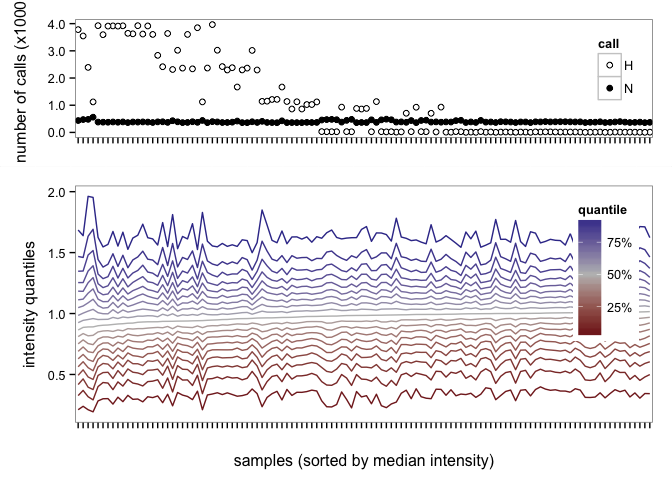
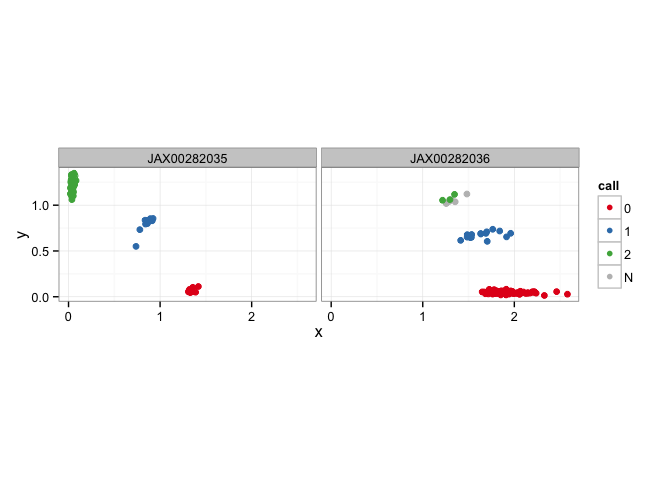
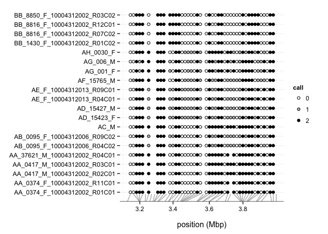

<!-- README.md is generated from README.Rmd. Please edit that file -->


argyle
======

An `R` package for import, QC and (some) analysis of genotyping and hybridization-intensity data from Illumina Infinium arrays.

Dependencies
------------

Effort has been made to keep to a minimum the number of package dependencies, subject to the constraint that I don't want to re-implement from scratch what others have done better.

-   `data.table`: really fast and efficient handling of big (multi-GB scale) table-style data with low overhead
-   `preprocessCore` (Biodoncuctor): robust quantile normalization routine written in `C`
-   `plyr`: generalizations of base-`R`'s `apply()` family
-   `reshape2`: easy "flattening" of matrices to dataframes
-   `digest`: for computing MD5 checksums to check data integrity

The following are required for some functions but one could get by without them:

-   `ggplot2` (and friends): required for the plotting functions
-   `corpcor`: required for "fast"-mode PCA

Installation
------------

Installation of the package directly from Github requires `devtools`.

``` {.r}
library(devtools)

## allow R to look for pacakges in both CRAN and Bioconductor
setRepositories(1:2)

## install from Github source
install_github("andrewparkermorgan/argyle")
```

Performance
-----------

For a realistic test of `argyle`'s performance, I use an Illumina BeadStudio dataset from the MegaMUGA array for mouse, containing 77808 markers x 96 samples (available from [do.jax.org](http://churchill.jax.org/research/cc/do_data/megamuga/raw/MegaMUGA_22Oct2012/)). The relevant files, compressed with ZIP, have total size 149 MB.

Testing on my Mac Pro desktop (OS X 10.6.8.10K549, 2x2.26 GHz quad-core Xeon, 24 GB DDR3 RAM) under `R` 3.1.3:

    #> Loading argyle
    #> Loading required package: data.table
    #> Loading required package: digest
    #> Loading required package: preprocessCore
    #> Loading required package: reshape2
    #> Loading required package: plyr

``` {.r}
system.time( geno <- read.beadstudio("", snps, "./data/MM_sample") )

summary(geno)

print(object.size(geno), units = "Mb")

sessionInfo()
```

The final object is format(object.size(geno), units = 'Mb'), and is completely "self-contained" in that sample and marker metadata are stored alongside the genotypes and hybridization intensities. It is worth noting that if the input files were decompressed they would occupy about 500 MB on disk.

Usage
-----

``` {.r}
data(ex)

summary(ex)
#> --- ex ---
#> A genotypes object with 6811 sites x 116 samples
#> Intensity data: yes (raw) 
#> Sample metadata: yes ( 67 male / 49 female / 0 unknown )
#> Filters set: 0 sites / 0 samples

## see marker map and sample metadata
head( markers(ex) )
#>                chr       marker          cM     pos A1 A2           type
#> UNCJPD004122 chr10 UNCJPD004122 0.001285159 3102907  T  G     wild_novel
#> JAX00282036  chr10  JAX00282036 0.002179439 3174515  T  C      MDA_other
#> ICR4265      chr10      ICR4265 0.002187332 3175147  T  G      ICR_novel
#> JAX00282035  chr10  JAX00282035 0.002190454 3175397  A  G      MDA_other
#> ICR265       chr10       ICR265 0.002214170 3177296  T  C      ICR_novel
#> UNCHS027452  chr10  UNCHS027452 0.002610731 3209050  T  G recomb_hotspot
#>              is.MM unique
#> UNCJPD004122 FALSE   TRUE
#> JAX00282036  FALSE   TRUE
#> ICR4265      FALSE   TRUE
#> JAX00282035  FALSE   TRUE
#> ICR265       FALSE   TRUE
#> UNCHS027452  FALSE   TRUE
head( samples(ex) )
#>                               fid                           iid mom dad
#> AA_0374_F_10004312002_R01C01   AA  AA_0374_F_10004312002_R01C01   0   0
#> AA_0374_F_10004312002_R11C01   AA  AA_0374_F_10004312002_R11C01   0   0
#> AA_0417_M_10004312002_R02C01   AA  AA_0417_M_10004312002_R02C01   0   0
#> AA_0417_M_10004312002_R03C01   AA  AA_0417_M_10004312002_R03C01   0   0
#> AA_37621_M_10004312002_R04C01  AA AA_37621_M_10004312002_R04C01   0   0
#> AB_0095_F_10004312006_R04C02   AB  AB_0095_F_10004312006_R04C02   0   0
#>                               sex pheno
#> AA_0374_F_10004312002_R01C01    2    -9
#> AA_0374_F_10004312002_R11C01    2    -9
#> AA_0417_M_10004312002_R02C01    1    -9
#> AA_0417_M_10004312002_R03C01    1    -9
#> AA_37621_M_10004312002_R04C01   1    -9
#> AB_0095_F_10004312006_R04C02    2    -9

## subset operations: hard brackets or subset()
ex[ 1:10,1:2 ]
#>              AA_0374_F_10004312002_R01C01 AA_0374_F_10004312002_R11C01
#> UNCJPD004122                            0                            0
#> JAX00282036                             0                            0
#> ICR4265                                 2                            2
#> JAX00282035                             2                            2
#> ICR265                                  2                            2
#> UNCHS027452                            NA                           NA
#> UNCHS027451                             2                            2
#> UNCJPD004121                           NA                           NA
#> UNCJPD009032                           NA                           NA
#> ICR4264                                 2                            2
#> attr(,"map")
#>                chr       marker          cM     pos A1 A2           type
#> UNCJPD004122 chr10 UNCJPD004122 0.001285159 3102907  T  G     wild_novel
#> JAX00282036  chr10  JAX00282036 0.002179439 3174515  T  C      MDA_other
#> ICR4265      chr10      ICR4265 0.002187332 3175147  T  G      ICR_novel
#> JAX00282035  chr10  JAX00282035 0.002190454 3175397  A  G      MDA_other
#> ICR265       chr10       ICR265 0.002214170 3177296  T  C      ICR_novel
#> UNCHS027452  chr10  UNCHS027452 0.002610731 3209050  T  G recomb_hotspot
#> UNCHS027451  chr10  UNCHS027451 0.002701123 3216288  A  G recomb_hotspot
#> UNCJPD004121 chr10 UNCJPD004121 0.002965181 3237432  A  G     wild_novel
#> UNCJPD009032 chr10 UNCJPD009032 0.003200915 3256308  A  G     wild_novel
#> ICR4264      chr10      ICR4264 0.003275721 3262298  A  C      ICR_novel
#>              is.MM unique
#> UNCJPD004122 FALSE   TRUE
#> JAX00282036  FALSE   TRUE
#> ICR4265      FALSE   TRUE
#> JAX00282035  FALSE   TRUE
#> ICR265       FALSE   TRUE
#> UNCHS027452  FALSE   TRUE
#> UNCHS027451  FALSE   TRUE
#> UNCJPD004121 FALSE   TRUE
#> UNCJPD009032 FALSE   TRUE
#> ICR4264      FALSE   TRUE
#> attr(,"ped")
#>                              fid                          iid mom dad sex
#> AA_0374_F_10004312002_R01C01  AA AA_0374_F_10004312002_R01C01   0   0   2
#> AA_0374_F_10004312002_R11C01  AA AA_0374_F_10004312002_R11C01   0   0   2
#>                              pheno
#> AA_0374_F_10004312002_R01C01    -9
#> AA_0374_F_10004312002_R11C01    -9
#> attr(,"intensity")
#> attr(,"intensity")$x
#>              AA_0374_F_10004312002_R01C01 AA_0374_F_10004312002_R11C01
#> UNCJPD004122                        0.756                        0.718
#> JAX00282036                         1.853                        1.849
#> ICR4265                             0.019                        0.047
#> JAX00282035                         0.050                        0.041
#> ICR265                              0.018                        0.029
#> UNCHS027452                         0.943                        0.884
#> UNCHS027451                         0.028                        0.022
#> UNCJPD004121                        0.573                        0.649
#> UNCJPD009032                        0.294                        0.303
#> ICR4264                             0.055                        0.065
#> 
#> attr(,"intensity")$y
#>              AA_0374_F_10004312002_R01C01 AA_0374_F_10004312002_R11C01
#> UNCJPD004122                        0.218                        0.209
#> JAX00282036                         0.037                        0.051
#> ICR4265                             0.643                        0.729
#> JAX00282035                         1.213                        1.175
#> ICR265                              0.682                        0.725
#> UNCHS027452                         0.167                        0.203
#> UNCHS027451                         0.941                        0.948
#> UNCJPD004121                        0.074                        0.108
#> UNCJPD009032                        0.690                        0.758
#> ICR4264                             0.975                        0.904
#> 
#> attr(,"normalized")
#> [1] FALSE
#> attr(,"alleles")
#> [1] "01"
#> attr(,"filter.sites")
#> UNCJPD004122  JAX00282036      ICR4265  JAX00282035       ICR265 
#>        FALSE        FALSE        FALSE        FALSE        FALSE 
#>  UNCHS027452  UNCHS027451 UNCJPD004121 UNCJPD009032      ICR4264 
#>        FALSE        FALSE        FALSE        FALSE        FALSE 
#> attr(,"filter.samples")
#> AA_0374_F_10004312002_R01C01 AA_0374_F_10004312002_R11C01 
#>                        FALSE                        FALSE 
#> attr(,"class")
#> [1] "genotypes" "matrix"

## or stuff like
x <- subset(ex, chr == "chrM")
x <- subset(ex, sex == 2, by = "samples")

## run QC checks and flag samples above thresholds
ex <- run.qc.checks(ex, max.H = 5e3, max.N = 500)
#> Performing QC checks on genotype calls...
#> Nothing to do; genotypes already in requested coding.
#> Performing QC checks on hybridization intensities...
#> 0 markers and 1 samples now flagged as low-quality.
# how many samples fail QC?
summarize.filters(ex)
#>   sites samples 
#>       0       1
## graphical summary
qcplot(ex)
```



``` {.r}

## peek at a couple of markers
plot.clusters(ex, c("JAX00282035","JAX00282036"))
#> Nothing to do; genotypes already in requested coding.
```



``` {.r}

## show genotypes at many markers in dense plot
dotplot(ex[ 1:50,1:20 ])
```



Interface to [`R/DOQTL`](http://cgd.jax.org/apps/doqtl/DOQTL.shtml)
-------------------------------------------------------------------

Genotypes processed with `argyle` can be packaged into a set of `R` objects (bundled in an `*.Rdata` file) suitable for use as input to Dan Gatti's `DOQTL` software. `DOQTL` performs haplotype reconstruction and genetic mapping (under both linkage/composite-interval and single-marker association models) in multifounder advanced intercross populations. Its namesake is the Diversity Outbred (DO) mouse population (see [do.jax.org](http://do.jax.org/)).

``` {.r}
## export for DOQTL
export.doqtl(ex, "./doqtl.objects.Rdata")
```

Interface to [`PLINK`](https://www.cog-genomics.org/plink2/)
------------------------------------------------------------

Computation on large SNP array genotyping datasets is not a new problem. Many common operations -- frequency statistics (sample-wise and marker-wise), differentiation statistics (\(F_{st}\) et al), homozygosity checks, association testing, multivariate clustering by PCA and MDS -- are implemented efficiently in the `PLINK` package. The input formats popularized by `PLINK` are now used by other software in population genetics.

This package provides functions to read and write **binary** `PLINK` filesets. The binary fileset consists of three files:

-   `*.fam`: the \`\`family file'' describing samples (6 columns): family ID, sample ID, mom ID, dad ID, sex (0=unknown, 1=male, 2=female), phenotype (-9=missing)
-   `*.bim`: a file describing the marker map (6 columns, at least): chromosome, marker ID, genetic position (cM), physical position (bp), allele 1, allele 2
-   `*.bed`: compact binary representation of genotypes using 2 bits per genotype

Note that order matters: genotypes from the `*.bed` file are mapped to samples and markers using order of appearance in the `*.fam` and `*.bim` files.

``` {.r}
## this command produces files 'sample.bed', 'sample.bim' and 'sample.fam' in the R sessions temporary directory
ff <- file.path(tempdir(), "sample")
ex <- recode(ex, "native")
write.plink(ex, ff)
#> Creating plink fileset </var/folders/_r/xn9svcws2sv9xns429lr0x_00000gp/T//Rtmptds12B/sample.*>...
#>  writing family file (116 individuals) ...
#>  writing marker map (6811 markers) ...
#>  preparing to convert genotypes to binary format...
#> [1] TRUE
## ... and this one reads it back in
summary( read.plink(ff) )
#> Reading family info from: </var/folders/_r/xn9svcws2sv9xns429lr0x_00000gp/T//Rtmptds12B/sample.fam>
#> Reading marker info from: </var/folders/_r/xn9svcws2sv9xns429lr0x_00000gp/T//Rtmptds12B/sample.bim>
#> Reading binary genotypes from: </var/folders/_r/xn9svcws2sv9xns429lr0x_00000gp/T//Rtmptds12B/sample.bed>
#> --- read.plink(ff) ---
#> A genotypes object with 6811 sites x 116 samples
#> Intensity data: no  
#> Sample metadata: yes ( 67 male / 49 female / 0 unknown )
#> Filters set: 0 sites / 0 samples
```

Also included are thin wrappers around some `PLINK` utilities. These of course require a working executable named `plink` in the user's path. [**TODO**]
